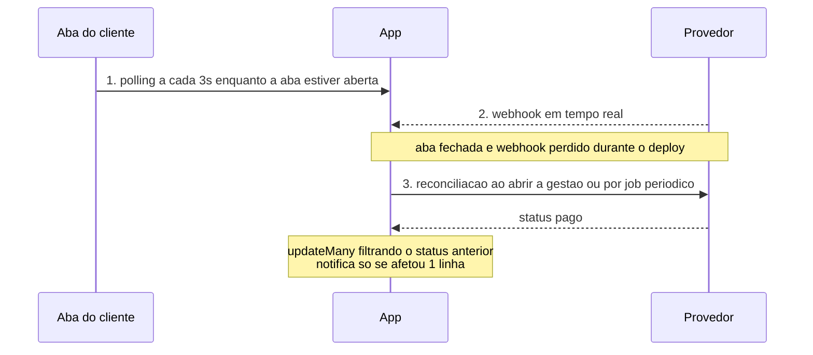
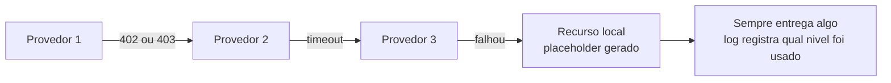
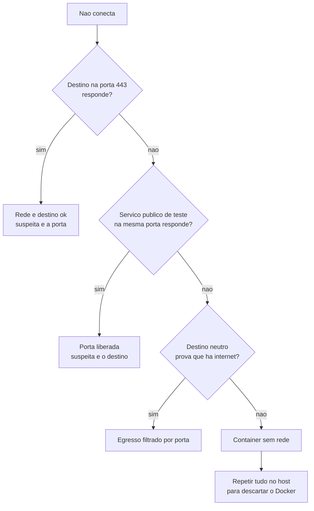
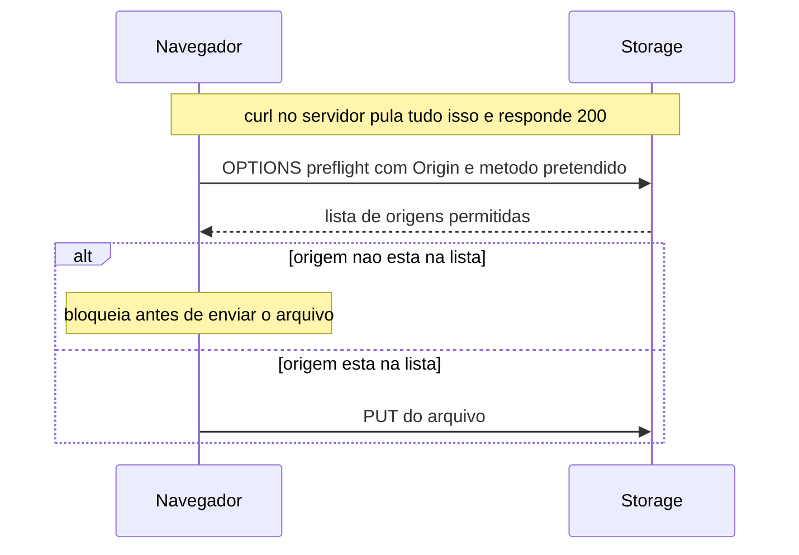

# APIs e integrações

## Headers HTTP são case-insensitive — `dict(response.headers)` quebra isso

**Sintoma:** você pagina uma API, recebe 100 itens, o laço termina sem erro nenhum e
você conclui que existem 100. Na verdade existem quase o dobro.

**Causa:** a especificação diz que nome de header é case-insensitive, e servidores
HTTP/2 costumam mandar tudo em minúsculo (`x-next-page`). O objeto de resposta da
biblioteca respeita isso, mas ao converter para `dict` comum vira busca literal:
`d.get("X-Next-Page")` devolve `None` mesmo com o header presente.

**Por que a caixa do header muda sem ninguém mexer:** em HTTP/1.1 os headers trafegam como
texto e quase todo mundo escreve em Title-Case. Em HTTP/2 o protocolo **exige** nomes em
minúsculo. Ou seja: a mesma API pode trocar a caixa de todos os headers só porque o
servidor foi atualizado — sem nenhuma mudança de contrato e sem aviso.

**Exemplo concreto:** você lista os posts de um blog, 200 no total, 100 por página. A
resposta traz `x-next-page: 2`, mas seu código procura `X-Next-Page` num `dict`, recebe
`None`, encerra o laço e reporta "200 posts encontrados"... quando são 400.

```python
r.headers.get("X-Next-Page")         # funciona: objeto case-insensitive da biblioteca
dict(r.headers).get("X-Next-Page")   # None: dict comum faz busca literal
```

**Regra:** nunca converta headers para `dict`. Use o objeto original da biblioteca.

**Como verificar:** compare o total acumulado com o header de contagem que a API
devolve. Um número redondo exato (100, 500, 1000) é suspeito por definição — é o tamanho
da página, não a realidade.

---

## Valide o total da paginação contra um número independente

**Sintoma:** um inventário "completo" que está truncado — e como nada falhou, o erro se
propaga para todas as decisões seguintes.

**Causa:** laços de paginação falham silenciosamente por vários motivos: header não
lido, limite de offset do servidor, filtro implícito, permissão que esconde itens.

**Exemplo concreto:** você exporta os pedidos de uma loja para uma planilha. A API diz
`x-total: 2500`, mas o servidor recusa qualquer offset acima de 2000 e simplesmente
devolve lista vazia. Seu laço termina feliz com 2000 pedidos, e o relatório de faturamento
do mês nasce 20% menor — sem nenhum erro em lugar nenhum.

```python
total = int(r.headers["x-total"])
assert len(itens) == total, f"coletei {len(itens)} de {total} itens"
```

**Regra:** todo laço de paginação termina com uma conferência contra o total declarado.
Melhor ainda: peça a mesma coleção por um segundo endpoint e compare.

---

## Webhook falha **fechada**, sempre

**Sintoma:** nenhum — esse é o problema. Qualquer um consegue postar um evento forjado e
mudar estado: marcar pedido como pago, ativar plano.

**Causa:** implementação típica é "se houver token configurado, valide; senão, siga".
Em ambiente onde a variável não foi propagada, o webhook passa a aceitar tudo.

**Exemplo concreto:** a loja tem `/api/webhook` que marca pedido como pago. O segredo foi
configurado em produção, mas ninguém lembrou do ambiente de preview. Nesse ambiente, um
`POST` de três linhas com o número de um pedido qualquer libera o produto — e não sobra
nem log de erro, porque do ponto de vista do código nada deu errado.

**Regra:** sem token ou assinatura válida, responda 401 **antes** de ler o corpo. Campos
que selecionam comportamento privilegiado (plano, valor, papel) passam por allowlist,
nunca são refletidos direto do payload.

**Como verificar:**
```bash
curl -s -o /dev/null -w "%{http_code}" -X POST https://HOST/api/webhook -d '{}'   # 401
```

---

## Rotacionar token de webhook exige atualizar os dois lados na ordem certa

**Sintoma:** após trocar o segredo, o provedor acumula 401 e **pausa a fila de
entrega**; eventos param de chegar mesmo depois do token certo entrar em produção.

**Causa:** rotação feita só no receptor. Provedores costumam suspender a assinatura após
N falhas consecutivas e não retomam sozinhos.

**Exemplo concreto:** sexta à tarde você troca o segredo no seu servidor e vai atualizar o
painel do provedor "daqui a pouco". Nos 10 minutos seguintes chegam 20 eventos, todos
levam 401, e na vigésima falha o provedor desativa a assinatura. Você corrige o painel às
18h e continua sem receber nada — porque a fila está pausada, não errada. Na segunda,
30 pagamentos estão na conta e 30 pedidos continuam "aguardando".

**Regra:** aceite token novo e antigo → atualize no painel do provedor → remova o antigo.
Depois de qualquer sequência de 401, verifique e reative manualmente a fila e reenvie os
eventos perdidos.

---

## Conta compartilhada entre produtos: responda 200 ao evento que não é seu

**Sintoma:** a fila de entrega do provedor entra em backoff e eventos legítimos atrasam;
ou erros 500 esporádicos num endpoint estável.

**Causa:** quando mais de uma aplicação assina os eventos da mesma conta, cada uma recebe os
eventos da outra. Devolver 500 para o evento alheio é interpretado como falha e penaliza a
fila inteira.

**O que é backoff de fila de entrega:** ao receber erro, o provedor não desiste — ele
reenvia depois de 1 minuto, depois 5, depois 30, com intervalos crescentes. Como a fila é
por assinatura e não por evento, o evento que você rejeitou "envenena" a fila: os seus
eventos legítimos ficam atrás dele, esperando o mesmo intervalo crescente.

**Exemplo concreto:** a loja online e o app de assinaturas usam a mesma conta no provedor
de pagamento. O app de assinaturas recebe o evento de um pedido da loja, não acha o
registro, devolve 500. O provedor entra em backoff, e o evento da própria assinatura —
que chegaria em 2 segundos — chega 30 minutos depois.

**Regra:** prefixe o identificador externo com um namespace da aplicação (`loja_ped_1042`,
`assin_sub_77`), ignore silenciosamente com **200** o que não for seu, e mantenha
compatibilidade com referências antigas sem namespace. Use atualização em massa tolerante
a zero linhas em vez de "buscar e falhar se não achar".

---

## Webhook sozinho não é confirmação — tenha reconciliação

**Sintoma:** alguns eventos nunca chegam; o estado local fica "pendente" para sempre
enquanto o provedor já considera concluído. Ou: pagamento entra na conta e o pedido
continua pendente porque o cliente fechou a aba.

**Causa:** entrega de webhook é best-effort — cai por indisponibilidade momentânea, fila
pausada, deploy no meio do caminho. E polling só roda com a página aberta.



**Exemplo concreto:** o cliente paga e fecha a aba antes do redirect — morreu o polling. O
webhook desse pagamento chegaria 4 segundos depois, no exato minuto em que o deploy
reiniciava o servidor — morreu o webhook. Sem a terceira camada, esse pedido fica
"aguardando pagamento" para sempre, com o dinheiro já na conta.

**O que quer dizer idempotente aqui:** rodar a reconciliação duas vezes tem que ter o mesmo
efeito de rodar uma vez. Se ela dispara e-mail de confirmação, credita saldo ou baixa
estoque toda vez que roda, o job periódico vira uma máquina de duplicar efeitos.

**Regra:** três camadas — polling (feedback imediato) + webhook (tempo real) +
reconciliação por consulta ao abrir a tela de gestão ou por job periódico (rede de
segurança). A reconciliação tem que ser idempotente. Com múltiplas abas em polling, troque
`update` por `updateMany` filtrando pelo status anterior e notifique só quando o contador
for 1 — senão o aviso sai duplicado.

---

## Falha silenciosa em efeito colateral "best-effort" produz buraco invisível

**Sintoma:** o registro principal existe e a interface parece correta, mas a busca ou
derivação nunca encontra nada. Nenhum erro no log.

**Causa:** o fluxo foi desenhado para não travar o caminho feliz: se o enriquecimento
(indexação, vetorização, notificação) falha, é engolido num `catch` vazio. Com a
credencial inválida por horas, todo o período fica sem enriquecimento.

**Exemplo concreto:** todo post publicado no blog também é enviado para o índice de busca.
A credencial do serviço de busca expirou às 9h e foi renovada às 15h. Os 40 posts
publicados nesse intervalo existem, abrem, aparecem no feed — e são invisíveis na busca
para sempre, porque ninguém guardou que eles não foram indexados.

**Regra:** efeito colateral opcional pode não travar a operação, mas **precisa** persistir
estado (`pendente`/`falhou` + timestamp + motivo) e ter um reprocessador que consulte esse
estado. Contadores de falha devem gerar alerta.

**Como verificar:**
```sql
SELECT count(*) FROM registros r
LEFT JOIN derivados d ON d.registro_id = r.id WHERE d.id IS NULL;
```

---

## `.catch(() => {})` numa remoção remota vira cobrança órfã

**Sintoma:** cobranças que ninguém consegue explicar continuam existindo no provedor
depois de o pedido ser apagado.

**Causa:** engolir o erro da chamada de remoção externa.

**Exemplo concreto:** o cliente cancela o pedido. Seu código apaga o pedido local e manda
remover a cobrança no provedor. O provedor responde 400 — "cobrança já recebida não pode
ser removida" —, o `.catch` vazio engole, o pedido some do sistema, e o cliente segue
pagando uma cobrança que não corresponde a nada. Ninguém consegue nem descobrir de qual
pedido ela era.

```js
if (res.status === 404) return 'ok';        // ja nao existe: sucesso
if (res.status === 400) throw new Error();  // recusa legitima: precisa chegar ao operador
```

**Regra:** distinga os códigos — **404 é sucesso** (já não existe); **400 costuma ser
recusa legítima** ("cobrança já recebida não pode ser removida") e precisa chegar ao
operador. Se a limpeza remota falha, **não apague o registro local**, senão some o rastro.
Em limpeza em lote, preserve os que falharam.

---

## "Criar cliente" a cada transação duplica cadastro no provedor

**Sintoma:** o mesmo documento aparece com três cadastros distintos na conta do provedor.

**Causa:** `POST /customers` chamado em toda venda, sem busca prévia.

**Exemplo concreto:** um cliente fiel compra 12 vezes no ano. A conta do provedor termina
com 12 cadastros do mesmo documento. Quando alguém tenta emitir um segundo boleto ou
consultar o histórico de pagamentos dele, cada consulta cai num cadastro diferente e
mostra uma compra só.

**Regra:** busque por identificador único primeiro e reuse; só crie se não achar. Se a
busca falhar por indisponibilidade, crie assim mesmo (não bloqueie a venda) e reconcilie
depois.

---

## Não monte URL de terceiro por concatenação — busque o link canônico

**Sintoma:** link gerado pelo sistema leva a "não encontrado" no site do provedor, mesmo
com o identificador correto.

**Causa:** a URL foi construída a partir de um ID interno seguindo um padrão observado. O
provedor usa outro identificador ou rota para acesso público, e o formato pode mudar sem
aviso.

**Exemplo concreto:** você abre uma fatura no painel do provedor, vê a URL, e monta
`.../fatura/` + o ID que a API te devolveu. Funciona nos seus testes. O que você não viu é
que a página pública usa um token de acesso separado, e o ID interno só funciona para quem
está logado. Todo cliente que recebe o e-mail com esse link vê "não encontrado".

**Regra:** use o campo de URL que a própria API retorna no recurso.

---

## Endpoint que consome recurso escasso precisa de limite de taxa **fora** do processo

**Sintoma:** estoque zerado, cobranças fantasma ou custo explodindo depois de uma rajada.

**Causa:** a rota muta recurso finito sem limite. Contadores em memória não funcionam em
serverless: cada invocação pode ser uma instância nova, sem estado compartilhado.

**Por que contador em memória não segura nada em serverless:** um `Map` de contagem vive
dentro do processo. Em servidor tradicional o processo dura semanas e o contador acumula;
em serverless a plataforma pode criar um processo novo para cada requisição simultânea, e
cada um começa com o contador em zero. Você não tem um contador — tem N contadores.

**Exemplo concreto:** um sistema de reservas com 1 sala disponível. O botão não tem
debounce e o usuário clica 20 vezes em 3 segundos. As 20 requisições caem em instâncias
diferentes, cada uma lê "0 reservas feitas por este usuário", e todas passam.

**Regra:** limite de taxa com estado externo (cache distribuído) ou na camada de borda da
plataforma. Além disso, só reserve o recurso escasso na confirmação, não na criação.

---

## Escolha a direção da falha pelo custo do erro

**Sintoma:** dilema recorrente — se o controle auxiliar (rate limit, cota,
contabilização) falhar, libera ou bloqueia?

**Causa:** bloquear por falha de mecanismo secundário derruba o produto; liberar por
falha de mecanismo de custo abre a torneira financeira.

**Falha aberta e falha fechada:** falhar **aberto** é deixar a operação passar quando o
controle não responde; falhar **fechado** é negar. Não existe escolha universalmente certa
— existe a escolha certa para aquele controle, decidida pelo que dói mais quando dá errado.

**Exemplo concreto:** o cache que guarda o rate limit fica indisponível por 5 minutos. Se
o rate limit falha fechado, ninguém consegue fazer login nesses 5 minutos — você derrubou
o produto para evitar um abuso hipotético. Já o contador de créditos de uma API paga: se
ele falha aberto, um laço bugado de um usuário roda a noite inteira e a fatura do mês
triplica.

**Regra:** controles de **proteção contra abuso** falham abertos; controles de **consumo
de recurso pago** falham fechados. Deixe a decisão explícita e comentada no código, com
log dos dois lados.

---

## Dado externo volátil: cache diário + último valor conhecido + padrão manual

**Sintoma:** uma API de terceiros fora do ar quebra uma tela inteira de relatório.

**Causa:** valor que muda devagar (câmbio, tabela de preços, feriados) buscado a cada
render, sem plano B.

**Exemplo concreto:** o relatório de vendas converte valores usando uma cotação buscada de
um serviço externo a cada carregamento. O serviço fica 20 minutos fora do ar e a tela
inteira — inclusive as 15 colunas que não dependem de câmbio — mostra erro. A cotação de
ontem estaria errada em fração de por cento; a tela em branco está 100% errada.

```ts
const r = await fetch(url, { signal: AbortSignal.timeout(3000) });
```

**Regra:** três degraus — (1) cache com chave de data; (2) falhou a rede? devolve o
último valor cacheado; (3) sem cache nenhum? devolve o padrão configurável. Sempre com
timeout explícito: sem ele, `fetch` pode pendurar a função até o limite da plataforma.

---

## Corrida entre dois provedores elimina o pior caso de timeout

**Sintoma:** a operação ocasionalmente leva minutos porque um provedor externo está
lento, mesmo havendo alternativa disponível.

**Causa:** chamada sequencial com fallback: só depois de estourar o timeout do primeiro é
que o segundo é tentado, somando as latências.

**Exemplo concreto:** gerar a miniatura de uma imagem. O provedor A responde em 2 segundos
quase sempre, mas uma vez a cada vinte trava e só devolve no timeout de 30 segundos. O B
responde em 3 segundos sempre. Sequencial, o pior caso é 33 segundos; em paralelo, é 3 —
e o usuário nunca vê a diferença entre os dois casos.

**Cuidado com "respondeu" como critério de vitória:** um provedor pode devolver 200 com o
corpo vazio, ou uma imagem de 0 byte, em 200 ms. Ele ganha a corrida sempre e entrega
lixo. A validação precisa olhar o conteúdo, não o código de status.

**Regra:** para operações idempotentes e de custo baixo, dispare em paralelo e aceite a
primeira resposta **válida** — validação de conteúdo, não apenas "respondeu". Cancele as
demais explicitamente. Para operações caras ou com efeito colateral, mantenha sequencial
com timeout curto.

---

## Serviço gratuito de terceiro vira pago sem aviso

**Sintoma:** funcionalidade que rodava há meses começa a devolver 402/403 em massa.

**Exemplo concreto:** o app de tarefas mostra um avatar gerado por um serviço gratuito ao
lado de cada nome. Numa terça qualquer o serviço passa a exigir chave paga e responde 402
para tudo. Todas as listas do app aparecem com ícones quebrados, e a única mudança do dia
foi no servidor de outra empresa.



**Regra:** para dependências não críticas, monte uma cascata explícita de 3-4 provedores
terminando num recurso local que nunca falha (placeholder gerado, degradação visual) —
melhor sair torto do que quebrar o layout. Cada nível registra qual foi usado, para você
perceber a degradação.

---

## Limite de tamanho em base64 é 33% mais permissivo do que você acha

**Sintoma:** uma imagem "dentro do limite" é recusada pelo provedor por exceder o
tamanho máximo.

**Causa:** base64 infla ~4/3. Validar o comprimento da string valida caracteres, não bytes.

**De onde vem o 4/3:** base64 pega 3 bytes do arquivo e escreve 4 caracteres. Toda string
base64 é ~33% maior que o arquivo que ela representa. Comprimento da string e tamanho do
arquivo são dois números diferentes, sempre.

**Exemplo concreto:** o limite é 5 MB. Uma foto de 4 MB vira uma string base64 de ~5,3 MB.
Se você mede a string e compara com o limite do arquivo, recusa uma foto que caberia. Se
mede o arquivo e o provedor mede a string, acontece o inverso e o erro só aparece do lado
dele. Os dois números nunca batem.

```js
Buffer.byteLength(b64, 'base64')   // bytes reais do arquivo
b64.length                         // ~33% maior: caracteres, nao bytes
```

**Regra:** valide sempre em bytes (`Buffer.byteLength(b64, 'base64')` ou o tamanho
reportado pelo storage).

---

## Serviço de visão com limite de tamanho: indexe uma derivada, não o original

**Sintoma:** reconhecimento passa a falhar em toda foto nova depois que você para de
degradar os uploads.

**Causa:** APIs de visão costumam ter teto rígido por imagem (ordem de 5 MB). Originais
de câmera passam disso com folga.

**Exemplo concreto:** o app aceitava upload comprimido no navegador e tudo funcionava.
Alguém remove a compressão para "não perder qualidade nas fotos dos produtos". A partir
dali, toda foto tirada de celular chega com 8 MB, e o reconhecimento automático — que roda
depois, em segundo plano — falha em 100% dos casos novos, sem barulho nenhum.

**Regra:** separe o arquivo **guardado** do arquivo **analisado** — guarde o original
intacto e mande para a API uma versão reduzida. Também respeita o limite de taxa e
barateia a conta.

---

## SSE atrás de proxy precisa de `X-Accel-Buffering: no`

**Sintoma:** o stream de progresso entrega tudo de uma vez, no final; ou funciona local e
trava em produção.

**Causa:** proxies reversos bufferizam a resposta por padrão.

**O que é SSE:** é uma resposta HTTP que nunca "termina" — o servidor mantém a conexão
aberta e vai empurrando linhas de texto conforme tem novidade, e o navegador lê cada uma
na hora. Só que, para um proxy no meio do caminho, isso parece uma resposta comum ainda
incompleta: ele acumula tudo num buffer e só repassa quando fecha. O header
`X-Accel-Buffering: no` é o pedido explícito para não fazer isso.

**Exemplo concreto:** a tela de importação de planilha mostra "processando linha 340 de
1000". Na sua máquina, sem proxy, os números sobem suavemente. Em produção a barra fica em
zero por 40 segundos e depois salta direto para 100% — o proxy segurou os 1000 eventos e
entregou todos juntos no final.

```
Content-Type: text/event-stream
Cache-Control: no-cache
X-Accel-Buffering: no
```

**Regra:** envie `Content-Type: text/event-stream`, `Cache-Control: no-cache` e
`X-Accel-Buffering: no`. Além disso, um dicionário de jobs em memória só funciona com uma
instância — atrás de load balancer o cliente pode cair em outro processo. Documente a
restrição e adicione limpeza periódica dos jobs finalizados, senão o processo vaza memória.

---

## Timeout de TCP não prova firewall

**Sintoma:** conexão a um banco remoto estoura o timeout no servidor de automação enquanto o
cliente gráfico do desenvolvedor conecta normalmente. Diagnóstico natural: "o firewall
bloqueia".

**Causa:** a configuração estava errada — porta e usuário diferentes dos reais. Pacote
para porta onde não há serviço produz timeout, exatamente a mesma assinatura de pacote
dropado por firewall.

**Exemplo concreto:** a automação aponta para a porta padrão do banco, mas aquele servidor
publica o banco numa porta alternativa. O pacote chega, não encontra ninguém escutando, e
o resultado é um timeout — visualmente idêntico ao de um firewall que descarta o pacote em
silêncio. Foram dois dias de chamado com a equipe de rede para descobrir um número errado
no arquivo de configuração.

```bash
nc -vz HOST PORTA   # timeout aqui = "nada escutando" OU "firewall": mesma assinatura
```

**Regra:** antes de abrir chamado de rede, extraia host, porta, usuário e base do
**cliente que funciona** e compare campo a campo. Erro de credencial é ótima notícia:
prova que rede e IP estão liberados.

---

## Diagnóstico de egresso: teste destinos e portas cruzados

**Sintoma:** "não conecta" — e não se sabe se o bloqueio é da porta, do destino, do host
de origem ou do container.

**Causa:** um único teste falho é compatível com quatro causas diferentes.

**O que é egresso:** é o tráfego que **sai** da sua máquina em direção à internet — o
oposto de ingresso, que é o que chega. Muita gente checa só o ingresso e assume que sair é
livre; em rede corporativa é comum o contrário: entrar é bloqueado e sair é filtrado por
porta, liberando 443 e negando o resto.

**Exemplo concreto:** o container não conecta num serviço externo numa porta que não é a
443. Isso é compatível com: aquela porta estar bloqueada na saída, aquele destino estar
bloqueado, o container não ter rede nenhuma, ou o destino estar fora do ar. Um teste só
não separa nada disso — a matriz separa em cinco minutos.



**Regra:** monte uma matriz — (a) o destino em outra porta que costuma estar aberta (443);
(b) a mesma porta contra um serviço público de teste; (c) destinos neutros para provar
internet; (d) o IP público de saída via serviço de eco, em portas diferentes. Rode tudo de
dentro do container **e** do host para descartar o Docker.

---

## Teste de upload feito com `curl` no servidor não exercita CORS

**Sintoma:** o teste ponta a ponta passou, mas no navegador o envio direto ao storage é
bloqueado.

**Causa:** CORS é política aplicada pelo **navegador**; qualquer cliente HTTP fora dele
ignora completamente.

**O que é CORS e o que é um preflight:** o navegador impede, por padrão, que uma página de
um domínio faça requisições a outro domínio. Para liberar, ele manda antes uma requisição
`OPTIONS` — o *preflight* — perguntando "posso fazer um PUT vindo desta origem?". Só se a
resposta listar a sua origem é que a requisição real acontece. Quem manda a pergunta é o
navegador, por conta própria: `curl`, Postman e qualquer código de servidor pulam essa
etapa inteira e por isso sempre "funcionam".



**Exemplo concreto:** você valida o upload direto ao storage com um `curl` rodado no
próprio servidor — 200, tudo certo, pode subir. No dia seguinte, nenhum usuário consegue
enviar foto: o console do navegador mostra bloqueio por origem, e o seu teste jamais
poderia ter pego isso.

```bash
curl -i -X OPTIONS https://STORAGE/bucket/arquivo \
  -H "Origin: https://meu-app.exemplo" \
  -H "Access-Control-Request-Method: PUT"
```

**Regra:** todo fluxo que sai do browser precisa de teste no browser ou de um preflight
`OPTIONS` explícito.

---

## `PutBucketCors` substitui a configuração inteira — leia antes de escrever

**Sintoma:** depois de habilitar CORS para um app novo, os uploads dos outros apps que
compartilham o bucket param de funcionar.

**Causa:** a API de CORS de storage S3-compatível é *replace*, não *merge*.

**Exemplo concreto:** o bucket já liberava as origens do site e do painel administrativo.
Você precisa liberar o app novo e grava a configuração com uma origem só — a dele. A
chamada devolve sucesso. Nesse instante o site e o painel perdem a permissão, e ninguém
associa a quebra deles a uma mudança feita "só para o app novo".

```
GetBucketCors   -> conjunto atual de origens
  + acrescentar a origem nova
PutBucketCors   -> gravar o conjunto COMPLETO, nunca só a nova
```

**Regra:** sempre `Get` → acrescentar a origem → `Put` com o conjunto completo. Mesmo
raciocínio para políticas de bucket e lifecycle.
