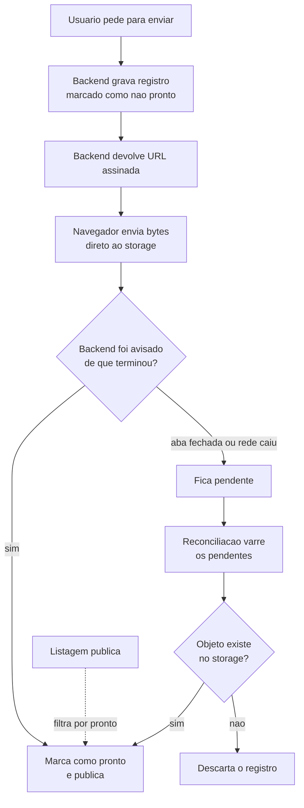
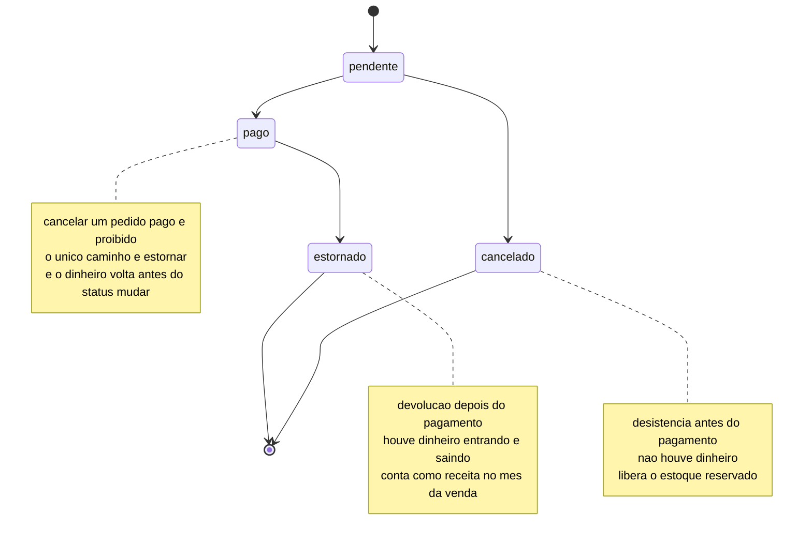
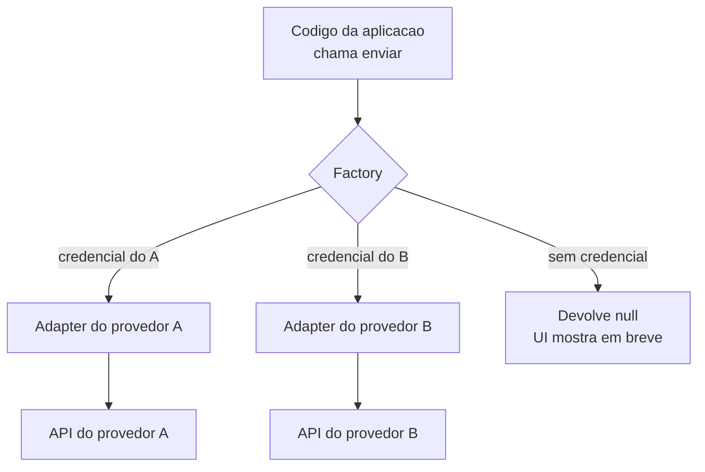

# Arquitetura, modelagem e decisões de produto

## Prove a arquitetura com uma fatia vertical antes de escalar

**Sintoma:** meses construindo camadas e, no final, o gargalo real — acesso à rede interna,
autenticação, latência — inviabiliza o desenho.

**Causa:** construir camada por camada só valida a integração no fim.

**O que é uma fatia vertical:** em vez de terminar o banco, depois toda a API, depois toda a
tela, você entrega **um único caso de uso atravessando todas as camadas**. É estreito de
propósito: uma consulta, um endpoint, um gráfico. O valor não está no que ele faz, e sim no
que ele prova — que os pedaços conseguem se falar naquele ambiente.

**Exemplo concreto:** um painel de vendas com 20 gráficos previstos. A fatia vertical é um
número só: "faturamento de ontem". Ela já obriga a resolver o acesso ao banco que está em
rede privada, o login, o formato do retorno e o desenho na tela. Se algo aí é impossível,
você descobre na primeira semana e não no quarto mês, com 19 gráficos prontos que não
conseguem buscar dado nenhum.

**Regra:** primeira entrega é uma fatia de ponta a ponta com um único caso: uma consulta →
um endpoint → uma visualização → o consumo por quem vai integrar. Ela exercita exatamente as
restrições que podem matar o projeto. Quando a fonte de dados vive em rede privada, exponha
**só a camada de API**, nunca o banco, e sirva de dados pré-agregados em vez de consultar o
modelo cru a cada requisição.

---

## O registro nasce antes do arquivo, e a reconciliação é obrigatória

**Sintoma:** em lotes longos, quando a aba é fechada ou a rede cai, ficam arquivos no
storage sem registro no banco: invisíveis, sem processamento, ocupando espaço para sempre.
E registros sem arquivo, pendentes eternamente.

**Causa:** no fluxo com URL assinada, o byte vai do navegador direto para o storage e o
backend só é avisado **depois**. Esse "depois" pode nunca acontecer. A operação está quebrada
em várias etapas de rede que não compartilham transação.

**O que é upload por URL assinada:** o backend não recebe o arquivo. Ele apenas emite um
endereço temporário e autorizado, e o navegador envia os bytes direto para o storage. Isso
economiza banda e tempo do servidor — e cria o problema: entre "autorizei" e "me avisaram
que terminou" existe uma janela em que ninguém está no controle.

**Exemplo concreto:** alguém sobe 200 fotos de um álbum. Na foto 130, fecha a aba. Sem essa
regra, ficam 130 arquivos pagos e invisíveis no storage e nada no banco. Com ela, existem
130 registros marcados como não prontos, e a rotina seguinte olha um por um: os 130 que têm
arquivo viram públicos, os 70 que não têm são descartados.



**Regra:** inverta — ao assinar a URL, já grave o registro com marcador de "não pronto"; a
listagem pública filtra por "pronto". Uma rotina de reconciliação varre os pendentes: se o
objeto existe no storage, conclui e publica; se não existe, descarta o registro. Assim
nenhum estado intermediário é irrecuperável, em qualquer ponto de falha.

**Como verificar:** suba um lote e mate a aba no meio; a reconciliação seguinte deve zerar
os pendentes sem intervenção manual.

---

## Reprocessamento idempotente: proteja só o passo caro e não-idempotente

**Sintoma:** a rotina de conclusão roda duas vezes e o mesmo item aparece duplicado no
índice de busca, ou a fatura é contada duas vezes.

**Causa:** regerar derivados é inofensivo (sobrescreve). Já chamadas a serviços externos
pagos que **acumulam estado** — indexação, cobrança, envio — não são idempotentes.

**O que é idempotência:** uma operação é idempotente quando executá-la dez vezes deixa o
sistema no mesmo estado que executá-la uma vez. Gerar a miniatura de uma foto é idempotente:
a segunda execução sobrescreve a primeira e o resultado é igual. Enviar o e-mail de
confirmação não é: a segunda execução gera um segundo e-mail, e o cliente recebe dois.

**Exemplo concreto:** a rotina que finaliza um pedido faz três coisas: recalcula o resumo,
gera o PDF do recibo e envia o e-mail de confirmação. Rodar de novo é seguro nas duas
primeiras — só sobrescreve. Na terceira, o cliente recebe o segundo e-mail e liga achando
que comprou duas vezes. A guarda vai só antes do envio, e é uma linha no banco:

```sql
INSERT INTO emails_enviados (pedido_id, tipo) VALUES ($1, 'confirmacao')
ON CONFLICT DO NOTHING;   -- 0 linhas = ja foi enviado, nao envie de novo
```

**Regra:** torne a função inteira segura para repetir, mas coloque uma guarda explícita
imediatamente antes do passo com efeito acumulativo: "só executa se ainda não houver
registro do resultado". A guarda vive no banco, não na memória do processo.

---

## Valor cobrado se recalcula no servidor; total vindo do cliente é sugestão

**Causa:** é natural o front já ter o total calculado para exibir e mandá-lo junto no envio.

**Exemplo concreto:** o carrinho manda `{"itens": [...], "total": 250.00}`. Qualquer pessoa
com o console do navegador aberto reenvia a mesma compra com `"total": 1.00`. Se o servidor
confiar no campo, a cobrança sai de um real. O payload correto manda só os itens e as
quantidades; os 250 reais são conclusão do servidor, não informação do cliente.

**Regra:** uma única função de cálculo, no servidor, usada tanto pela tela quanto pela
geração da cobrança. O payload do cliente traz apenas parâmetros — o quê, quanto —, nunca o
resultado financeiro.

---

## Status de pedido é um extrato: cancelar e estornar não são a mesma coisa

**Sintoma:** relatórios de faturamento divergem do dinheiro real, e o histórico "mente".

**Causa:** um único estado "cancelado" usado tanto para desistência antes do pagamento
quanto para devolução depois.

**Exemplo concreto:** em janeiro entram 100 pedidos: 90 pagos e 10 abandonados no checkout.
Em fevereiro, 3 dos pagos são devolvidos. Com um estado só, os 13 viram "cancelado" e o
relatório de janeiro passa a mostrar 87 vendas — mas o dinheiro dos 3 estornados **entrou**
em janeiro e **saiu** em fevereiro. O extrato do banco nunca vai bater com o relatório.



**Regra:** modele transições explícitas (`pendente → pago | cancelado`, `pago → estornado`)
numa função `podeTransicionar`; derive de funções puras quem **segura** estoque, quem
**conta** como receita e quais botões aparecem. Não permita "cancelar" um pedido pago.
Estornar deve devolver o dinheiro **antes** de mudar o status: se o provedor recusar, o
pedido continua pago e o operador lê o motivo. E limpar histórico não é desfazer vendas —
não devolva estoque nessa operação.

---

## Ligar um recurso não pode desligar o negócio

**Sintoma:** um clique exploratório num botão novo grava um valor que esconde o produto da
loja — e as vendas param até alguém perceber.

**Causa:** o botão "ativar controle de estoque" gravava **zero**, e zero significa esgotado,
que significa produto oculto na loja. Sem confirmação e sem aviso.

**Exemplo concreto:** o lojista está passeando pela tela nova e clica em "ativar controle de
estoque" só para ver o que acontece. O produto mais vendido some da vitrine naquele segundo.
Ele descobre três dias depois, pelo faturamento. O botão devia ter perguntado "quantas
unidades você tem?" e avisado "produtos com estoque zero ficam ocultos na loja".

**Regra:** ativar um recurso nunca deve gravar um valor com efeito destrutivo. Peça o valor,
só grave quando informado, e avise em texto claro qual é a consequência visível.

---

## CRUD sem "update" força um fluxo destrutivo

**Sintoma:** para mudar o papel de um usuário só existia apagar e recriar — o que obriga a
combinar uma senha nova com a pessoa.

**Exemplo concreto:** promover um atendente a gerente exige apagar a conta e criar outra. A
pessoa perde o histórico de ações, recebe uma senha provisória por mensagem e precisa
refazer o login em todo lugar — tudo isso para trocar uma palavra numa coluna.

**Regra:** ao modelar permissões, garanta a operação de alteração desde o começo, com
travas: o papel de dono nunca é oferecido na lista (um segundo dono pode apagar o primeiro)
e ninguém altera o próprio papel.

---

## "Papel fixo" costuma ser palpite sobre a realidade do cliente

**Sintoma:** requisito de "criar conta de funcionário e marcar quais telas ele vê".

**Causa:** confundir navegação com autorização, e presumir que os papéis do seu modelo
correspondem à realidade daquele negócio.

**Exemplo concreto:** você modela três papéis — dono, gerente, atendente. O primeiro cliente
tem um contador externo que só precisa ver relatórios financeiros, e um estagiário que só
cadastra produtos. Nenhum dos dois cabe nos três papéis, e o cliente seguinte vai ter dois
casos diferentes destes. Uma lista de áreas liberadas por pessoa acomoda os quatro sem
inventar um papel novo a cada contrato.

**Regra:** lista de áreas liberadas costuma modelar melhor que papéis fixos. Identifique de
antemão as travas **não-delegáveis** — assinatura, credenciais de pagamento, domínio, gestão
de usuários e operações que movem dinheiro — e o requisito estrutural: se hoje existe relação
1:1 entre conta e organização, isso vira tabela de vínculo e refatoração de **toda** a
verificação de posse.

---

## Integração com provedor externo: Adapter + falha segura quando a chave não existe

**Sintoma:** trocar de fornecedor exige mexer em dezenas de arquivos, e um deploy com a
chave faltando expõe a feature quebrada para todo mundo.

**O que é o padrão Adapter, e o que é falhar de forma segura:** Adapter é definir um
contrato que o **seu** código usa — `enviar(mensagem)` — e escrever uma classe por
fornecedor traduzindo esse contrato para a API específica de cada um. O resto do sistema
nunca chama o fornecedor direto, só o contrato. Falhar de forma segura (fail-closed) é a
outra metade: sem credencial, o sistema **não oferece** a funcionalidade. O oposto
(fail-open) é seguir em frente e deixar o usuário descobrir o buraco no clique.

**Exemplo concreto:** um app de tarefas manda lembretes por e-mail. Existem
`AdapterProvedorA` e `AdapterProvedorB`, ambos com `enviar(destinatario, texto)`; uma
factory decide qual devolver. Trocar de fornecedor é escrever um arquivo novo e mudar uma
linha da factory. E no dia em que a chave não foi configurada no ambiente, a factory devolve
`null`, o botão aparece como "em breve", e ninguém vê uma tela de erro.



**Regra:** defina um contrato e um adapter por fornecedor, escolhidos por uma factory —
trocar de provedor vira um arquivo novo. A factory retorna `null` quando a credencial não
está configurada, e a UI mostra "em breve" em vez de tentar. Complemente com allowlist por
variável de ambiente para lançamento gradual. Lembre que cada troca de provedor de OAuth
obriga todos os usuários a reconectar — por isso migrar cedo, enquanto a base é pequena.

---

## Dados de demonstração vazam para sitemap e listagens públicas

**Exemplo concreto:** você cria 10 produtos falsos para gravar um vídeo de apresentação da
loja. Some da vitrine porque a listagem principal foi filtrada. Três semanas depois, alguém
pesquisa o nome da loja num buscador e a primeira ocorrência é "Camiseta Teste 3" — que o
sitemap entregou e a busca do site também.

**Regra:** marque registros de demo com uma flag dedicada num único módulo e aplique esse
filtro em toda superfície pública — listagens, busca, sitemap, feeds. Um filtro só,
reutilizado, evita esquecer um lugar.

---

## Print de comprovante não é prova de pagamento

**Sintoma:** pedido de feature "o cliente manda o print e o sistema confirma".

**Causa:** print é trivialmente falsificável — é o golpe clássico de balcão. IA lendo valor
e data pega falsificação grosseira, e só.

**Exemplo concreto:** o comprador manda a imagem de uma transferência de R$ 200 feita
ontem para outra pessoa, com o nome do destinatário editado. Valor confere, data confere,
formato confere. O sistema libera o pedido. O dinheiro nunca entrou na conta da loja, e
ninguém vai olhar o extrato antes do envio.

**Regra:** quem prova é o extrato do provedor. Se a cobrança passa por um adquirente, deixe
a confirmação automática ser a fonte da verdade; se é chave estática, a confirmação é manual
e isso deve estar claro na UI.

---

## Recibo deve ser gerado ao vivo e não conter contato do cliente

**Sintoma:** um comprovante compartilhado continua dizendo "pago" depois de um estorno.

**Exemplo concreto:** o comprovante é um PDF gerado no momento da compra e enviado por link.
O pedido é estornado na semana seguinte, e o link continua entregando o mesmo papel dizendo
"pago" — agora um documento falso, que pode ser reencaminhado para qualquer pessoa. E se ele
trouxer o telefone e o endereço do comprador, cada reencaminhamento vaza os dois.

**Regra:** gere o comprovante a partir do estado atual — comprovante congelado após estorno
é documento falso circulando. Não inclua telefone nem endereço: o link é reencaminhável, e o
comprovante prova a compra, não expõe o comprador.

---

## Busca por similaridade tem dois cortes silenciosos

**Sintoma:** a busca "não encontra tudo" mesmo com os itens indexados.

**Causa:** o limiar de confiança alto derruba correspondências legítimas em condições ruins,
e o limite máximo de resultados corta o resto sem avisar.

**Exemplo concreto:** a busca por foto tem limiar de 0,85 e teto de 10 resultados. O produto
certo aparece com 0,80 numa foto mal iluminada e é descartado; e mesmo quando passa, se 10
itens mais parecidos vierem antes, ele fica de fora da lista sem que nada indique que houve
corte. Os dois números são invisíveis para quem usa — e para quem investiga.

**Regra:** ajuste limiar e teto conscientemente e registre-os como configuração, não como
número mágico. Antes de culpar a busca, confirme que a indexação terminou — resultado vazio
pode ser recall ruim **ou** base incompleta, e são diagnósticos opostos.

---

## Automação de mensageiro por biblioteca não-oficial bane o número do cliente

**Exemplo concreto:** o pedido é "avisar por mensagem quando o pedido sair para entrega".
Uma biblioteca não-oficial resolve em uma tarde e funciona por três semanas — até a
plataforma detectar o padrão automatizado e banir o número. O número banido é o mesmo que a
loja usa para atender clientes há cinco anos, e não volta.

**Regra:** ou faz pelo caminho oficial (conta comercial verificada, template aprovado, custo
por conversa), ou usa outro canal. Nunca coloque o número do cliente em risco. Antes disso,
mapeie o buraco real: às vezes só um subconjunto dos casos precisa de aviso.

---

## Valide o tier comercial da API antes de desenhar o produto em cima dela

**Sintoma:** um plano de produto que depende de integrar uma plataforma externa morre na
fase de integração.

**Causa:** APIs de plataformas com forte apelo visual costumam exigir tier corporativo,
autenticação por usuário final e revisão do app antes de publicar.

**Exemplo concreto:** o produto inteiro é "gere o material e publique direto na plataforma".
Três semanas de desenvolvimento depois, descobre-se que publicar exige plano corporativo com
contrato anual e uma revisão de app que leva semanas. O produto não fica atrasado — ele fica
inviável, e a descoberta custava meia hora de leitura da documentação de acesso no dia zero.

**Regra:** valide tier comercial, modelo de autenticação e processo de aprovação **antes** de
desenhar o produto em cima. Alternativa controlada: renderizar HTML/CSS próprio e converter
para PDF.

---

## Só use base de código com licença permissiva

**Causa:** muitos repositórios populares são copyleft, não-comercial, ou simplesmente **sem
licença** — e sem licença significa "todos os direitos reservados", não "livre".

**O que muda entre as famílias:** permissiva (MIT, Apache, BSD, CC0) deixa você usar num
produto fechado, bastando manter o aviso de copyright. Copyleft exige que o que você
distribuir derivado dali também seja aberto sob a mesma licença. Não-comercial proíbe o uso
que paga a conta. E ausência de licença é o caso mais perigoso justamente por parecer o mais
livre: publicar no aberto não concede direito nenhum de uso.

**Exemplo concreto:** você encontra um editor de imagens no navegador, sem arquivo de
licença, com 30 mil estrelas. Usar como base do seu produto pago é usar código de terceiro
sem permissão — e o fato de estar público não muda isso.

**Regra:** como base de código, só MIT/Apache/BSD/CC0, confirmada pela API de licença do
provedor — não pelo README. Qualquer outra coisa entra apenas como referência visual, com a
implementação recriada.

---

## Feature que depende de credencial de produção precisa de plano de diagnóstico em produção

**Sintoma:** um caminho de código nunca foi realmente exercitado porque, localmente, ele
para antes com erro de configuração.

**Exemplo concreto:** o fluxo de pagamento local morre na primeira linha, por falta da chave
do adquirente. Todo o código que roda **depois** da cobrança aprovada — atualizar o pedido,
mandar o recibo — nunca executou uma vez sequer. Ele estreia em produção, com dinheiro real
de um cliente real, e o único jeito de saber o que aconteceu é o log que você lembrou de
escrever antes.

**Regra:** assuma explicitamente o que só pode ser validado em produção e planeje como
observar: log estruturado, endpoint de diagnóstico protegido, ou um painel temporário
removido no commit seguinte. Quando o bug só reproduz em dispositivo real, isso resolve em
uma tentativa o que várias hipóteses no escuro não resolvem.

---

## Resumo para stakeholder é escrito em resultado, não em implementação

**Sintoma:** o relato técnico do que foi feito não é compreendido por quem precisa aprovar.

**Causa:** nome de tabela, contagem de linhas e jargão de código não significam nada para
quem é da área mas não é mão-na-massa.

**Regra:** duas a quatro frases dizendo o que passou a funcionar, o que foi corrigido, o que
falta e de quem depende. Evite nome de tabela, de repositório e número de linhas.

> Ruim: "criadas as duas tabelas de dimensão, com centenas de milhares de linhas."
> Bom: "as duas bases que faltavam foram reconstruídas no ambiente novo e já estão prontas
> para os relatórios."

Prepare esse texto **junto** com a entrega técnica — quem executou é quem consegue traduzir.

---

## Carregamento rápido de dashboard vem de payload pequeno e cache, não de trocar o banco

**Sintoma:** para um painel "carregar rápido", surge a proposta de reescrever a stack inteira:
banco colunar dedicado (OLAP), API numa linguagem de altíssimo desempenho, biblioteca de gráfico
de baixo nível. Muita engenharia antes de existir um gargalo medido.

**Causa:** confunde-se "banco que agrega bilhões de linhas cruas em milissegundos" com "painel
que carrega rápido". São problemas diferentes. Se os dados são **pré-agregados** (uma tabela
pequena recalculada por um job periódico), a consulta já responde em milissegundos em qualquer
banco relacional comum — o motor OLAP não acrescenta nada. E a linguagem da API só importa em
concorrência altíssima; para consumo interno, o custo é a query mais a rede, não o runtime.

**Por que a proposta soa convincente:** ela lista as ferramentas "mais rápidas do mercado", e
cada uma é de fato excelente **no cenário para o qual foi feita** — volumes massivos, drill-down
ao vivo sobre dados crus, milhares de requisições por segundo. Fora desse cenário, você paga a
complexidade (mais um banco para manter, mais um pipeline para carregá-lo, uma linguagem que a
equipe não domina) sem colher o ganho.

**Exemplo concreto:** um painel que mostra faturamento por mês. Servir uma tabela de 12 linhas
pré-somadas, com a resposta cacheada porque só muda uma vez por dia, carrega instantâneo — com o
banco relacional que você já tem. Trocar por um banco colunar e reescrever a API em outra
linguagem não faz esses 12 números chegarem mais rápido; só adiciona três sistemas para operar.

**Regra:** o que dá "carregamento rápido" é **payload pequeno (pré-agregado) + cache + biblioteca
de gráfico enxuta** — não o motor de banco nem a linguagem. Pré-agregue e cacheie primeiro; só
troque de banco/linguagem quando um gargalo **medido** provar que precisa. Reserve o banco
colunar embarcado (que talvez você já use no ETL) como passo intermediário antes de subir um
servidor OLAP dedicado.

**Como verificar:** meça o tempo real de resposta do endpoint com a tabela pré-agregada e cache.
Se está em dezenas de milissegundos, o banco não é o gargalo — e a reescrita não teria retorno.

---

## Fallback para dados de demonstração serve leitura, nunca escrita

**Sintoma:** Usuário envia um formulário (uma informação, um comentário, um cadastro), a UI mostra "enviado com sucesso" com um ID, mas o dado nunca chega ao servidor.

**Causa:** O mesmo padrão de "fallback gracioso para mock" que protege as telas de leitura quando a API cai foi aplicado ao POST. No `catch`, em vez de propagar o erro, o código liga o modo demonstração e **retorna um objeto de sucesso fabricado** (ID aleatório, anexos vazios), indistinguível de uma resposta real.

**Exemplo concreto:** Um GET que cai volta a mostrar registros de exemplo — irritante, mas honesto (há um banner "modo demonstração"). O POST de "enviar informação" com o mesmo tratamento faz: `catch (err) { setMockEnabled(true); return { id: Math.random()*10000, anexos: [] } }`. A pessoa acredita que a denúncia foi registrada; ela evaporou.

**Regra:** Fallback offline/mock é aceitável para GET (mostrar dado velho > tela quebrada). Para qualquer mutação, o fallback deve **falhar visível**: erro na tela, botão continua ativo, opção de reenviar. Nunca sintetize uma resposta de sucesso para uma escrita que não aconteceu.

```ts
// errado: escrita que falhou vira "sucesso"
catch (err) { setMockEnabled(true); return fakeSuccess(); }
// certo: leitura degrada, escrita reclama
catch (err) { throw err; } // e a UI mantém o rascunho para reenvio
```

---

## Armazenamento de arquivos por usuário exige prefixo por dono — bucket plano não isola nada

**Sintoma:** Cada pessoa "tem sua conta", mas ao listar arquivos aparecem os arquivos de todos; qualquer um consegue baixar ou apagar o arquivo de qualquer outro.

**Causa:** Os objetos são gravados num único bucket com chave `uuid_nomeoriginal`, sem nenhum prefixo/pasta por dono, e as rotas de listar/baixar/apagar recebem só o nome do arquivo — não existe coluna de dono nem filtro por usuário. O uuid evita colisão de nome, mas não é segredo nem autorização.

**Exemplo concreto:** Um app de "drive pessoal" sobe tudo em `bucket/{uuid}_{arquivo}`. `GET /files` faz `list_objects_v2(Bucket)` e devolve o bucket inteiro; `GET /download/{key}` gera URL assinada para qualquer chave passada. Basta enumerar as chaves (a própria listagem entrega todas) para baixar arquivos alheios.

**Regra:** Em storage multiusuário, o dono faz parte da chave (`{user_id}/arquivo`) e toda operação valida que o objeto pertence a quem pede. Listagem sempre com `Prefix={user_id}/`; download/delete conferem o prefixo antes de assinar/apagar. UUID na chave é anti-colisão, nunca controle de acesso.

---

## Nome de arquivo de saída fixo num handler web faz requisições concorrentes se atropelarem

**Sintoma:** Sob dois usuários ao mesmo tempo, um baixa o documento do outro, ou recebe um arquivo pela metade / "arquivo não encontrado". Em teste solo nunca reproduz.

**Causa:** O handler grava sempre no mesmo caminho fixo no diretório de trabalho e ainda apaga os antigos no início. Não há isolamento por requisição: a request B sobrescreve (ou deleta) o arquivo que a request A ainda vai enviar.

**Exemplo concreto:** A rota apaga `documento_gerado.pdf` e `temp_image.png`, regrava esses mesmos nomes e responde com `FileResponse("documento_gerado.pdf")`. Dois envios simultâneos brigam pelos mesmos dois arquivos globais.

**Regra:** Saída por requisição vai em caminho único (tempfile/UUID) ou, melhor, direto num buffer em memória (`BytesIO`) devolvido no response — nada de nome fixo compartilhado nem "limpar antigos" como estratégia. Estado compartilhado no filesystem é corrida garantida assim que houver dois usuários.
