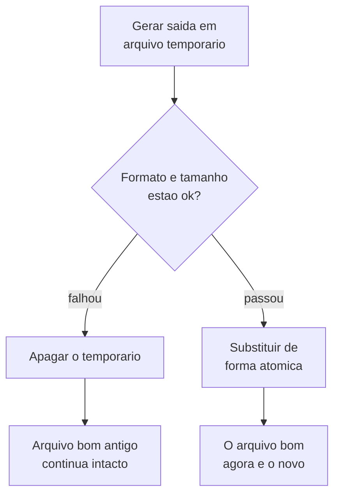
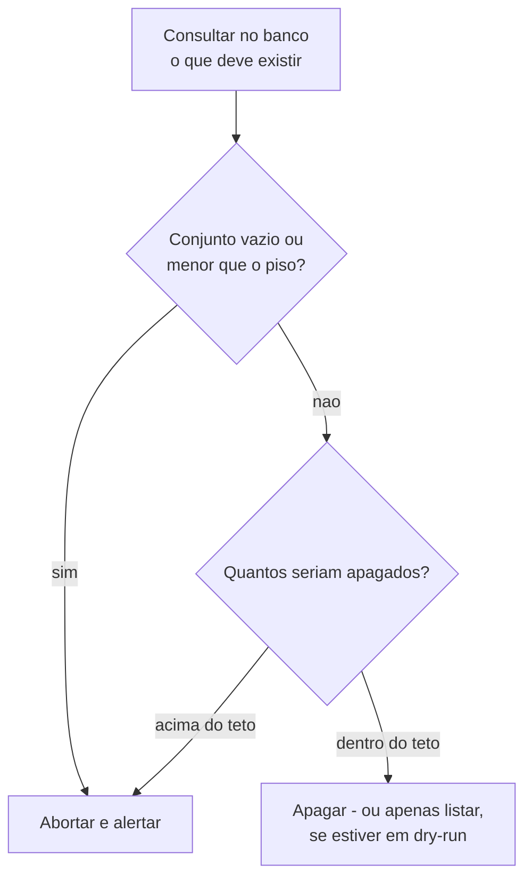
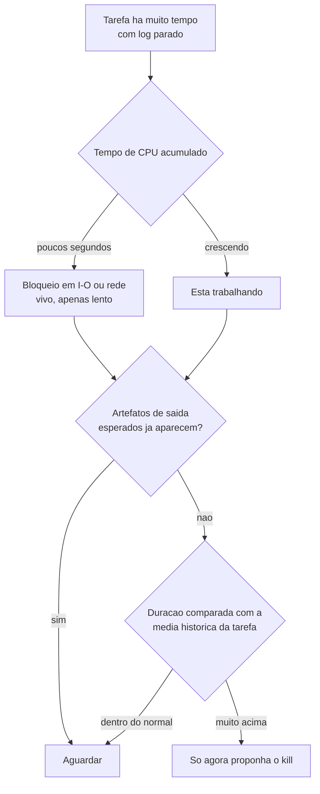

# Automação, jobs agendados e ETL

## Toda tarefa agendada precisa de um arquivo de status legível por humano

**Sintoma:** a automação parou de rodar semanas atrás e ninguém notou, porque "não
apareceu erro".

**Causa:** falha silenciosa é o modo de falha padrão de job agendado — quem não roda também
não avisa. E o agendador só registra o código de saída, que ninguém olha.

**O que é "falha silenciosa", e por que ela é o padrão:** um job agendado não tem plateia. Se
ele termina bem, ninguém olha; se ele termina mal, também ninguém olha — a menos que alguém
tenha construído o canal de aviso. Um job que simplesmente **deixou de ser disparado** é ainda
pior: não gera nem log nem código de saída, porque não houve execução alguma.

**Exemplo concreto:** um backup noturno roda às 3h. Em janeiro o disco de destino ficou
indisponível e o script morreu no segundo passo. Em março alguém precisa restaurar um arquivo
e descobre que o backup mais recente é de dezembro — três meses de nada, sem um único alerta.

**Regra:** toda rodada grava um arquivo de status com timestamp, resultado e causa da
falha, e sai com código diferente de zero quando falha. O check de saúde vira "a data
avançou?" em vez de "achei algum erro?".

```json
{"tarefa": "backup-noturno", "fim": "2026-03-14T03:12:00Z",
 "status": "erro", "causa": "destino inacessivel", "itens": 0}
```

Ler esse arquivo custa dois segundos, e a pergunta "a data de `fim` é de hoje?" é respondível
por qualquer pessoa, inclusive por outro script.

---

## O modo de morte mais comum de automação é a credencial expirar

**Sintoma:** vários jobs vermelhos de uma vez; parece que a rede, o banco ou o servidor caiu.

**Causa:** falha de infraestrutura costuma ser parcial e heterogênea. Expiração de
credencial derruba tudo que compartilha o mesmo segredo, simultaneamente e com mensagem
idêntica.

**Exemplo concreto:** numa segunda-feira, oito extrações falham entre 2h e 5h. A primeira
suspeita é queda de rede, e alguém abre chamado com a infraestrutura. Os oito tracebacks
trazem exatamente a mesma linha de login recusado: a senha do sistema de origem venceu no fim
de semana. Trinta segundos de leitura teriam poupado o chamado.

**Regra:** antes de investigar rede, runner ou banco, leia o traceback de **um** job. Se
todos têm a mesma mensagem de login, é credencial. Se os jobs equivalentes em outro
ambiente (que usa outro segredo) seguem verdes, isso confirma.

---

## Teste a tarefa agendada **pelo agendador**, não pelo seu terminal

**Causa:** rodar pelo agendador usa outro usuário, outro ambiente e outras permissões.

**Exemplo concreto:** o script de exportação roda perfeito no seu terminal — onde você já está
autenticado, o diretório de trabalho é o do projeto e uma variável de ambiente vem do seu
perfil de shell. Agendado, ele roda como conta de serviço, num diretório diferente, sem esse
perfil, e morre na primeira linha que lê a variável.

**Regra:** dispare manualmente pelo agendador e confirme o resultado. É o único teste que
vale. Tarefa nunca executada é exatamente o tipo de coisa que falha em silêncio na
primeira vez que importa.

---

## Automação que aborta deve preservar o estado anterior

**Sintoma:** uma falha transitória de rede não só interrompe a atualização como destrói o
dado bom que já existia.

**Causa:** scripts costumam limpar o destino antes de repovoar. Se a origem responde vazio
— por token revogado, filtro errado ou API instável — o resultado é apagar tudo e não
escrever nada.

**Exemplo concreto:** a sincronização diária de um catálogo apaga a tabela de produtos e
reimporta os 5.000 itens da API de origem. Num dia a API responde 200 com lista vazia. O
script apaga os 5.000 e insere zero, sem erro nenhum. A loja abre vazia.

**Regra:** antes de sobrescrever, valide que a origem devolveu algo plausível. Resposta
vazia com sucesso HTTP é um caso a tratar explicitamente: aborte sem tocar no destino.

**Como verificar:** teste o caminho de erro de propósito, com credencial inválida. Se o
resultado for destino zerado, o desenho está errado.

---

## Grave o novo, valide, só então substitua o bom

**Sintoma:** uma execução com rede instável troca um backup íntegro por um corrompido.
Você só descobre no dia em que precisa restaurar.

**Exemplo concreto:** o job noturno escreve direto por cima de `backup.zip`. Numa noite a rede
cai na metade da transferência. O arquivo existe, tem tamanho plausível e está truncado — e o
backup bom da véspera já não existe mais.



**O que "atomicamente" quer dizer aqui:** renomear um arquivo por cima de outro, dentro do
mesmo volume, é uma operação que o sistema de arquivos conclui de uma vez só — não existe
instante em que o destino esteja pela metade. Copiar por cima **não** tem essa garantia: se o
processo morre no meio da cópia, o destino fica quebrado.

**Regra:** grave como arquivo temporário, valide o formato, e só então substitua
atomicamente. Se a validação falhar, apague o temporário e mantenha o antigo — melhor um
backup velho e íntegro que um novo e quebrado.

---

## Todo coletor de lixo precisa de trava contra lista de referências vazia

**Sintoma:** uma rotina de limpeza de órfãos apaga o acervo inteiro.

**Causa:** a rotina monta o conjunto "o que deve existir" a partir do banco e apaga do
storage tudo que não está nele. Se a consulta falhar, voltar vazia ou a tabela ainda não
existir, **tudo** vira órfão.

**Exemplo concreto:** uma galeria guarda 40.000 fotos no storage e a lista do que é válido no
banco. Na madrugada de terça a consulta falha por timeout, e o erro é tratado como "nenhum
registro encontrado". A rotina conclui, com toda a lógica correta, que as 40.000 fotos são
órfãs.



**O que é dry-run:** um modo em que a rotina percorre toda a lógica e **imprime** o que faria,
sem executar nenhuma exclusão. É a forma barata de revisar uma decisão destrutiva antes que
ela seja tomada — e a lista impressa é justamente onde "40.000 arquivos" salta aos olhos.

**Regra:** antes de deletar, aborte se o conjunto de referências estiver vazio ou
implausivelmente pequeno. Adicione teto por execução e um modo dry-run que só lista.

---

## Reconciliação só deve tocar no que já esfriou

**Sintoma:** a rotina de conserto "conserta" itens que outro worker está processando neste
exato momento, duplicando trabalho e gastando chamadas pagas.

**Causa:** um item em processamento e um item abandonado têm o mesmo estado: "pendente".

**Exemplo concreto:** cada item leva até 3 minutos para ser processado. A rotina de conserto
roda a cada 5 minutos e recolhe tudo que está "pendente" — inclusive os itens que entraram na
fila há 30 segundos e estão perfeitamente vivos. Resultado: cada item é processado duas vezes,
e cada processamento custa uma chamada paga.

**Regra:** filtre por idade — só reconcilie pendentes com mais de N minutos. A janela deve
ser maior que a duração máxima esperada de um lote normal.

---

## Grave um marcador sentinela para "processado, resultado vazio"

**Sintoma:** toda varredura reprocessa os mesmos itens indefinidamente, gastando chamadas
pagas.

**Causa:** "sem resultado" e "nunca processado" são indistinguíveis quando ausência de
linha é o único sinal.

**O que é uma linha sentinela:** um registro gravado apenas para dizer "eu já olhei aqui e não
havia nada". Ele não representa um dado de negócio; representa **o fato de a busca ter
acontecido**. É o que separa "vazio porque não existe" de "vazio porque ninguém perguntou".

**Exemplo concreto:** um enriquecimento consulta uma API externa para cada um dos 10.000
clientes. Trezentos deles não têm dado nenhum lá. Sem sentinela, toda madrugada o job consulta
esses mesmos 300 de novo, para sempre, pagando por consulta — e o número nunca diminui.

**Regra:** ao processar e não encontrar nada, grave uma linha sentinela. As consultas de
negócio filtram a sentinela; as consultas de "o que falta processar" a respeitam.

---

## Log vazio de processo em execução não é sinal de travamento

**Sintoma:** tarefa marcada como "em execução" há horas com log de duas linhas; a tentação
é matar o processo.

**Causa:** scripts bufferizam a saída — enquanto o processo vive, o arquivo fica vazio ou
truncado. Tamanho de log não é medida de progresso.

**O que é bufferização de saída:** por eficiência, o interpretador acumula o texto impresso
numa área de memória e só grava em disco quando ela enche — tipicamente alguns kilobytes — ou
quando o processo termina. Enquanto isso, quem olha o arquivo de log está vendo o passado, ou
nada. Um processo pode ter percorrido metade do trabalho sem ter escrito uma linha sequer.

**Exemplo concreto:** uma importação de planilha com 2 milhões de linhas está há 40 minutos
"rodando", com um log de duas linhas escritas no início. Matar o processo joga fora os 40
minutos e ainda deixa a carga pela metade.



**Regra:** antes de declarar travamento, junte três evidências independentes: (1) tempo de
**CPU acumulado** do processo — poucos segundos de CPU em muitos minutos significa bloqueio
em I/O, não travamento; (2) os artefatos de saída esperados já existem? (3) a duração
comparada com a média histórica da mesma tarefa. Só com as três, proponha o kill.

**Como verificar:** para log em tempo real, rode o interpretador em modo não-bufferizado.

```bash
python -u script.py > job.log 2>&1     # -u desliga o buffer
PYTHONUNBUFFERED=1 python script.py    # mesma coisa, por variavel de ambiente
```

---

## Condição de espera por "nenhum processo X rodando" nunca se satisfaz

**Sintoma:** um watcher fica preso para sempre esperando algo que já terminou.

**Causa:** máquina de trabalho tem processos do mesmo interpretador rodando o tempo todo.
Usar "não existe processo com esse nome" como sinal confunde o seu processo com os dos
outros.

**Exemplo concreto:** o watcher espera até que "não exista mais nenhum processo `python`". Na
mesma máquina há um editor com plugin em Python, um servidor de desenvolvimento e outro job
agendado. A condição nunca fica verdadeira, e o watcher espera a noite inteira por um job que
terminou em oito minutos.

**Regra:** espere pelo artefato que o trabalho produz, ou pelo PID específico que você
lançou. Nunca por ausência genérica de processo.

---

## Timeout no processo não mata o container

**Sintoma:** após um timeout, o processo local morre mas o container continua rodando,
segurando CPU, disco e o volume montado.

**Causa:** matar o cliente `docker run` não mata a carga no daemon.

**Regra:** sempre passe `--name <nome-único>` e, no tratamento de timeout, execute
`docker rm -f <nome>`. Gere o nome com sufixo aleatório para permitir execuções
concorrentes.

```bash
NOME="conversao-$(date +%s)-$RANDOM"
docker run --name "$NOME" imagem:tag ... || true
docker rm -f "$NOME" >/dev/null 2>&1   # roda tambem no caminho de timeout
```

---

## Variável de CI com host de rede interna não resolve em job comum

**Sintoma:** pipeline **verde**, mas o passo de espelhamento não gravou nada; o erro é um
`EndpointConnectionError` perdido no meio do log.

**Causa:** a variável foi definida no escopo mais amplo com um nome que só resolve dentro de
uma rede privada. Em job que roda o processo direto no runner, esse nome não existe. E o
passo era best-effort, então não derrubou o build.

**O que é um passo "best-effort":** um passo escrito para nunca falhar o pipeline — na prática,
o comando termina com `|| true` ou tem o erro engolido. A intenção é boa (não derrubar o build
por causa de algo secundário), mas sem um log de erro **visível** ele vira um passo que nunca
funcionou e nunca reclamou.

**Regra:** variáveis com endereço de rede interna nunca vão no escopo amplo. Defina no escopo
do projeto, com o endereço externo — o escopo mais específico sobrescreve o mais amplo. E
qualquer passo não-fatal precisa logar erro visível.

**Como verificar:** confira o **efeito** (o objeto apareceu no destino?), nunca a cor do
pipeline.

---

## Variável errada em nível de grupo continua sendo uma bomba, mesmo sobrescrita

**Sintoma:** tudo funciona, porque a variável de projeto correta tem precedência.

**Causa:** precedência esconde o valor ruim; quem apagar a de projeto no futuro cai
silenciosamente no valor errado.

**Exemplo concreto:** o grupo define o endereço do banco apontando para uma máquina que já foi
desligada. Cada projeto redefine a variável com o valor certo, então ninguém percebe. Um ano
depois, alguém cria um projeto novo — que herda o valor do grupo — e passa a tarde procurando
o erro no código.

**Regra:** corrija o valor no nível de grupo para que o fallback também esteja certo. Antes
de mexer, mapeie quem realmente consome aquela variável.

---

## Isole automação nova do pipeline crítico

**Sintoma:** um passo novo, útil porém secundário, é enxertado no pipeline que sustenta o
relatório mais importante — e passa a poder derrubá-lo.

**Exemplo concreto:** o pipeline que gera o relatório de fechamento ganha, no fim, um passo
que copia os arquivos para um bucket de arquivamento. Um dia a credencial do bucket expira. O
passo falha, o pipeline fica vermelho, e o relatório — que já estava pronto e correto — não é
publicado.

**Regra:** rotina auxiliar (backup, espelhamento, exportação) roda **fora** do pipeline
crítico. Documente explicitamente que é exceção consciente à convenção e por quê. Antes,
confirme que ninguém consome o artefato que você vai sobrescrever.

---

## Priorize no backup o dado digitado à mão

**Sintoma:** um desastre destrói uma tabela pequena de parâmetros e a única forma de
recuperar é perguntar às pessoas o que estava lá.

**Causa:** o plano de backup cobria as tabelas grandes de pipeline — justamente as que são
reconstruíveis rodando a extração de novo.

**Exemplo concreto:** o backup cobre com carinho a tabela de 80 milhões de linhas de eventos —
que pode ser reconstruída em duas horas rodando a extração de novo. Fora do backup ficou uma
tabela de 40 linhas com as regras de comissão, digitadas uma a uma ao longo de dois anos. As
40 linhas são as insubstituíveis.

**Regra:** classifique cada tabela em "reproduzível pelo pipeline" e "digitada
manualmente". A segunda é a que precisa de backup, mesmo tendo poucas linhas. Snapshot
manual **não é backup**: se não tem agendamento, envelhece.

**Como verificar:** faça o dump por leitura **somente-leitura** do banco, garantindo que a
rotina de backup nunca escreve na origem.

---

## Troca de fonte de dados se valida em tabelas paralelas

**Sintoma:** você troca a origem de um relatório e não tem como provar que melhorou.

**Causa:** escrever direto nas tabelas vivas destrói a base de comparação.

**Exemplo concreto:** a fonte antiga preenchia o campo de peso em 60% dos registros. Você
troca por uma fonte nova, grava por cima, e agora não há como responder à pergunta óbvia da
reunião: "melhorou quanto?". Com a tabela de staging ao lado, a resposta é "de 60% para 95%",
e a conversa acaba em um minuto.

**Regra:** rode o pipeline novo gravando em tabelas de staging e meça a mesma métrica de
negócio nas duas versões. Só promova com o número na mão — e esse número é o que se
comunica ao stakeholder.

---

## Dado congelado: descubra qual fonte dirige a data antes de culpar o código

**Sintoma:** uma tabela de conciliação para de receber registros; a suspeita cai sobre o
pipeline que acabou de mudar.

**Causa:** a tabela era dirigida por **outra** fonte (um arquivo que alguém deposita numa
pasta), que parou de ser alimentada. As demais estavam frescas e só faziam enriquecimento.

**Regra:** num build com várias fontes, identifique qual define a **contagem de linhas e a
data máxima**; as outras só preenchem colunas. Quando a causa é operacional, o registro
precisa dizer isso claramente — é cobrança, não bug.

---

## Leitor de CSV novo pode trocar string vazia por NULL

**Sintoma:** depois de migrar a leitura para outro motor, JOINs e filtros por `= ''` param
de casar.

**Exemplo concreto:** o motor antigo lia a célula em branco como `''`; o novo lê como `NULL`.
O filtro `WHERE observacao = ''` que devolvia 3.000 linhas passa a devolver zero — e `NULL`
nem sequer é igual a `NULL`, então o JOIN por essa coluna também emudece. Nenhum erro é
levantado em lugar nenhum.

**Regra:** ao trocar o motor, compare o resultado campo a campo numa amostra e preserve
explicitamente a convenção anterior até que os consumidores sejam ajustados. Ler CSV
desconhecido com todas as colunas como texto evita inferência de tipo instável entre
arquivos.

---

## `str(asyncio.TimeoutError())` é string vazia

**Sintoma:** o job termina com `error: ""` e você não sabe o que aconteceu.

**Causa:** algumas exceções não têm argumentos.

**Regra:** em logging genérico, sempre `str(e) or type(e).__name__`.

```python
except Exception as e:
    logger.error("falhou: %s", str(e) or type(e).__name__)
```

---

## Sempre use execução destacada para tarefas longas em servidor

**Exemplo concreto:** você inicia uma carga de 4 horas por SSH e vai almoçar. O Wi-Fi cai, a
sessão morre, o processo morre junto — e o log, que estava só na tela, some com ela. Não há
nem resultado nem pista de onde parou.

**Regra:** `nohup cmd &`, `tmux` ou `screen` — e redirecione a saída para arquivo, senão
você perde o log junto com a sessão.

```bash
nohup python -u carga.py > /var/log/carga.log 2>&1 &
echo $! > /var/run/carga.pid          # guarde o PID para poder esperar por ele
```

---

## Serviço que manda a saída para `/dev/null` esconde prompt bloqueante

**Sintoma:** o serviço está "ativo", o processo existe, a conta é a certa — e mesmo assim
ele nunca faz o que deveria.

**Causa:** o programa parou numa pergunta interativa que nunca seria respondida. Como a
unit descartava a saída, o travamento foi mudo.

**Exemplo concreto:** um agente sobe como serviço e fica "ativo" por dias sem produzir nada.
Redirecionando a saída para um arquivo e reiniciando, a primeira linha é uma pergunta do tipo
"confia neste diretório? [s/N]" — esperando um teclado que não existe.

**Regra:** processo vivo **não** prova serviço funcional; a prova é o efeito observável. Ao
diagnosticar, redirecione temporariamente a saída para um arquivo, reinicie e leia. Quando
a causa for um diálogo de confiança, a solução é marcar o consentimento no arquivo de
configuração antes de subir o serviço.

---

## Só escreva em arquivo de configuração compartilhado sabendo como a outra automação o manipula

**Sintoma:** sua entrada some sozinha depois de um tempo.

**Causa:** outro processo regenera o arquivo inteiro em vez de fazer append.

**Regra:** leia o código do outro automatismo antes de editar à mão. Se ele reescreve o
arquivo, a edição precisa ir para a fonte dele.

---

## `rsync` sem `-c` torna o dry-run inútil depois de um clone novo

**Sintoma:** o `--dry-run` lista **todos** os arquivos como alterados.

**Causa:** por padrão o rsync compara tamanho e mtime; um clone recente reescreve o mtime
de tudo, mesmo com conteúdo idêntico.

**Exemplo concreto:** você clona o repositório numa máquina nova para publicar uma correção de
uma linha. O dry-run lista os 4.000 arquivos do projeto como modificados, e a revisão que
deveria durar dez segundos vira uma decisão às cegas.

**Regra:** em deploy por rsync a partir de um clone, use `-c` (checksum). Mais lento, porém
é o que dá um dry-run legível. Peça confirmação entre o dry-run e o envio, e valide o
destino ao final.

```bash
rsync -avc --delete --dry-run ./build/ usuario@host:/var/www/app/
# revise a lista curta, confirme, e so entao repita sem --dry-run
```

---

## Erro transitório de rede em job incremental e atômico se resolve no próximo ciclo

**Sintoma:** um job que transfere muitos arquivos termina com um punhado de erros — `502 Bad
Gateway`, conexão resetada no meio do stream — e sai com código de falha, mas nada no que já
baixou está corrompido.

**Causa:** sob volume, proxies e armazenamentos de objeto devolvem erros esporádicos. Se cada
arquivo é baixado de forma **atômica** (grava num temporário e só promove ao nome final
depois de conferir o tamanho) e o job **pula o que já está igual**, esses erros deixam apenas
os arquivos que falharam pendentes — nunca meia-cópia com nome definitivo.

**Exemplo concreto:** um espelho de dezenas de gigabytes fecha com "7 erros" numa rede
instável. Como o job é incremental, rodá-lo de novo lista tudo, pula os milhares já íntegros
e baixa só os 7 que faltaram — zerando os erros. Sem atomicidade, um dos 7 teria virado
arquivo pela metade com o tamanho "quase certo" e passaria despercebido para sempre.

**Regra:** projete jobs de transferência para serem **idempotentes** (pule por tamanho ou
hash) e **atômicos** (temporário → renomeia só após validar). Aí "COM_ERROS(n)" com n pequeno
é operação normal: re-rodar resolve. Só investigue se o número não cair entre execuções.
Nunca contabilize um erro transitório como perda antes de tentar de novo.

```python
tmp = destino + ".part"
baixar(url, tmp)
if os.path.getsize(tmp) == tamanho_esperado:
    os.replace(tmp, destino)   # promocao atomica; retomavel no proximo ciclo
else:
    os.remove(tmp)             # deixa pendente, sem enganar a proxima rodada
```

---

## Pipeline verde não prova que o dado chegou ao destino

**Sintoma:** o painel de CI está todo verde, mas você não consegue afirmar que os números
que o usuário final vê estão atualizados hoje.

**Causa:** "job concluído com sucesso" e "dado fresco no destino" são fatos diferentes. Um
pipeline pode sair com código 0 tendo gravado num lugar (um armazenamento intermediário) e
não no banco que o painel lê; ou pode ter rodado num executor que só alcança metade da rede
e nem chega ao destino final.

**Exemplo concreto:** 21 de 22 pipelines verdes no CI. Mesmo assim, a prova de que a rodada
do dia serviu para algo é abrir o **destino** (a tabela que o painel consome) e conferir o
carimbo de última execução — e confirmar que o job rodou no executor que enxerga esse
destino, não num que alcança só parte da infraestrutura.

**Regra:** audite em três frentes independentes — (1) o CI está verde; (2) o executor certo
rodou; (3) o dado no destino final está fresco. Verde no CI é condição **necessária, não
suficiente**. Tenha uma consulta de frescor no destino como parte da rotina, não só o status
do job.

```sql
-- o verde do CI tem que se refletir aqui, no destino que o painel le
SELECT max(dt_execucao) AS ultima_carga FROM destino.tabela_do_painel;
```

---

## Orquestrador que não checa `returncode` roda a etapa seguinte sobre a falha da anterior

**Sintoma:** O pipeline imprime "finalizado com sucesso" mesmo quando a primeira etapa falhou, e as camadas posteriores processam dado antigo ou vazio sem reclamar.

**Causa:** O script orquestrador roda cada etapa com `subprocess.run(..., capture_output=True)`, imprime `stdout`/`stderr`, mas nunca inspeciona `resultado.returncode`. A cadeia é incondicional: a etapa 2 roda faça o que fizer a etapa 1.

**Exemplo concreto:** A extração de arquivos de uma fonte externa falha (fonte fora do ar). Como ninguém checa o código de saída, os passos "salvar → normalizar → agregar" rodam mesmo assim sobre o CSV da rodada anterior, e o print final comemora com um emoji.

**Regra:** Toda etapa de um orquestrador tem que checar o código de saída e abortar a cadeia (ou propagar a exceção). "Rodou sem exception no orquestrador" não é "a etapa deu certo".

```python
r = subprocess.run(["python", script], capture_output=True, text=True)
if r.returncode != 0:
    raise SystemExit(f"{script} falhou ({r.returncode})\n{r.stderr}")
```

---

## Detectar status por substring: "unpaid" contém "paid"

**Sintoma:** Um parser que classifica e-mails/documentos por palavra-chave marca itens como o oposto do que são — faturas em aberto aparecem como pagas.

**Causa:** Teste de status feito com `substring in texto`. A palavra do estado negativo **contém** a do positivo, então o `in` casa nos dois casos.

**Exemplo concreto:** `status = "Paid" if "paid" in body.lower() else "Pending"`. O corpo diz "Status: unpaid" → `"paid" in "...unpaid..."` é `True` → a fatura não paga vira "Paid". O mesmo vale para "not paid", "non-payment", etc.

**Regra:** Nunca derive estado por `substring in`. Case por token/limite de palavra (regex com âncora de palavra) e teste o caso negativo **primeiro**. Melhor ainda: extraia o campo estruturado, não faça match no texto solto.
