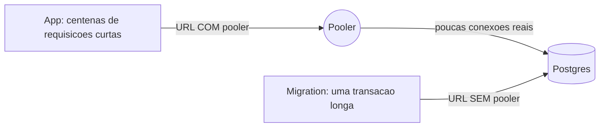
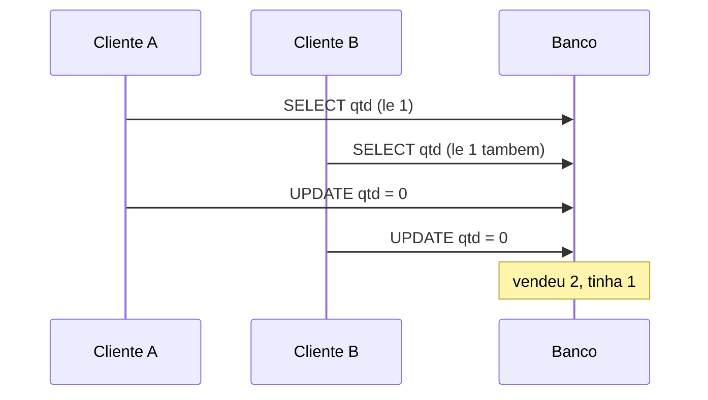
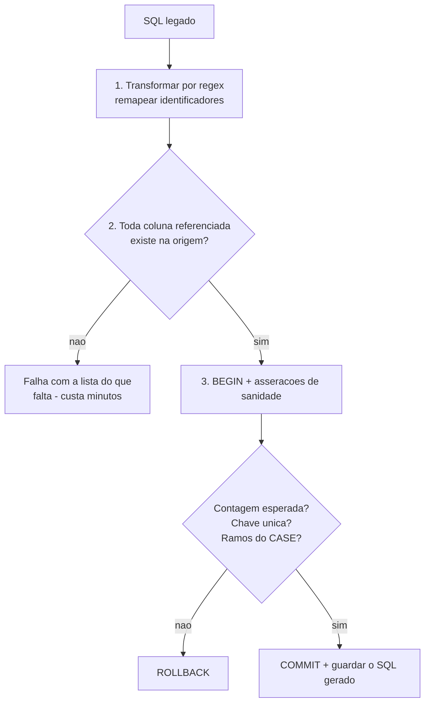
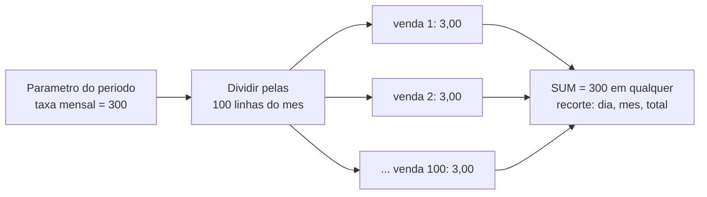

# Banco de dados

## Integrações gerenciadas criam seis connection strings quase iguais

**Sintoma:** a aplicação funciona, mas a migration falha com erro de conexão ou timeout de
transação. Ou o inverso.

**Causa:** integrações de Postgres gerenciado criam meia dúzia de URLs para o mesmo banco,
variando em dois eixos: passa pelo pooler ou não, e quais parâmetros de query carrega
(`sslmode`, timeout de conexão, ligação de canal). Nomes diferentes podem ter o mesmo valor,
e **nomes sinônimos podem ter valores diferentes** — duas variáveis chamadas `_UNPOOLED` e
`_NON_POOLING` podem não ser a mesma coisa, apesar do nome sugerir.

**O que é um pooler, e por que ele quebra migration:** um pooler fica entre a aplicação e o
banco, reaproveitando um punhado de conexões reais entre centenas de clientes. Em "modo
transação" ele devolve a conexão ao pote assim que a transação fecha — ótimo para requisições
curtas, fatal para qualquer coisa que dependa de estado que atravessa transações: `CREATE
INDEX` longo, advisory lock, statement preparado.



**Exemplo concreto:** um blog com 200 leitores simultâneos usa a URL com pooler — cada
requisição pega uma conexão emprestada por 30 ms e devolve. Mas a migration que cria um
índice em 2 milhões de linhas precisa da URL sem pooler: ela segura a conexão por minutos, e
o pooler a arrancaria no meio.

**Regra:** runtime da aplicação usa a URL **com** pooler; migrations e DDL usam a **sem**
pooler. A variante sem `sslmode` só serve para debug local. Documente qual é qual, porque não
dá para deduzir pelo nome.

**Como verificar:** diferencie pelo host (o do pooler costuma ter sufixo próprio) e pela
query string, nunca pelo nome da variável.

---

## Em Postgres serverless, prefira o adaptador HTTP ao WebSocket

**Sintoma:** erro de adapter no login e, nos logs, um crash fatal do Node
(`ERR_INVALID_ARG_TYPE`) dentro da classe `WebSocket`; a interface mostra apenas um erro
genérico de configuração.

**Causa:** o adaptador padrão usa uma biblioteca de WebSocket para falar com o pooler. Em
runtime serverless — onde o processo nasce e morre a cada requisição — essa combinação
(WebSocket não-nativo + pooler + conexões efêmeras) é frágil: a função pode encerrar antes do
handshake completar.

**Exemplo concreto:** sua rota de login funciona local, onde o processo é longo e o WebSocket
se estabelece uma vez. Em produção serverless cada chamada abre um WebSocket novo, às vezes
morre antes de terminar, e o erro chega ao usuário como "não foi possível entrar".

**Regra:** use a variante HTTP do adaptador, que trafega em 443 via `fetch` nativo — sem
socket persistente, compatível com o ciclo de vida de uma função. Aponte-o para a string
**não pooled** quando disponível.

---

## `relation "x" does not exist` significa que a migração não faz parte do deploy

**Sintoma:** o deploy fica verde e a primeira requisição devolve erro 500 dizendo que a
tabela não existe.

**Causa:** o deploy publicou o código sem aplicar o DDL. O build gera o cliente do ORM — que
é só código — mas ninguém rodou o comando que altera o banco.

**Exemplo concreto:** você adiciona o modelo `Comentario` no schema e faz push. O build passa,
porque o cliente compilou. A primeira pessoa que abre um post recebe 500: o banco de produção
nunca ouviu falar de `Comentario`.

**Regra:** esquema versionado e aplicado no pipeline. Rota administrativa de setup, se
existir, é idempotente, autenticada e temporária — criar a tabela por um endpoint improvisado
só transfere o problema para o próximo ambiente.

**Como verificar:**
```sql
SELECT to_regclass('public.minha_tabela');   -- NULL = não existe
```

---

## DDL idempotente em tempo de requisição: atalho legítimo com prazo de validade

**Sintoma:** rotas chamando `CREATE TABLE IF NOT EXISTS` no caminho quente, a cada
requisição.

**Causa:** sem ferramenta de migração no projeto, é a forma mais rápida de garantir o esquema
logo após o deploy — e realmente evita a classe de bug do item anterior.

**Exemplo concreto:** um projeto de uma pessoa só, um ambiente só. A primeira linha da rota
garante que a tabela existe. Funciona, e o custo é um comando barato por requisição. O
problema aparece quando entra o segundo dev, surge o ambiente de staging, e a tabela já tem
milhões de linhas — aí um `ALTER TABLE` idempotente pode pegar lock e travar produção.

**Regra:** aceitável em projeto pequeno **desde que** a DDL seja estritamente idempotente,
esteja isolada num `try/catch` que não derrube a requisição, e rode em um ponto único — não
espalhada por dezenas de handlers. Com mais de um ambiente ou mais de um dev, migre para
migrações versionadas.

**Como verificar:** se `git grep -c "IF NOT EXISTS"` cresce a cada sprint, passou da hora.

---

## `operator does not exist: uuid = text` é erro de modelagem

**Sintoma:** um JOIN ou uma chave estrangeira é rejeitado com essa mensagem.

**Causa:** a tabela nova foi criada com a coluna de referência como `TEXT` enquanto a chave
primária referenciada é `UUID`. PostgreSQL não faz coerção implícita entre esses tipos — e
está certo em não fazer.

**Exemplo concreto:** `usuarios.id` é `UUID`. Alguém cria `comentarios.usuario_id` como
`TEXT`, porque "o valor é uma string mesmo". O JOIN quebra. A tentação é remover a constraint
para o erro sumir — e a partir daí entram `usuario_id` que não correspondem a nenhum usuário,
silenciosamente, para sempre.

**Regra:** confira o tipo real da chave primária antes de criar tabelas dependentes.
**Nunca** remova a chave estrangeira só para o erro sumir.

---

## Leitura-modificação-escrita em estoque entrega o último item duas vezes

**Sintoma:** dois clientes compram a última unidade no mesmo instante, e os dois conseguem.

**Causa:** `SELECT` → subtrai em memória → `UPDATE` não é atômico. Entre a leitura e a
escrita cabe a leitura de outra pessoa.



**Regra:** atualização condicional atômica — quem decide é o banco, não a aplicação:

```sql
UPDATE produtos SET qtd = qtd - 1 WHERE id = $1 AND qtd >= 1;
```

Verifique o número de linhas afetadas: `0` significa que não havia estoque, e a venda deve
falhar.

**Como verificar:** dispare várias requisições concorrentes com o estoque em 1 e confirme que
só uma passa.

---

## `include` de ORM para "só contar" carrega todas as linhas filhas

**Sintoma:** o feed fica progressivamente mais lento conforme o engajamento cresce, sem
nenhuma consulta aparentemente pesada.

**Causa:** o include trazia **todas** as reações de cada post apenas para exibir o número
delas e saber se o usuário atual já reagiu.

**Exemplo concreto:** 20 posts na tela, cada um com 500 curtidas. O ORM traz 10 mil linhas do
banco, serializa e manda pela rede — para mostrar o número "500" vinte vezes.

**Regra:** substitua por `groupBy` agregando por chave, mais uma consulta única do que é do
usuário logado. Contadores devem ser agregação ou coluna materializada, nunca carregamento de
coleção.

---

## Toda tabela materializada precisa nascer com plano de atualização

**Sintoma:** o relatório funciona no dia da entrega e, semanas depois, mostra dados velhos
sem nenhum aviso.

**Causa:** diferente de uma view, uma tabela criada por `CREATE TABLE AS SELECT` é um
**snapshot**: uma fotografia do momento. A origem continua mudando; a fotografia não.

**Exemplo concreto:** você cria `resumo_vendas_mensal` a partir de um `SELECT` pesado para o
painel abrir rápido. Em março o painel mostra os números de janeiro, e ninguém percebe —
porque os números *parecem* plausíveis.

**Regra:** se a escolha for tabela — comum quando a ferramenta de BI trabalha melhor com
tabela física — a entrega **inclui** o mecanismo de refresh: job agendado, passo no pipeline,
ou repontar o pipeline para gravar direto no nome esperado. Registre também a dependência
entre tabelas.

---

## Alias de schema com views reconecta painel legado sem tocar no painel

**Sintoma:** um relatório antigo quebra porque o pipeline novo passou a gravar em outro
schema, e reapontar dezenas de consultas dentro do arquivo do painel é caro.

**Causa:** a referência `schema.tabela` está gravada dentro do arquivo do painel, repetida em
cada consulta.

**Exemplo concreto:** o painel procura `antigo.vendas`. O pipeline novo grava em
`novo.vendas`. Em vez de editar 40 consultas à mão:

```sql
CREATE SCHEMA antigo;
CREATE VIEW antigo.vendas AS SELECT * FROM novo.vendas;
```

O painel abre sem saber que mudou nada.

**Regra:** trate como ponte temporária e remova quando o painel for oficialmente reapontado —
ponte esquecida vira cópia redundante que alguém vai ter que manter.

---

## Auditoria de objeto órfão exige três frentes — e busca por nome cru

**Sintoma:** você está prestes a apagar uma tabela grande "sem uso" e descobre, tarde, que
ela alimentava um painel.

**Causa:** as referências a uma tabela vivem em lugares que não se conversam: o código dos
pipelines, o catálogo do banco, e **dentro dos arquivos binários das ferramentas de BI**.

**Exemplo concreto:** o `grep` no código não acha nada. O catálogo não acha nada. Mas o
arquivo do painel — que é um zip — contém a referência, escrita com um formato de aspas
diferente do que você procurou. Você apaga, e o relatório quebra na segunda-feira.

**Regra:** antes de aposentar um objeto, cheque as três frentes: (1) grep do nome em todos os
repositórios; (2) dependências no catálogo do banco; (3) busca do nome **cru, como
substring**, dentro dos arquivos de painel — extraia o zip e busque nos membros decodificando
tanto em UTF-16LE quanto em UTF-8. Cuidado com nomes que são prefixo de outros: procurar por
`vendas` acha `vendas_2023` e te dá um falso positivo tranquilizador.

---

## Coluna "que falta no banco" pode ser medida calculada no modelo de BI

**Sintoma:** o painel referencia dezenas de campos que não existem em nenhuma tabela; parece
que falta metade do modelo de dados.

**Causa:** são medidas e colunas calculadas definidas no próprio arquivo do painel, derivadas
de colunas físicas que já existem.

**Exemplo concreto:** o painel usa `Margem %`. Não existe coluna `margem` em lugar nenhum — é
uma fórmula dentro do painel, calculada a partir de `receita` e `custo`, que existem.

**Regra:** ao reconectar um painel, separe as referências em "colunas físicas" (precisam
existir no banco) e "medidas" (não exigem mudança nenhuma). Reduz drasticamente o trabalho.

**Risco associado, que vale registrar:** regra de negócio que só existe dentro do arquivo do
painel **se perde junto com o arquivo**, e não passa por revisão de código. O ideal é
materializá-la no pipeline.

---

## "Quebrou o agrupar por mês" quase nunca é o banco

**Sintoma:** depois de trocar a fonte de dados, os totais continuam certos mas a quebra por
período some, ou repete o mesmo valor em todos os meses.

**Causa:** a relação entre a tabela de datas e a tabela de fatos se perdeu no modelo do
painel. Sem ela, o painel não sabe ligar "março" às linhas de março — então repete o total.

**Regra:** após qualquer troca de fonte, revise as relações do modelo **antes** de investigar
as consultas. O sintoma parece de SQL e a causa é de modelagem.

---

## Dados legados vêm com espaço à esquerda e NBSP à direita

**Sintoma:** um JOIN que "deveria casar 100%" casa 0%. Ou pior: casa 60%, e você acha que é
problema de cobertura de dados.

**Causa:** o valor de um lado tem caracteres invisíveis que o outro não tem — padding de
sistemas antigos, que gravavam campos de largura fixa, e `\xa0`, o espaço não separável,
vindo de qualquer coisa que passou por HTML.

**Exemplo concreto:** `"  12345"` de um sistema legado versus `"12345"` do sistema novo são
strings diferentes para o banco. E `"João\xa0Silva"` copiado de uma página web nunca vai casar
com `"João Silva"` digitado à mão.

**Regra:** normalize os dois lados — troque o NBSP por espaço comum **antes** do trim, senão o
trim não o remove:

```sql
btrim(replace(col, chr(160), ' '))
```

**Como verificar:** compare a taxa de casamento antes e depois. Diferenças residuais de
fração de 1% costumam ser frescor de dado, não encoding.

---

## Timestamp com offset precisa ser normalizado antes de comparar

**Sintoma:** a tabela parece desatualizada em algumas horas — ou, mais confuso ainda,
"atualizada no futuro".

**Causa:** o banco grava com o offset local do servidor e o orquestrador de CI registra em
UTC. Comparar os dois crus dá uma diferença que é só fuso.

**Regra:** compare sempre em UTC, convertendo explicitamente. Não faça aritmética de fuso na
mão — horário de verão e mudanças de legislação transformam "somar 3 horas" em bug sazonal.

**Detalhe que atrapalha a auditoria:** a coluna que indica frescor varia de nome entre
tabelas, e algumas simplesmente não têm nenhuma. Identifique a de cada tabela antes de sair
comparando.

---

## Migração de procedure legada: transforme por regex, valide, execute em transação

**Sintoma:** reescrever à mão uma procedure de centenas de linhas introduz erros silenciosos
de mapeamento — uma coluna trocada que ninguém percebe até o número sair errado.

**Causa:** edição manual de centenas de referências não é auditável nem repetível.

**Regra:** o método que funciona tem quatro passos, e o segundo é o que salva:



Falhar cedo custa minutos; falhar no meio, com dados já alterados, custa horas.

**Detalhe de ambiente legado:** procedures que fazem `TRUNCATE` + `INSERT` sem `CREATE TABLE`
têm a estrutura implícita no `INSERT` — a tipagem precisa ser decidida explicitamente na
recriação, e é aí que entram os erros sutis.

---

## Renomeação inconsistente entre tabelas do mesmo pipeline

**Sintoma:** a migração falha no meio, depois de já ter alterado dados.

**Causa:** o pipeline novo normalizou os nomes de coluna em algumas tabelas e preservou os
antigos em outras. Não há regra global; há regra por tabela.

**Exemplo concreto:** você assume que tudo virou `MAIUSCULA_COM_UNDERSCORE` e escreve o
script inteiro nessa premissa. Metade das tabelas obedece. A outra metade mantém
`nome com espaco`, e o script morre na décima tabela — com as nove primeiras já processadas.

**Regra:** escreva a normalização como função mecânica e explícita, aplique
programaticamente, e **valide a existência de todas as colunas antes de executar qualquer
coisa**.

---

## `DISTINCT ON` substitui o `ROW_NUMBER` de origens já deduplicadas

**Sintoma:** a consulta migrada fica lenta e complexa reproduzindo uma janela que talvez não
seja mais necessária.

**Causa:** o `ROW_NUMBER() OVER (PARTITION BY ...) = 1` existia porque a origem **antiga**
trazia duplicatas. A origem nova já entrega uma linha por chave — a lógica virou cerimônia.

**Regra:** ao migrar, cheque se a duplicação ainda existe. Se existir, no PostgreSQL:

```sql
SELECT DISTINCT ON (chave) * FROM origem ORDER BY chave, data_evento DESC;
```

Mais curto e mais barato que a subquery com janela. Se não existir mais, remova a lógica —
mas mantenha uma asserção de unicidade no build, senão você troca uma consulta lenta por um
bug silencioso.

---

## Valor global do período cabe numa tabela por-item se for distribuído

**Sintoma:** você tem um valor único que vale para o período inteiro — uma taxa mensal, um
custo fixo — e precisa que ele apareça numa tabela cuja granularidade é por transação. Se
repetir o valor em cada linha, qualquer `SUM` devolve o valor multiplicado pela quantidade de
linhas.

**Exemplo concreto:** a plataforma cobra R$ 300 de taxa no mês. Houve 100 vendas naquele mês.
Gravando `300` em cada linha, a soma dá R$ 30.000. O truque é gravar `3,00` em cada uma:



**Regra:** divida o valor do período pela quantidade de linhas daquele período e grave a
fração em cada linha. A soma bate exatamente em **qualquer** recorte. Guarde o valor original
numa tabela de parâmetro datada, aplicando o registro vigente mais recente — assim uma
mudança de taxa no futuro não reescreve o passado.

**Como verificar:** `SUM(coluna_distribuida)` agrupado por período deve dar exatamente o
valor do parâmetro vezes o número de períodos.

---

## Cotas e limites são regra de servidor, com reset preguiçoso

**Sintoma:** usuários estouram cotas, ou o custo variável foge do controle.

**Causa:** controle apenas na interface, ou um job agendado de reset que falha em silêncio e
ninguém percebe.

**Exemplo concreto:** o plano gratuito permite 50 gerações por mês. Se o reset depende de um
cron que morreu em março, ou o usuário fica travado para sempre, ou ganha uso ilimitado —
dependendo de para que lado o bug caiu.

**Regra:** guarde contador **e** período no registro do usuário, e faça o reset **na
leitura**: se o período gravado é diferente do período atual, zera antes de checar. Sem job,
sem cron, sem nada para falhar.

O plano precisa ser argumento **obrigatório** da função de consumo — assumir o plano mais
generoso por omissão é o erro caro; assumir o mais restrito é o padrão seguro. Devolva
429/402 com o motivo e trate no cliente oferecendo o caminho degradado.

---

## Taxa agregada se recalcula do total somado, nunca pela média das taxas por linha

**Sintoma:** A taxa de um grupo (ex.: percentual por região) não bate com `numerador_somado / denominador_somado`; grupos com muitas linhas pequenas ficam distorcidos.

**Causa:** No `groupby` a agregação soma o numerador e o denominador, mas aplica `mean` numa coluna de taxa que já vinha pré-calculada por linha. Média de razões ≠ razão das somas, e a média ainda dá peso igual a uma linha gigante e a uma linha minúscula.

**Exemplo concreto:** `groupby(["estado","ano"]).agg({"confirmados":"sum","obitos":"sum","letalidade":"mean"})` — o certo para o grupo é `sum(obitos)/sum(confirmados)`, não a média aritmética das taxas por município/dia.

**Regra:** Agregue só os componentes brutos (`sum` do numerador e do denominador) e recalcule a taxa **depois** do `groupby`. Nunca leve uma coluna de razão pré-calculada para dentro de um `mean`.

---

## CSV de indicador de órgão público traz linhas de metadados no topo e coluna fantasma no fim

**Sintoma:** `read_csv` joga descrição do dataset dentro do cabeçalho, todas as colunas desalinham, e ainda sobra uma coluna sem nome no final da tabela.

**Causa:** Bases estatísticas de órgãos públicos prefixam algumas linhas de metadados antes do cabeçalho real e terminam cada linha com uma vírgula (gerando uma coluna vazia). Além disso publicam em **formato largo** — uma coluna por ano — que ferramenta de BI não consome direito.

**Exemplo concreto:** `pd.read_csv(path, skiprows=4)` para pular os metadados, seguido de `melt(id_vars=[...], var_name="Ano")` para virar formato longo; a coluna-ano fantasma cai como `Ano` não-numérico e é descartada no `to_numeric(errors="coerce")`.

**Regra:** Ao ingerir CSV de fonte estatística: `skiprows` para os metadados, descarte explicitamente a coluna fantasma do fim, e pivote largo→longo (`melt`) antes de carregar no BI. Não confie que o arquivo começa na linha 1.

---

## `CREATE DATABASE` sem qualificar o catálogo cai no catálogo default

**Sintoma:** O schema é criado sem erro, mas um `SHOW DATABASES IN outro_catalogo` logo depois não lista ele — parece que "não criou".

**Causa:** Num ambiente com múltiplos catálogos (lakehouse / catálogo de dev e prod), `CREATE DATABASE IF NOT EXISTS x` sem prefixo usa o catálogo **corrente/default** da sessão. Consultar um catálogo diferente procura no lugar errado. (De quebra, é `SHOW DATABASES`, no plural.)

**Exemplo concreto:** `spark.sql("CREATE DATABASE IF NOT EXISTS schema_x")` seguido de `spark.sql("SHOW DATABASES IN catalogo_desenv").show()` — o schema foi para o catálogo default, a listagem do `catalogo_desenv` volta vazia.

**Regra:** Qualifique sempre `catalogo.schema` no DDL, ou fixe o catálogo corrente (`USE CATALOG ...`) no início da sessão antes de criar e de consultar. Criar e verificar têm que apontar para o mesmo catálogo.

---

## Backend que usa a service_role do BaaS desliga o RLS — reaplique o escopo do tenant em toda query

**Sintoma:** Um usuário de uma unidade/filial consegue ver dados de outra unidade em algumas telas, mesmo com o "login funcionando" e a maioria das telas filtrando certo.

**Causa:** O backend acessa o banco com a chave secreta (service_role) do BaaS. Essa chave ignora o Row Level Security do Postgres, então nada no banco impede uma linha de vazar: a segurança por tenant passa a depender 100% de o código lembrar de aplicar o filtro em cada consulta. Uma rota que esquece o `.eq("unidade")` devolve o mundo inteiro.

**Exemplo concreto:** A maioria das rotas faz `if ctx['nivel'] < 9: query = query.eq("id_unidade", ctx['id_unidade'])`, mas a rota que lista a árvore de cursos faz só `db.table("cursos").select("*, modulos(*, aulas(*))")` sem nenhum filtro — ou seja, o escopo do tenant é opcional e frágil, decidido rota a rota.

**Regra:** Se o servidor usa a chave que bypassa RLS, trate o escopo do tenant como obrigação de código auditável: um único helper de query que já injeta o filtro de tenant, ou reative o RLS e faça o backend agir em nome do usuário. Nunca confie que "as outras rotas filtram".

---

## Ter um ORM não protege a query crua que você monta com template string

**Sintoma:** O app usa um ORM com métodos seguros (`findOne`, operadores de filtro), mas um campo de busca vindo da URL permite injeção de SQL — aspas, `OR 1=1` ou `;` mudam o resultado ou vazam dados.

**Causa:** Em algum ponto o código abandona o ORM e chama `query`/`raw` interpolando entrada do usuário direto na string SQL com template literal. A parametrização do ORM só vale nos métodos do ORM; a query montada à mão volta a ser concatenação vulnerável.

**Exemplo concreto:** A rota de listagem monta `... WHERE LOWER(nome) LIKE LOWER('${filtro}%')` no mesmo projeto que em outros lugares usa `findOne({ where: { email } })` corretamente. O `filtro` é o parâmetro de busca digitado pelo usuário.

**Regra:** Nunca interpole entrada em SQL. Use os métodos parametrizados do ORM, ou `query(sql, { replacements })` / bind `$1`. "Usar ORM no projeto" não é garantia — o furo aparece exatamente na query crua onde o ORM foi contornado.

```js
// ERRADO: query montada à mão dentro de um app que tem ORM
`WHERE LOWER(nome) LIKE LOWER('${filtro}%')`
// CERTO
sequelize.query('... WHERE nome ILIKE :f', { replacements: { f: `${filtro}%` } })
```

---

## `ddl-auto: update` deixa o ORM alterar seu schema sozinho no boot

**Sintoma:** Colunas e tabelas aparecem/mudam de tipo "sozinhas" a cada deploy; ninguém rodou migração e mesmo assim o banco mudou.

**Causa:** `spring.jpa.hibernate.ddl-auto: update` (padrão de muitos tutoriais) manda o Hibernate comparar as entidades com o banco e aplicar DDL automaticamente ao subir a aplicação. Ele **adiciona** o que falta, mas nunca remove nem corrige divergências — e você não tem controle nem histórico do que rodou.

**Exemplo concreto:** `application.yml` com `jpa.hibernate.ddl-auto: update` num app que aponta para um Postgres compartilhado: renomear um campo na entidade cria uma coluna nova e deixa a antiga órfã, sem aviso.

**Regra:** Em produção use `validate` (ou `none`) e versione o schema com migrações explícitas (Flyway/Liquibase). Deixe `update`/`create` só para protótipo local descartável.
