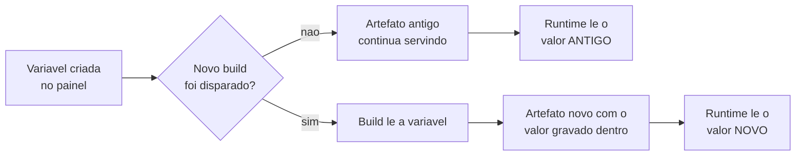
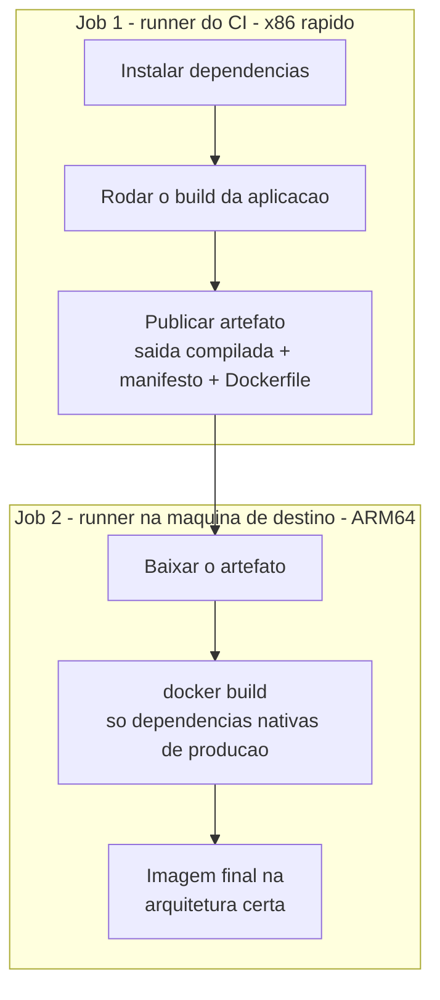
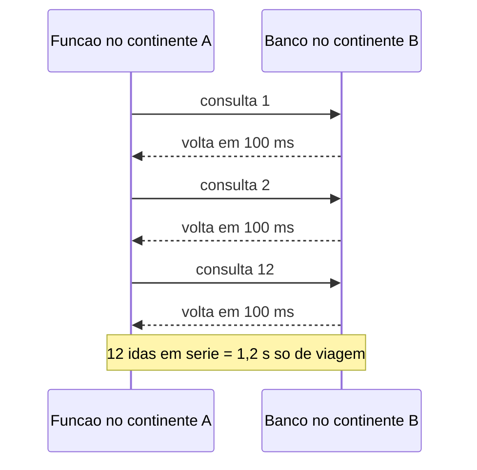

# Deploy, build e plataforma

## Variável de ambiente nova só vale no próximo deploy

**Sintoma:** você adiciona a variável no painel, a feature continua desligada, e a
suspeita cai sobre o código.

**Causa:** o valor é injetado no artefato durante o build. Sem novo build, o runtime
continua com o valor anterior. Pior: se o código tem fallback silencioso, ele cai no
caminho degradado sem avisar.

**Build-time versus runtime, em uma frase:** o build é o momento em que o código-fonte
vira um pacote pronto (o artefato); o runtime é o momento em que esse pacote atende
requisições. Variável lida no build fica **congelada dentro** do artefato. Variável lida no
runtime é consultada a cada requisição. Frameworks de front-end embutem no bundle tudo que
o navegador precisa ver — por isso a leitura acontece no build, e por isso o painel sozinho
não muda nada.



**Exemplo concreto:** você liga a flag `LOJA_CHECKOUT_NOVO` no painel às 10h e testa às
10h05. Nada muda. O último build foi na sexta-feira, e o artefato que está no ar ainda
carrega `undefined` gravado dentro dele desde então.

**Regra:** toda mudança de variável exige redeploy. Um commit vazio
(`git commit --allow-empty`) é o gatilho mais barato. Documente isso junto da feature
flag, senão o próximo a mexer perde a mesma hora.

**Como verificar:** exponha uma rota de diagnóstico que devolva apenas
`Boolean(process.env.X)` — nunca o valor — e chame após o deploy.

---

## Deploy `BLOCKED` não é build quebrado — é o e-mail do autor do commit

**Sintoma:** todo push para de deployar. Não há logs de build para investigar, porque o
build nunca começou.

**Causa:** a plataforma recusa o deploy quando o e-mail do autor do commit não
corresponde a alguém com acesso ao projeto. Acontece quando a máquina tem um
`git config user.email` herdado de outro contexto.

**Exemplo concreto:** você clonou o repositório do blog numa máquina nova, onde o git
global ainda estava com o e-mail corporativo do trabalho anterior. Os cinco últimos pushes
aparecem no repositório normalmente, mas nenhum deles virou deploy — e não há um único log
de build para olhar, porque não houve build.

**Regra:** configure `user.email` por repositório com o e-mail da conta que tem acesso.
Não caia na armadilha de procurar erro de build.

**Como verificar:** `git log -1 --format='%ae'` e o campo de estado do deployment — não
os build logs.

```bash
git log -1 --format='%ae'          # e-mail que foi de fato para o commit
git config user.email              # o que esta configurado agora
git config user.email eu@exemplo.com   # corrige so neste repositorio
```

---

## Com integração git ativa, push na branch principal **é** o deploy de produção

**Sintoma:** um commit "só de ajuste" vai para produção sem ninguém rodar comando de
deploy.

**Exemplo concreto:** você corrige um typo no rodapé da loja e faz push direto na `main`,
achando que depois vai "subir com calma". Dois minutos depois, o build já publicou junto o
componente pela metade que estava no mesmo commit.

**Regra:** saiba se o projeto tem integração git ativa **antes** de commitar. Trabalho em
progresso vai para branch (que gera preview). Se o fluxo exigir aprovação humana,
desligue a integração ou proteja a branch.

---

## O lint do CI é mais rigoroso que o dev local

**Sintoma:** `npm run dev` roda liso, mas o build na plataforma falha com
`'x' is defined but never used` ou `prefer-const`.

**Causa:** o servidor de desenvolvimento não roda a checagem completa; o build de
produção roda. Sobras de refatoração só aparecem lá.

**Exemplo concreto:** você removeu o filtro de categoria da listagem, mas deixou o import
`import { normalizarCategoria } from './utils'` no topo do arquivo. O `dev` nunca reclama,
porque nem chega a avaliar o import não usado. O build de produção falha na hora.

**Regra:** rode `npm run build` localmente antes de qualquer push. Remova o parâmetro em
vez de deixá-lo, use `catch { }` sem binding, e use `const` sempre que a referência não
for reatribuída — mutar propriedades de um objeto **não** é reatribuição.

```js
const carrinho = { itens: [] };
carrinho.itens.push(produto);   // ok: muta a propriedade, nao reatribui a referencia
```

---

## `ignoreDuringBuilds` / `ignoreBuildErrors` compram velocidade a crédito

**Sintoma:** o build passa mesmo com erro de tipo, e o erro reaparece como falha em
runtime, em produção.

**Exemplo concreto:** para destravar uma entrega na sexta, você liga as duas flags. O erro
de tipo era um campo `preco` que às vezes chega como string. Na segunda, o carrinho da loja
soma `"10" + 5` e mostra `105` para o cliente.

**Regra:** desligue apenas quando há portão de qualidade **em outro lugar** (CI rodando
`tsc --noEmit` e lint separadamente, bloqueando o merge). Sem esse portão, você não
removeu a verificação — só a moveu para produção.

---

## `grep` que encontra "Failed" retorna sucesso e empurra build quebrado

**Sintoma:** pipeline do tipo `npm run build | grep -E "Compiled|Failed" && git push`
empurra código que não compila.

**Causa:** `grep` sai com 0 quando **acha** o padrão. Achar "Failed" é sucesso para o
shell, e o `&&` dispara o push.

**Regra:** nunca use presença de string como portão. Use o exit code do build, ou conte
ocorrências: `test "$(... | grep -c Failed)" -eq 0`.

```bash
# errado: qualquer linha casada, inclusive "Failed", vale como sucesso
npm run build | grep -E "Compiled|Failed" && git push

# certo: quem decide e o codigo de saida do build
npm run build && git push
```

---

## Em comando composto, `&&` e `;` decidem qual código de saída sobrevive

**Sintoma:** um build que falhou é reportado como sucesso porque um `cp` de limpeza rodou
depois.

**Causa:** o retorno do comando composto é o do **último** comando executado.

**Regra:** encadeie o passo de persistência com `&&` e feche o bloco acessório com
`; true` para que um erro cosmético não mascare o retorno real.

```bash
# o build falha, mas quem responde pelo exit code e o cp
npm run build; cp -r dist /destino

# o cp so roda se o build passar; a limpeza cosmetica nao muda o resultado
npm run build && cp -r dist /destino && { rm -f *.tmp; true; }
```

---

## Build pesado no runner do CI, montagem nativa no servidor de destino

**Sintoma:** ou o build direto na VPS consome toda a RAM e derruba a aplicação, ou o build
no CI gera uma imagem que morre no boot com `exec format error`.

**Causa:** o runner gratuito do CI é x86_64; VPS baratas de bom desempenho por watt
costumam ser ARM64. Emular ARM via QEMU leva dezenas de minutos. Já compilar na máquina de
produção rouba CPU e RAM de quem está sendo atendido.

**O que é "arquitetura" aqui:** x86_64 e ARM64 são conjuntos de instruções diferentes —
dialetos incompatíveis de processador. Um binário compilado para um não roda no outro, e a
mensagem que o Linux devolve nesse caso é justamente `exec format error`. QEMU é o emulador
que traduz um no outro instrução por instrução; funciona, mas é ordens de magnitude mais
lento que compilar nativamente.

**Exemplo concreto:** o build do site leva 3 minutos no runner x86 do CI e 40 minutos com
emulação ARM. Rodando direto na VPS de 2 GB, ele come toda a memória e derruba a loja no
meio do expediente. A saída é não escolher entre os dois males: compile no runner, monte a
imagem no destino.



**Regra:** quebre em dois jobs. Job 1 (runner do CI): instala dependências, roda o build e
publica um artefato com a saída compilada + manifesto + Dockerfile. Job 2 (runner na
máquina de destino): baixa o artefato e roda `docker build`, que só instala dependências
nativas de produção — segundos, na arquitetura certa. O Dockerfile do job 2 nunca roda o
build da aplicação.

**Como verificar:**
```bash
docker image inspect  --format '{{.Architecture}}'   # deve bater com uname -m
```

---

## `docker builder prune` incondicional + `--no-cache` torna todo build frio

**Causa:** reflexo de "limpar disco" aplicado a cada execução, matando o cache de camadas
que existe exatamente para isso.

**O que é cache de camadas:** cada instrução do Dockerfile gera uma camada. O Docker
reaproveita uma camada quando a instrução e as entradas dela não mudaram. Por isso o
padrão é copiar **só o manifesto de dependências**, instalar, e só depois copiar o resto do
código: enquanto o manifesto não muda, a instalação inteira vira cache hit, mesmo que você
tenha alterado cem arquivos de código.

```dockerfile
COPY package.json package-lock.json ./
RUN npm ci                  # so refaz quando o manifesto muda
COPY . .                    # muda o tempo todo, mas e barato
```

**Exemplo concreto:** o `npm ci` do projeto leva 4 minutos. Com o manifesto estável, ele
roda uma vez por semana. Com `docker builder prune -af` no começo de todo pipeline, ele
roda nos 30 deploys do dia — 2 horas de CPU jogadas fora para liberar um disco que estava
em 40% de uso.

**Regra:** pode o cache **condicionalmente**, só quando o disco aperta. Com o manifesto de
dependências constante, a camada de instalação vira cache hit permanente.

**Como verificar:**
```bash
df --output=pcent /var/lib/docker | tail -1 | tr -dc '0-9'   # pode acima de ~85%
```

---

## Pré-valide o build real em container quente

**Sintoma:** erros que só aparecem no `docker build`, com log truncado, depois de dez
minutos. `tsc --noEmit` passou.

**Causa:** checagem de tipos não detecta erros específicos do framework (props
assíncronas, diretiva de componente cliente faltando, import inválido em contexto de
servidor). E `--no-cache` reinstala tudo antes de falhar.

**Exemplo concreto:** você esqueceu a diretiva de componente cliente num arquivo que usa
`useState`. O checador de tipos não vê problema nenhum — é código válido. Você descobre
depois de 10 minutos de build, no log cortado do CI. Com a imagem quente, a mesma falha
aparece em 40 segundos, na sua máquina, com o log inteiro.

**Regra:** mantenha uma imagem base com dependências já instaladas e rode o build real
dentro dela montando o código como volume (30–60s). Persista a saída para a imagem final
reaproveitar: `if [ -d .next/standalone ]; then echo reaproveitando; else npm run build; fi`.

```bash
docker run --rm -v "$PWD":/app -w /app minha-base:deps npm run build
```

---

## Backfill em função serverless morre no timeout

**Sintoma:** a rota de reprocessamento retorna sucesso parcial, ou é cortada pela
plataforma; o operador acaba apertando F5 dezenas de vezes.

**Causa:** funções serverless têm teto de duração e memória.

**Por que existe esse teto:** numa plataforma serverless você não aluga uma máquina, e sim
uma execução. A plataforma corta qualquer execução que passe de alguns segundos ou poucos
minutos, porque o modelo foi desenhado para responder requisições HTTP curtas — não para
hospedar processos longos. Não há como "pedir mais tempo" no meio da execução.

**Exemplo concreto:** você precisa recalcular a miniatura de 50 mil produtos. A rota
processa 8 mil e é cortada. Você aperta F5, ela recomeça do zero e é cortada de novo nos
mesmos 8 mil. O backfill nunca termina.

**Regra:** a rota processa um lote e devolve `{processados, falhas, restantes}`. Quem
itera é um loop no cliente, um cron ou uma fila — nunca o humano. Selecione sempre pelos
itens **ainda não processados**, não por offset, para não pular registros.

---

## A plataforma rejeita corpos grandes antes da sua função rodar — e devolve HTML

**Sintoma:** upload "às vezes funciona": foto de celular falha, print passa. O cliente
mostra mensagem genérica porque `res.json()` estourou.

**Causa:** o limite de payload (tipicamente ~4,5 MB) é do runtime da plataforma. A
resposta 413 é uma página HTML, não JSON — e o `.json()` lança antes de você ler o status.

**Exemplo concreto:** a foto tirada no celular tem 6 MB e falha; o print de tela tem 300 KB
e passa. Como o padrão é aleatório aos olhos do usuário, o suporte recebe "o upload não
funciona às vezes" — e ninguém suspeita de um limite fixo, porque a sua função nunca é
chamada e não há um único log dela.

**Regra:** (1) comprima no navegador antes de enviar; (2) melhor ainda, tire o binário do
caminho da função com upload assinado direto para o storage; (3) no cliente,
`await res.json().catch(() => ({}))` e trate 413 com mensagem específica.

```js
const res = await fetch('/api/upload', { method: 'POST', body: fd });
const data = await res.json().catch(() => ({}));
if (res.status === 413) mostrarErro('Arquivo grande demais. Reduza e tente de novo.');
```

---

## Região do compute longe da região do banco é o gargalo real

**Sintoma:** uma página administrativa leva alguns segundos. O instinto diz "roteamento".

**Causa:** as funções rodavam num continente e o banco em outro — uma travessia
intercontinental custa da ordem de 100 ms por ida e volta. Uma página com mais de uma dezena
de consultas, várias em série, multiplica isso.

**Consulta em série versus em paralelo:** cada `await` que espera o anterior soma o tempo de
viagem. Doze consultas em série a 100 ms cada são 1,2 s de puro deslocamento, sem contar o
trabalho do banco. As mesmas doze disparadas juntas custam ~100 ms no total, porque as
viagens acontecem ao mesmo tempo.



**Exemplo concreto:** o painel de pedidos faz 12 consultas — usuário, permissões, contagem,
lista, totais. Cada uma espera a anterior. Nenhuma delas aparece como lenta no banco, todas
levam 3 ms lá dentro. O que o usuário sente é 1,2 s de tela branca vinda só da distância.

**Regra:** (1) fixe a região das funções ao lado do banco, e faça isso **em arquivo de
configuração versionado** — ele vence o painel, que pode continuar mostrando o valor
antigo; (2) paralelize as ondas de `await`, inclusive as do layout, que rodam em toda
navegação; (3) páginas dinâmicas não são pré-buscadas por links — um esqueleto de
carregamento evita a sensação de congelamento.

```js
const [usuario, pedidos, totais] = await Promise.all([
  buscarUsuario(id), buscarPedidos(id), buscarTotais(id),
]);
```

---

## CDN não resolve latência de SSR

**Sintoma:** plano de migrar de plataforma serverless para VPS mais barata "sem perder
velocidade".

**Causa:** um CDN acelera estático; SSR, rotas de API e consultas continuam na origem. Se
a origem muda de continente e o banco fica, cada consulta paga a travessia.

**O que um CDN faz e o que não faz:** um CDN guarda cópias de arquivos prontos em servidores
espalhados pelo mundo, para que a imagem e o JavaScript venham de perto do usuário. Isso não
tem efeito nenhum sobre uma página renderizada no servidor a cada requisição (SSR): essa
resposta é única para aquele usuário, precisa ser gerada na origem, e a origem precisa
conversar com o banco. O CDN encurta o caminho do usuário até a origem, nunca o caminho da
origem até o banco.

**Exemplo concreto:** o blog é praticamente todo estático — migrar para uma VPS distante
custa quase nada, porque o CDN entrega as páginas. Já o painel administrativo da mesma
aplicação, com 20 consultas por tela, fica visivelmente mais lento no mesmo dia da migração.

**Regra:** classifique a aplicação antes de migrar. **Dominada por round-trip de banco**
(listagens, painéis com muitas consultas) exige compute e banco na mesma região.
**Dominada por chamada externa lenta** (geração por LLM, que custa dezenas de segundos)
tolera origem distante.

---

## Meça antes de otimizar: o gargalo costuma ser payload, não roteamento

**Sintoma:** "navegação lenta" numa galeria.

**Causa:** medindo em produção — a rota de listagem era dinâmica sem cache e refeita a cada
volta (mais de um segundo de spinner), e cada miniatura baixava o arquivo original inteiro,
centenas de KB cada.

**Exemplo concreto:** a galeria mostra 30 miniaturas de 150×150 pixels. Cada uma baixa o
JPEG original de 400 KB, que o navegador reduz na tela. São 12 MB para desenhar uma grade
que caberia em 300 KB. Trocar de framework não muda nada disso.

**Regra:** gere derivadas no servidor — uma miniatura corta a maior parte dos bytes —, sirva
a lista com cache de borda, e ofereça um parâmetro de "recarregar sem cache" para a área
administrativa.

---

## Desligue a otimização de imagem da plataforma quando o CDN já serve derivadas

**Causa:** se você já gera variantes no upload e as serve por um CDN, a otimização
on-the-fly é trabalho duplicado, pago e com padrões remotos a manter.

**Regra:** `images: { unoptimized: true }` + `srcset` próprio. Faça o oposto quando as
imagens são poucas, de origem heterogênea e você não quer manter pipeline de derivadas.

---

## Não fixe a URL base de autenticação quando existem deploys de preview

**Sintoma:** OAuth falha com `invalid_grant: Invalid code verifier` ou
`redirect_uri_mismatch` só nos previews; produção funciona.

**Causa:** cada preview tem host diferente. Uma variável fixa de URL base faz a biblioteca
montar o callback com o domínio errado, e o cookie do verifier fica preso a outro host.

**Exemplo concreto:** o preview da sua branch abre em `minha-loja-abc123.exemplo.app`, mas
a variável de URL base aponta para o domínio de produção. Você clica em "entrar com conta
externa", o provedor devolve o usuário para produção, e o cookie gerado no host do preview
não existe lá. Resultado: login quebrado só em preview, e sempre com mensagem críptica.

**Regra:** cadastre no provedor OAuth os domínios estáveis e **remova** as variáveis de
URL base fixa, deixando a plataforma resolver. Mantenha o segredo de assinatura de sessão
idêntico entre ambientes que compartilham cookies. Para depurar, teste em aba limpa.

---

## Redirect e rota baseados em **host** não podem ser testados em preview

**Sintoma:** a regra "funciona" em preview porque simplesmente não é acionada.

**Causa:** a condição casa o host de produção; o domínio de preview é outro.

**Regra:** regras host-gated (redirect de `www`, roteamento por subdomínio) e verificações
de SEO só se validam em produção. Implemente **em código versionado**, não no painel.

**Como verificar:** `curl -sI https://www.dominio` deve devolver 308 preservando o path.

---

## Subdomínio `www` não herda o certificado do apex

**Regra:** registre as duas variantes no projeto e redirecione uma para a outra com 308,
decidindo qual é canônica e refletindo isso no `canonical` e no sitemap.

---

## Build da aplicação não roda migração de banco

**Sintoma:** deploy verde, aplicação com erro de coluna ou tabela inexistente.

**Causa:** o script de build típico gera o client do ORM, mas não aplica schema.

**Exemplo concreto:** você renomeia a coluna `titulo` para `nome` no schema e faz deploy. O
build passa. Todas as telas que leem posts quebram, porque o banco ainda tem `titulo` e o
código já pede `nome`. O caminho seguro é em duas fases: primeiro um deploy que aceita as
duas colunas, depois a migração, depois o deploy que remove a leitura antiga.

**Regra:** deixe explícito no runbook que migração é passo separado. Alterações
**aditivas** são seguras antes do deploy do código; alterações destrutivas exigem duas
fases — deploy que tolera os dois formatos → migração → deploy que limpa.

---

## Nível "hobby" de plataforma proíbe uso comercial, inclusive doações

**Sintoma:** o projeto roda dentro dos limites técnicos do plano gratuito e ainda assim
está em violação.

**Causa:** a restrição é de **termos de uso**, não de quota. "Comercial" costuma abranger
qualquer ganho financeiro de qualquer envolvido — processar pagamento, anunciar venda ou ser
pago para hospedar e manter.

**Exemplo concreto:** um app de tarefas com 40 usuários, consumo irrisório, folgado dentro
da franquia. No dia em que você adiciona um botão de doação — ou cobra R$ 50 de um amigo
para manter o app no ar — ele passa a violar os termos, sem que nenhum número no painel
mude.

**Regra:** separe a decisão em duas — cabe nos limites? é permitido pelos termos? A segunda
decide. Note também que o plano gratuito costuma ter **teto rígido** (o projeto pausa)
enquanto o pago cobra excedente: o risco não é a conta, é o downtime.

---

## Distinga add-on **flat** de add-on **por uso** antes de cortar custo

**Sintoma:** a fatura está acima do valor do assento e ninguém sabe por quê.

**Causa:** add-ons de preço fixo por projeto (às vezes ligados sem intenção) somam dezenas
de dólares, enquanto ferramentas de observabilidade por uso podem custar centavos.

**Exemplo concreto:** a fatura veio 60 dólares acima do esperado. O instinto manda desligar
a observabilidade — que custava 40 centavos no mês. Os 60 dólares eram dois add-ons de
preço fixo ligados durante um teste e nunca desligados. Você cortaria justamente a
ferramenta que ajudaria a achar o problema.

**Regra:** antes de desligar observabilidade "para economizar", verifique o modelo de
preço. Retenção estendida de log e latência por rota costumam ser baratíssimas e são
exatamente o que resolve incidente.

---

## Config de ambiente de SPA estática mora fora do bundle, num arquivo gerado no container

**Sintoma:** Mudar a URL da API (dev, staging, prod) exige rebuildar o bundle e gerar uma imagem por ambiente; a mesma imagem não roda em dois lugares.

**Causa:** Tudo que é importado no código-fonte é congelado no bundle em tempo de build. Se a base da API for uma constante importada, ela vira imutável no artefato.

**Exemplo concreto:** O app lê `window.__API_BASE__` (com um default embutido só como fallback). Esse valor vem de um `app-config.js` **não incluído no bundle**, carregado por `<script src="./app-config.js">` **antes** do módulo principal e git-ignorado. O Dockerfile o gera na hora: `RUN printf 'window.__API_BASE__="/api";' > .../app-config.js`. A mesma imagem estática roda em qualquer ambiente trocando só esse arquivo.

**Regra:** Em SPA pré-buildada e servida como estática, não asse nada específico de ambiente no bundle. Injete um `config.js` minúsculo, carregado como script clássico antes do app e gerado em tempo de container/boot. Deixe no código apenas um default inofensivo.

---

## Import de Python quebra conforme o processo sobe como script ou como pacote

**Sintoma:** Roda no seu terminal e estoura `ImportError`/`ModuleNotFoundError` na plataforma de deploy (ou vice-versa), sempre nos imports do próprio projeto.

**Causa:** `from database import X` (absoluto/top-level) só funciona quando o diretório do módulo é o cwd; `from .database import X` (relativo) só funciona quando o módulo roda como parte de um pacote. Quem decide qual dos dois vale é **como o processo é iniciado** — `uvicorn main:app` (cwd dentro da pasta) versus `uvicorn pacote.main:app` (como pacote) — e isso muda entre a máquina local e o runner da plataforma.

**Exemplo concreto:** O Procfile usa `uvicorn main:app` (a plataforma entra na subpasta e roda o módulo como top-level), mas testes locais importavam como pacote. O código acabou com `try: import models except ImportError: from . import models` espalhado em vários arquivos só para sobreviver aos dois modos.

**Regra:** Fixe **um** modo de execução e alinhe os imports a ele: ou sempre pacote (`python -m pacote`, imports relativos), ou sempre top-level (cwd na pasta, imports absolutos). Faça o comando de start local ser idêntico ao do Procfile/deploy. O `try/except ImportError` duplo é curativo, não cura.

---

## Arquivo de config com nome levemente errado é ignorado sem nenhum erro

**Sintoma:** O build passa verde, o app sobe, mas o Tailwind/PostCSS simplesmente não processa nada — as classes utilitárias não têm efeito e ninguém avisa por quê.

**Causa:** Ferramentas de build procuram o arquivo de config por nome exato (`postcss.config.cjs`, `tailwind.config.js`). Um nome quase certo — um ponto a mais, extensão trocada — não casa com o padrão esperado; a ferramenta não acha config, cai no default e segue como se estivesse tudo bem. Como não é erro, não aparece em log.

**Exemplo concreto:** O arquivo foi salvo como `postcss.config..cjs` (dois pontos). O PostCSS nunca o carrega, as diretivas do Tailwind não são expandidas, e o resultado é "o CSS não aplica" sem uma única mensagem de falha.

**Regra:** Config silenciosa que "não fez efeito" — verifique o **nome exato** do arquivo antes de mexer no conteúdo. Ferramenta que ignora config desconhecida não reclama; confirme com um teste que quebre de propósito (ex.: uma classe utilitária impossível) para provar que a pipeline realmente lê aquele arquivo.

---

## Dois gatilhos de auto-deploy no mesmo push disputam o mesmo diretório

**Sintoma:** Um único `git push` dispara duas reconstruções simultâneas; às vezes o container reinicia duas vezes, às vezes o `docker compose up` colide com um `git pull` em andamento e o deploy fica num estado inconsistente.

**Causa:** Existem dois caminhos de deploy independentes ligados ao mesmo evento: um workflow de CI que faz SSH e roda `git pull && docker compose up -d --build`, e um webhook-listener rodando no próprio servidor que faz exatamente a mesma coisa ao receber o evento de push. Ninguém desativou o primeiro ao criar o segundo.

**Exemplo concreto:** `.github/workflows/deploy.yml` (ssh-action) e `webhook_listener.py` executam a mesma sequência `cd /app && git pull && docker compose up -d --build`. Pior: o webhook-listener é ele próprio um serviço do compose, então o `--build` que ele dispara recria e mata o processo que está respondendo à requisição.

**Regra:** Um evento, um gatilho de deploy. Ao migrar de CI para webhook (ou vice-versa), remova o antigo no mesmo commit. E jamais faça um serviço rodar `docker compose up --build` de um compose que contém ele mesmo — ele se derruba no meio da operação.
