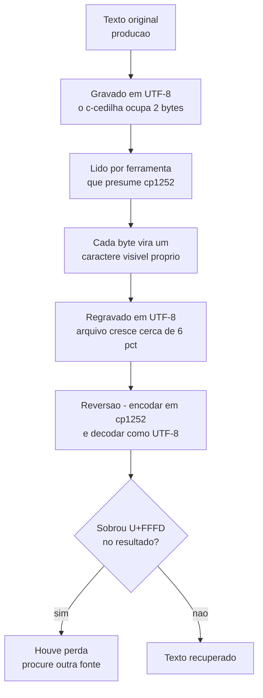
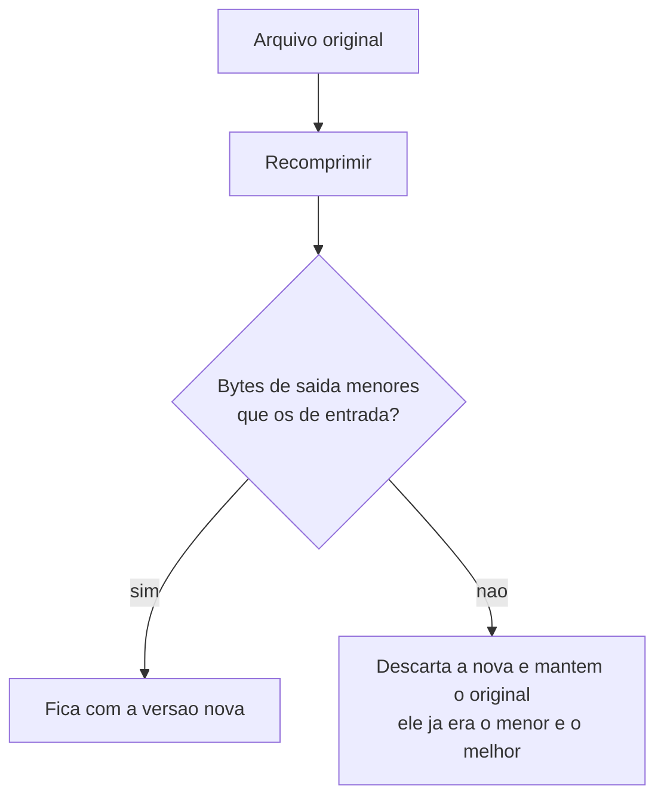

# Encoding, texto e mídia

## Arquivo que engordou sem ganhar conteúdo é mojibake

**Sintoma:** texto vira "produção" no lugar de "produção", e o arquivo cresce ~6% sem
nenhuma edição real.

**Causa:** conteúdo UTF-8 lido como cp1252/latin-1 e regravado como UTF-8: cada caractere
acentuado vira dois bytes visíveis, e um BOM costuma ser acrescentado no processo.

**O que é mojibake:** um arquivo de texto é só uma sequência de bytes; a codificação é a
**convenção** que diz quais bytes formam qual letra. Em UTF-8, o `ç` são dois bytes (`C3 A7`).
Em cp1252 — a codificação antiga do Windows — cada byte é uma letra sozinha: `C3` é `Ã` e `A7`
é `§`. Quem lê um arquivo UTF-8 presumindo cp1252 vê `ç` onde havia `ç`, e ao salvar de volta
em UTF-8 grava **de verdade** esses dois caracteres. O texto passa a ocupar o dobro de bytes
nos acentos — daí o arquivo engordar sem ninguém ter digitado nada.

**Exemplo concreto:** uma exportação de contatos com 5.000 nomes passa por uma planilha aberta
com a codificação errada e é salva de novo. O arquivo vai de 500 KB para 530 KB, ninguém
percebe, e "José da Silva" vira "José da Silva" no sistema de destino.



**O que é `U+FFFD`:** o caractere de substituição, aquele losango preto com uma interrogação.
Ele aparece quando o decodificador encontra uma sequência de bytes que **não corresponde a
nada** na codificação pedida. A presença dele depois da reversão é a prova de que a informação
original não está mais lá — nenhum conserto vai trazê-la de volta.

**Regra:** é uma transformação determinística e portanto **reversível** — codifique de
volta para cp1252 e decodifique como UTF-8. Cuidado com 5 bytes que o cp1252 não mapeia
(`0x81`, `0x8D`, `0x8F`, `0x90`, `0x9D`): precisam de tratamento explícito ou a reversão
quebra. Antes de sobrescrever, meça: se sobrar `U+FFFD` depois de reverter, houve perda e
você precisa de outra fonte. Melhor ainda: se existe uma fonte íntegra, regenere a partir
dela em vez de consertar.

```python
corrigido = texto.encode('cp1252', errors='strict').decode('utf-8', errors='replace')
if '�' in corrigido:
    raise ValueError('reversao com perda - nao sobrescreva o original')
```

**Como verificar:** crescimento inexplicado de tamanho é o detector barato. Mas **nem todo
`Ã` é mojibake** — em português, `NÃO` e `PRODUÇÃO` em maiúsculas são legítimos. Procure as
sequências que só existem corrompidas (`ç`, `ã`, `õ`, `â€`), não a letra isolada.

---

## Declare o encoding sempre, na leitura e na escrita

**Exemplo concreto:** o script lê um CSV com acentos e roda bem na sua máquina. O mesmo script,
no servidor, lê o mesmo arquivo e quebra — porque lá o locale do sistema é outro e a linguagem
escolheu uma codificação padrão diferente. Nada mudou no código nem no arquivo.

**Regra:** `encoding='utf-8'` explícito em toda abertura de arquivo. A codificação padrão
varia por sistema operacional, por locale e por versão da linguagem — depender dela é
depender de algo que muda de máquina para máquina.

```python
with open(caminho, 'r', encoding='utf-8') as f:   # nunca open(caminho) e torcer
    ...
```

---

## Extração de JSON embutido em texto: regex não-greedy trunca em array aninhado

**Sintoma:** o JSON emitido por um modelo é cortado no meio quando contém uma lista.

**Causa:** um padrão não-greedy para no primeiro `]` ou `}` encontrado, que pertence ao
array interno.

**Greedy versus não-greedy, em uma frase:** um padrão guloso (`.*`) casa o **maior** trecho
possível; um não-guloso (`.*?`) casa o **menor**. Como o menor trecho que termina em `}` é o
que para no primeiro fechamento encontrado, ele corta o objeto externo no primeiro objeto
interno que aparecer.

**Exemplo concreto:** a resposta traz `{"titulo": "x", "tags": ["a", "b"], "ok": true}`. O
padrão não-guloso para logo depois de `["a", "b"]` — devolve um pedaço que não é JSON válido,
e o erro só aparece quando o texto por acaso tem uma lista dentro.

**Regra:** use padrão guloso delimitado pelas chaves externas, ou — melhor — um contador de
chaves. Valide com `JSON.parse` e só então aceite.

---

## `canvas.toBlob('image/webp', 1.0)` ativa modo sem perda e engorda o arquivo

**Sintoma:** converter uma foto de 3 MB gera 7 MB e leva segundos por imagem.

**Causa:** qualidade 1.0 em WebP significa **lossless**. Sobre um JPEG, lossless gasta bits
reproduzindo até os artefatos da compressão anterior.

**Compressão com perda versus sem perda:** com perda (*lossy*) descarta informação que o olho
dificilmente nota — é o que faz um JPEG de 12 megapixels caber em 3 MB. Sem perda
(*lossless*) reconstrói o arquivo **byte a byte**, sem descartar nada. O detalhe traiçoeiro é
que, quando a entrada já é um JPEG, o que o modo sem perda preserva fielmente não é a foto
original: são os **defeitos** que a compressão anterior introduziu. Guardar defeito com
fidelidade perfeita é caro.

**Regra:** nunca use 1.0. Sem perda só compensa em imagem que nunca foi comprimida.

---

## Recomprimir JPEG frequentemente **aumenta** o arquivo

**Sintoma:** o painel de otimização mostra algo como "3 MB → 4 MB" e ninguém entende.

**Causa:** arquivos que saem de câmera ou editor já vêm comprimidos (tipicamente qualidade
~85). Recodificar com qualidade **maior** que a original decodifica para pixels crus e
gasta bits reproduzindo os defeitos da compressão anterior.

**Exemplo concreto:** um lote de 1.000 fotos passa pelo "otimizador" com qualidade 95. Umas
400 encolhem, outras 600 crescem, e o acervo termina 15% maior do que começou. O processo se
chamava otimização e fez o contrário.



**Regra:** trate compressão como otimização **condicional** — comprima, compare com o
original e fique com o menor. Se a recompressão não ajudou, o original também é o de melhor
qualidade. Só force a conversão quando o formato de origem não for exibível na web.

**Como verificar:** logue `bytesEntrada`/`bytesSaída` por arquivo e alarme quando a razão
for maior que 1.

---

## AVIF pode ser descartado por custo de codificação, não por tamanho

**Sintoma:** o pipeline de imagens fica lento após adotar um formato mais moderno.

**Causa:** ganho de tamanho pequeno em miniaturas (ordem de 10%) contra tempo de encode uma
ordem de grandeza maior.

**Exemplo concreto:** as miniaturas de 200 pixels passam de 10 KB para 9 KB — um ganho real,
mas de 1 KB. Em compensação, cada miniatura leva 10 vezes mais tempo para ser gerada. Num lote
de 500 imagens, você economiza meio megabyte e gasta minutos de CPU a mais por lote.

**Regra:** ao escolher formato, meça as duas pontas — bytes entregues **e** tempo/CPU de
geração. Em pipeline que codifica centenas de arquivos, o encode domina o custo.

---

## Não cape resolução quando o destino final é impressão em grande formato

**Sintoma:** o time quer "otimizar" um acervo de imagens, sem saber para que elas são
usadas.

**Causa:** faça a conta antes de decidir — pixels da maior dimensão divididos pela largura
impressa em polegadas. Uma foto de câmera ampliada para alguns metros cai facilmente para
algumas dezenas de dpi, sem folga nenhuma. E artefato de JPEG **cresce** com a ampliação:
invisível na tela, quadriculado no papel.

**Exemplo concreto:** uma foto de 6.000 pixels de largura parece enorme. Impressa num painel
de 2 metros (cerca de 80 polegadas), sobram 75 dpi — abaixo do confortável para impressão. Se
alguém tiver "otimizado" o acervo reduzindo para 2.000 pixels, o mesmo painel cai para 25 dpi,
e não há como voltar atrás.

**Regra:** decida compressão pelo destino do arquivo, não pelo peso. Sirva uma escada de
tamanhos e mantenha o original intocado para quem vai imprimir. Métricas objetivas de
similaridade medem mal o defeito que aparece no papel — não as use sozinhas para justificar
qualidade baixa.

---

## Compressão dupla não rende quase nada

**Sintoma:** você embrulha um backup em zip esperando economia relevante e ganha uns poucos
por cento.

**Causa:** packfile de git, JPEG, PNG, vídeo e a maior parte dos formatos modernos já
aplicam compressão. Uma segunda passada só adiciona cabeçalho e tempo de CPU.

**Por que a segunda passada não rende:** compressão funciona explorando repetição e padrão. Um
arquivo já comprimido teve toda a repetição óbvia removida — o que sobrou parece ruído
aleatório, e ruído não comprime. Zipar uma pasta de 5 GB de fotos e obter 4,9 GB não é um
compressor ruim: é a matemática dizendo que não havia mais nada a tirar.

**Regra:** o ganho real vem de **escolher o que não guardar**. E desconfie de otimização
cara: uma passada agressiva de repack pode custar minutos de CPU para economizar frações de
por cento.

**Como verificar:** meça antes e depois numa amostra antes de aplicar em tudo.

---

## Não extrapole tamanho de acervo a partir de amostra pequena

**Sintoma:** você calibra com poucos itens, encontra uma razão em torno de 0,8, promete um
número — e o real vem cerca de 20% acima, fora da faixa que você deu como garantida.

**Causa:** taxa de compressão varia muito com o conteúdo. Se a amostra pega um item grande
que comprime bem, a razão fica enviesada. E acervos costumam ser dominados por poucos itens
grandes, então o erro não se dilui.

**Exemplo concreto:** você mede 5 pastas de um acervo de 200, encontra razão 0,8 e promete
"vai caber em 800 GB". As 5 pastas eram de documentos, que comprimem bem. As outras 195 são
majoritariamente vídeo, que não comprime nada. O resultado real passa de 950 GB, e o disco
comprado com base na sua estimativa não serve.

**Regra:** para dimensionar espaço, use o tamanho que a própria origem reporta para o
conjunto inteiro. Amostra serve para estimar **tempo**, não volume.

**Como verificar:** compare a razão item a item, não só a agregada. Se ela varia bastante
entre os itens da amostra, não é uma constante que você possa aplicar ao todo.

---

## `to_csv(encoding=...)` é ignorado ao escrever num buffer de texto

**Sintoma:** Você passa `encoding=` no `to_csv`, mas o resultado sai noutra codificação — ou o BOM esperado do `utf-8-sig` simplesmente não aparece.

**Causa:** Um `StringIO` já é texto (`str`); o pandas só aplica `encoding` quando o destino é um caminho de arquivo ou um buffer de **bytes**. Ao escrever em `StringIO`, o parâmetro `encoding` não faz nada — a codificação real só acontece no `.encode()` posterior sobre o `getvalue()`.

**Exemplo concreto:** `df.to_csv(buf, encoding="utf-8-sig")` com `buf = io.StringIO()` não injeta BOM nenhum; quem injeta é `buf.getvalue().encode("utf-8-sig")` na hora de montar o `BytesIO` para download.

**Regra:** Para controlar a codificação de um CSV em memória, escreva direto num `BytesIO` ou trate a codificação no `.encode()` — e não confie no argumento `encoding` do `to_csv` quando o alvo é `StringIO`.

---

## Fonte core do FPDF é Latin-1: acento fora da tabela ou emoji derruba a geração do PDF

**Sintoma:** Gerar PDF funciona com texto simples e estoura `UnicodeEncodeError: 'latin-1' codec can't encode character` assim que o usuário digita um emoji, um traço "—", aspas curvas ou certos símbolos.

**Causa:** As fontes core do FPDF (Arial/Helvetica/Times embutidas) só suportam Latin-1 (code points ≤ 255). O FPDF clássico não faz fallback: qualquer caractere fora dessa faixa levanta exceção na hora de escrever a célula.

**Exemplo concreto:** Editor rich-text manda o conteúdo; o backend faz `pdf.set_font("Arial"); pdf.multi_cell(0,10, texto)`. Um título com emoji ou um "—" colado do Word quebra a rota inteira e o usuário recebe erro 500 sem pista.

**Regra:** Para texto Unicode em FPDF, registre uma fonte TrueType com `add_font(..., uni=True)` (ex.: DejaVu) ou troque por uma lib que aceite UTF-8. Se mantiver a fonte core, higienize/transcodifique o texto para Latin-1 antes de escrever e decida o que fazer com o que não couber — não deixe estourar no meio da geração.
