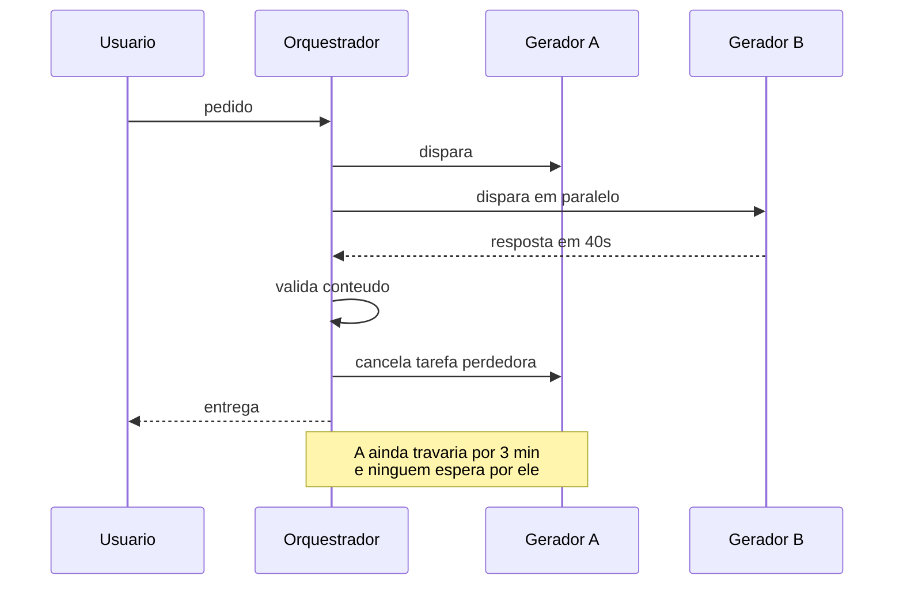
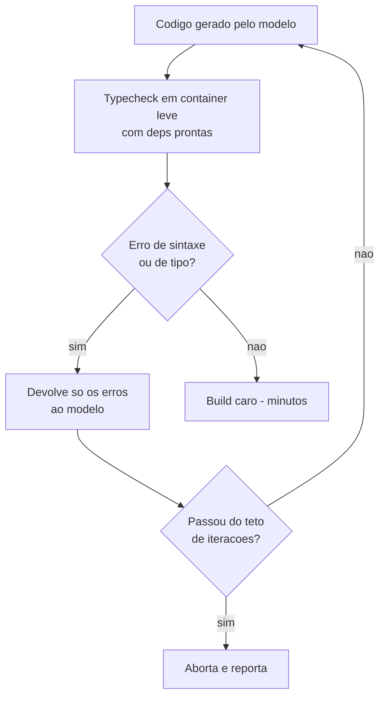
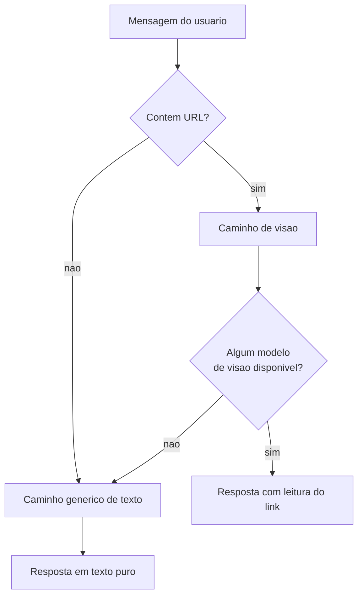
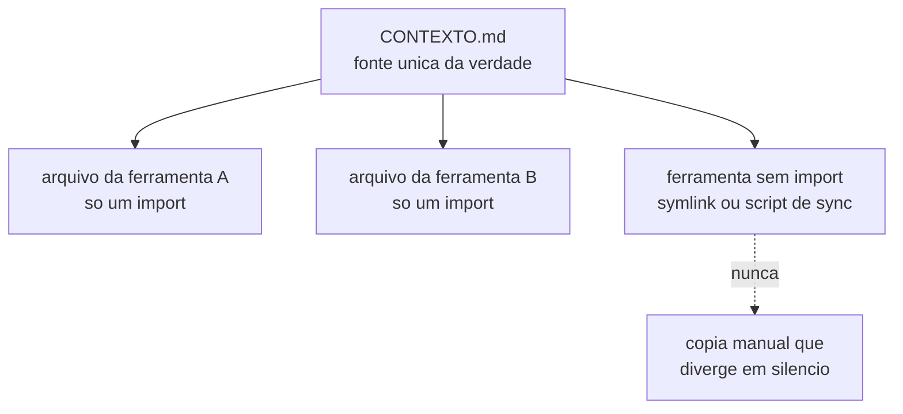

# LLMs e ferramentas de IA em produção

## Valide contra o contexto todo ID que o modelo devolver

**Sintoma:** o conteúdo gerado referencia um produto, cupom ou registro que não existe.

**Causa:** o modelo recebeu o catálogo como texto e devolveu identificadores plausíveis mas
inventados.

**Exemplo concreto:** você manda 40 produtos de uma loja de camisetas no prompt e pede uma
postagem de promoção. O modelo devolve `{"produto_id": "CAM-1042", "desconto": 20}`. O ID
tem a cara certa — prefixo certo, quatro dígitos — e não existe no catálogo. Gravado sem
conferência, vira uma promoção apontando para uma página 404.

**Regra:** a saída estruturada do modelo é **entrada não confiável**. Cada ID retornado é
conferido contra o conjunto que foi enviado no prompt; o que não casa vira `null` com
fallback, nunca vai para o banco. Serializar o contexto de forma compacta e explícita
melhora muito a taxa de acerto.

---

## Retry com backoff não é opcional — 429 e 503 são rotina

**Causa:** endpoints de modelo generativo rejeitam por capacidade com frequência muito
maior que APIs comuns.

**O que é backoff exponencial:** em vez de tentar de novo imediatamente, você espera um
intervalo que dobra a cada tentativa — 1s, 2s, 4s. A ideia é dar tempo para a fila do
provedor esvaziar. Retry sem espera piora a situação: todo mundo que tomou 429 volta ao
mesmo tempo e o serviço, que estava só congestionado, passa a estar sob ataque.

**Regra:** envolva toda chamada num wrapper com ~3 tentativas e backoff exponencial para
429, 5xx e erro de rede; nunca faça retry de 4xx de validação. Tenha um caminho de
degradação quando as tentativas esgotam.

**Ponto crítico de implementação:** trate `status == 429` **antes** de
`raise_for_status()`, senão vira exceção e pula a espera.

```python
for tentativa in range(3):
    r = requests.post(url, json=payload, timeout=60)
    if r.status_code == 429 or r.status_code >= 500:
        time.sleep(2 ** tentativa)     # 1s, 2s, 4s
        continue
    r.raise_for_status()               # so aqui; 4xx de validacao nao repete
    return r.json()
return caminho_degradado()
```

---

## Não chame o mesmo provedor duas vezes no mesmo pipeline

**Sintoma:** a segunda etapa falha com 429 de forma intermitente.

**Causa:** limite de taxa por conta, consumido pela primeira etapa.

**Exemplo concreto:** um pipeline de moderação de um blog: a etapa 1 classifica 500
comentários, a etapa 2 resume os reprovados num relatório. A etapa 1 gasta a cota do minuto
inteira; a etapa 2, que faz uma única chamada, é a que toma 429 e parece a culpada.

**Regra:** distribua etapas entre provedores diferentes e monte uma cadeia de fallback
explícita. Verifique os identificadores de modelo contra o endpoint de listagem do provedor
antes de fixá-los no código — IDs mudam e somem.

---

## Cota tem duas dimensões independentes e contexto varia por modelo

**Sintoma:** erro de limite mesmo com poucas chamadas, ou truncamento inesperado do prompt
ao trocar de modelo dentro do mesmo provedor.

**Causa:** o limite é aplicado separadamente a **requisições** e a **tokens** (por minuto,
hora e dia) — estourar qualquer um bloqueia. E a janela de contexto pode variar em ordem de
grandeza entre modelos do mesmo catálogo.

**O que é janela de contexto:** é o teto de tokens que cabe numa única chamada, somando o
que você envia e o que o modelo responde. Ultrapassar não dá erro claro em toda API: às
vezes o começo do prompt é simplesmente descartado, e você fica com uma resposta coerente
que ignora metade das suas instruções.

**Exemplo concreto:** o plano permite 60 requisições e 40 mil tokens por minuto. Você monta
um lote de 20 chamadas, cada uma com 3 mil tokens de prompt: usa um terço do limite de
requisições e estoura o de tokens com folga. Dimensionar pelo número de chamadas te dá a
falsa sensação de estar longe do limite.

**Regra:** dimensione o batch pelo limite de tokens por minuto, não pelo de requisições.
Implemente backoff lendo os headers de rate limit e tenha um modelo alternativo mapeado por
caso de uso.

---

## Corrida entre dois geradores vence fallback sequencial

**Sintoma:** encadear provedores em sequência com timeout generoso desperdiça minutos toda
vez que o primeiro trava — e o primeiro trava com frequência.

**Exemplo concreto:** o provedor primário responde em 20 segundos quando está bem, e trava
até o timeout de 3 minutos quando não está. Em sequência, um dia ruim custa 3 minutos de
espera antes de sequer começar a segunda tentativa. Em paralelo, o segundo gerador entrega
em 40 segundos e a espera do usuário acaba ali.



**Regra:** dispare os dois em paralelo, consuma com "primeiro que devolver resultado
**válido** vence" (validação de conteúdo, não apenas código de saída zero), e cancele as
tarefas restantes no `finally`. Custa o dobro de chamadas no pior caso e economiza minutos
em cada execução. Use quando o custo por chamada é baixo e a latência é o gargalo.

---

## O tempo de geração é dominado pelo **modelo**, não pelo volume de saída

**Sintoma:** você "enxuga" o prompt para gerar menos texto e a latência quase não muda.

**Causa:** medições reais — a mesma saída levou cerca de cinco minutos num modelo grande e
cerca de um minuto num pequeno; e uma saída quatro vezes menor no mesmo modelo não foi mais
rápida. Cold start e latência do provedor dominam.

**O que é cold start:** é o tempo que o ambiente leva para ficar pronto antes de processar
qualquer coisa — provisionar a instância, carregar o modelo, abrir a conexão. É um custo
fixo: não importa se você vai pedir 200 palavras ou 2 mil, ele é pago igual.

**Exemplo concreto:** a descrição de um produto tinha 800 palavras e demorava 4 minutos.
Você corta o prompt e passa a gerar 200 palavras. Continua demorando 3 minutos e meio — o
que você cortou eram os 30 segundos de escrita, não os 3 minutos de partida.

**Regra:** para ganhar velocidade, troque o modelo ou o caminho, não o tamanho da saída.
Reduzir volume ainda vale — mas pelo peso entregue ao usuário, não pelo tempo de geração.

**Como verificar:** instrumente tempo **por fase** do pipeline. Sem isso, a atribuição de
culpa é chute.

---

## Modelo de raciocínio é a escolha errada para reescrita longa

**Causa:** modelos com cadeia de raciocínio pagam um custo fixo alto antes de emitir saída
longa.

**O que é um modelo de raciocínio:** antes de responder, ele gasta tokens "pensando" —
enumerando hipóteses, testando caminhos. Isso paga quando a tarefa tem uma decisão difícil
no meio. Numa tarefa mecânica, esse gasto vira puro atraso: não há o que decidir, só o que
transcrever.

**Exemplo concreto:** passar 30 páginas de um manual de instruções para linguagem simples é
tarefa mecânica: cada parágrafo entra e sai transformado, sem decisão. Um modelo de
raciocínio gasta minutos deliberando sobre parágrafos que só precisavam ser reescritos.

**Regra:** para transformar ou reescrever texto longo, use a variante sem raciocínio; ou
substitua a etapa por validação heurística determinística. Raciocínio compensa em decisão,
não em transcrição.

---

## "Template determinístico + LLM preenchendo só JSON" ganha de "LLM gera tudo"

**Sintoma:** geração de documento leva minutos e a qualidade oscila a cada execução.

**Causa:** pedir ao modelo que produza o artefato final coloca o custo e a variância no
caminho crítico.

**Exemplo concreto:** um sistema de reservas emite o voucher da hospedagem. Pedir o HTML
inteiro ao modelo dá um documento diferente a cada emissão — às vezes sem o número da
reserva, às vezes com a data em outro formato. Peça só isto:

```json
{
  "titulo": "Reserva confirmada",
  "saudacao": "Sua estadia esta garantida para o fim de semana",
  "observacao": "Check-in a partir das 14h"
}
```

O layout, o número da reserva, as datas e o valor vêm do código. O modelo só escreve as três
frases que precisam soar humanas — e o render vira instantâneo.

**Regra:** separe layout (código fixo, sem IA) de conteúdo (o modelo devolve só um JSON
estruturado pequeno). O render vira instantâneo e consistente. Reserve a geração livre para
os casos que não cabem em template.

---

## Um loop de typecheck antes do build caro derruba a taxa de falha

**Sintoma:** boa parte dos builds de código gerado por IA falha, cada um custando minutos.

**Exemplo concreto:** o build completo leva 4 minutos e morre num `import` de um pacote que
não existe. Um contêiner com as dependências já instaladas descobre isso em 8 segundos,
devolve a mensagem ao modelo e recebe a correção — tudo antes de o build caro começar.



**Regra:** rode a checagem de tipos num container leve com dependências pré-instaladas,
monte o código como volume somente-leitura, filtre apenas erros de sintaxe e devolva ao
modelo para correção, com teto de iterações. Medido: a taxa de falha caiu de mais da metade
dos builds para uma fração pequena, e o tempo total quase pela metade.

---

## Caminho especializado sem fallback derruba a funcionalidade inteira

**Sintoma:** o chat quebra por completo quando o usuário cola um link.

**Causa:** a presença de URL desviava para um caminho exclusivo de modelos de visão. Sem
nenhum deles disponível, não havia rota de texto puro.

**Exemplo concreto:** alguém escreve "o que você acha deste artigo? https://exemplo/post".
O roteador vê a URL, manda para o caminho de visão, os dois modelos de visão estão fora, e a
conversa inteira morre — inclusive a parte que era texto simples e teria funcionado.



**Regra:** todo caminho especializado precisa de degradação para o caminho genérico. E toda
chamada auxiliar de rede precisa de timeout curto com cancelamento, senão trava a função
inteira.

---

## Regex de detecção estreita demais faz a feature nunca rodar

**Sintoma:** a métrica de uso do recurso fica em zero e você conclui que "ninguém quer
isso".

**Causa:** o gatilho exigia uma palavra-chave **mais** uma palavra de contexto; as frases
naturais dos usuários não casavam.

**Exemplo concreto:** o gatilho pedia "gerar" e "imagem" na mesma frase. As pessoas
escreviam "faz uma foto do produto", "cria um banner", "quero uma arte pro post". Zero
acionamentos em um mês, e a conclusão errada de que a feature era desnecessária.

**Regra:** detecte por padrão amplo e monitore a taxa de acionamento. Zero uso de uma
feature entregue é sintoma de bug de roteamento até prova em contrário.

---

## Quando o modelo escolhe a ferramenta errada, ponha rede de segurança no cliente

**Sintoma:** pedidos claramente de edição ("muda a cor") fazem o sistema recriar o artefato
do zero.

**Causa:** o modelo, mesmo com regra prioritária no prompt, às vezes emite a ferramenta
errada.

**Exemplo concreto:** o usuário passou 20 minutos ajustando uma página e digita "deixa o
botão azul". O modelo chama `criar_pagina` em vez de `editar_pagina`, e os 20 minutos de
ajuste somem. O cliente sabia, com certeza absoluta, que já existia um artefato na tela —
essa informação não é probabilística, e por isso não deveria depender do modelo.

**Regra:** camada dupla — (1) regra prioritária no prompt quando o estado indica "já existe
artefato"; (2) verificação determinística no cliente que sobrepõe a decisão do modelo.
Prompt é probabilístico; estado é fato.

---

## Agente que narra sucesso não substitui verificação

**Sintoma:** sequência de "está 100% funcionando agora" seguida imediatamente do mesmo erro
em produção, várias vezes seguidas.

**Causa:** o agente declara conclusão ao terminar de escrever o código ou disparar o deploy,
sem exercitar o caminho real. E "espera" por tempo em vez de consultar o estado do build.

**Exemplo concreto:** o agente corrige o formulário de cadastro, dispara o deploy, espera 60
segundos, e anuncia "corrigido e no ar". O deploy ainda estava em fila; entrou dois minutos
depois com um erro de build. Bastava uma requisição à rota real devolvendo 200 para o
anúncio ser verdadeiro — ou falso na hora certa.

**Regra:** fechamento de tarefa só com evidência — código HTTP da rota real, linha do log,
ou contagem no banco. Consulte o status pelo comando da plataforma em vez de dormir e
presumir. **O mesmo vale para você: deploy verde ≠ feature funcionando.**

---

## Layout, contraste e ícone são o que build e linter **nunca** reprovam

**Sintoma:** build verde, revisão aprovada, e a tela sai ilegível ou quebrada em produção.

**Causa:** nenhuma ferramenta estática avalia render. Ícone desenhado à mão, contraste em
modo escuro e alvo de toque só existem em pixels.

**Regra:** para qualquer mudança visual, adicione captura de tela como etapa de
verificação. E **meça, não olhe**: overflow por `scrollWidth > clientWidth`, alvos por
`getBoundingClientRect`, tamanho por `font-size` computado, contraste calculado.

```js
// roda na pagina; devolve fatos, nao impressoes
[...document.querySelectorAll('*')]
  .filter(el => el.scrollWidth > el.clientWidth)   // estourou a largura
  .map(el => el.className);

[...document.querySelectorAll('button, a')]
  .map(el => el.getBoundingClientRect())
  .filter(r => r.width < 44 || r.height < 44);     // alvo de toque pequeno demais
```

---

## `--headless --screenshot` **não** emula mobile

**Sintoma:** a captura "de celular" mostra layout desktop cortado — falso positivo de
layout quebrado.

**Causa:** a flag só define o tamanho da janela; não muda user agent, densidade de pixels
nem flag de dispositivo móvel.

**Exemplo concreto:** você captura com janela de 390 px de largura e vê a barra de navegação
desktop espremida, com os itens sobrepostos. Conclui que o menu mobile está quebrado. Ele
nunca chegou a ser acionado: o CSS depende do user agent, e o navegador continuou se
apresentando como desktop.

**Regra:** use o protocolo de depuração com override de métricas de dispositivo
(`mobile: true`, `deviceScaleFactor`) antes de capturar.

---

## Mudar só o hash da URL não recarrega — o estado vaza entre passadas de teste

**Sintoma:** uma captura de celular aparece com um estado de UI que só foi ativado na
passada de desktop.

**Exemplo concreto:** a passada de desktop abre o painel lateral e navega para `#/detalhe`.
A passada de celular vai para `#/lista` e captura — com o painel lateral ainda aberto,
porque a página nunca recarregou. Você registra um bug de layout que não existe.

**Regra:** em automação de captura, force reload usando querystring diferente a cada
passada, ou recarregue com cache desativado.

---

## Clique programático e clique por coordenada mentem de formas diferentes

**Sintoma:** o teste "clica" e nada acontece; ou clica no elemento errado depois de uma
correção de layout.

**Causa:** clique programático num filho não dispara o handler registrado no pai por
delegação; clique por coordenada erra quando o layout deslocou.

**O que é delegação de eventos:** em vez de registrar um handler em cada um dos 50 itens de
uma lista, você registra **um** handler no contêiner e descobre qual item foi clicado pelo
alvo do evento. É eficiente, e cria a armadilha: um clique sintético disparado direto no
filho pode não subir até o contêiner do jeito que o handler espera.

**Exemplo concreto:** a lista de tarefas tem um único handler no `<ul>`. Seu teste chama
`li.click()` no terceiro item; o handler não roda, e você passa uma hora procurando bug na
lógica de conclusão de tarefa que está perfeita.

**Regra:** para validar handler, dispare o evento de mouse real via protocolo no elemento
certo; para elementos estáveis, prefira clique programático. Detalhe: `dispatchEvent(new
Event('blur'))` **não** aciona `onBlur` do React — ele escuta `focusout`.

---

## Servidor de desenvolvimento pode não hidratar por causa do websocket de HMR

**Sintoma:** uma rota fica presa em "Carregando…", o efeito de autenticação nunca roda, e a
rota vizinha hidrata normalmente — parece bug da página.

**O que é hidratação:** o servidor manda o HTML já pronto, e no navegador o JavaScript
"assume" esse HTML, ligando os eventos e os estados. Antes disso a página é uma fotografia:
aparece, mas nada responde e nenhum efeito roda. É por isso que o sintoma parece um
travamento na tela de carregamento.

**Regra:** para auditoria de UI, rode o build de produção localmente. A hidratação fica
determinística.

---

## Meça tráfego cross-origin pelos eventos do protocolo

**Sintoma:** sua auditoria diz que a página baixa 0 byte de imagem.

**Causa:** `encodedBodySize` é **0** em recursos cross-origin sem `Timing-Allow-Origin`; e
um service worker faz a requisição perder a classificação de tipo.

**Exemplo concreto:** a página carrega 15 fotos de produto de um CDN em outro domínio. A API
de performance do navegador reporta cada uma com tamanho 0, por política de privacidade
entre origens. Sua auditoria conclui "página levíssima, 0 KB de imagem" enquanto o usuário
no celular baixa vários megabytes.

**Regra:** meça pelos eventos de rede do protocolo de depuração e filtre por URL, não por
tipo. Limpe qualquer cache de aplicação antes de medir, senão você mede o estado antigo.

---

## Instrução de agente centralizada com import evita cópia divergente

**Sintoma:** o agente A obedece uma regra que o agente B ignora; ninguém entende por quê.

**Causa:** cada ferramenta lê um arquivo de instrução diferente na raiz do projeto.



**Regra:** um único arquivo de contexto como fonte da verdade; o arquivo esperado por cada
ferramenta contém apenas um import mais o específico daquele projeto. Para ferramentas sem
suporte a import, symlink ou script de sincronização — **nunca cópia manual**, e se a cópia
for inevitável, trate-a como artefato gerado que nunca se edita à mão.

**Como verificar:** compare os hashes dos arquivos que deveriam ser idênticos. E audite a
cadeia de imports de **cada** projeto: import que não resolve não gera erro.

---

## Substituição por texto falha em arquivo com blocos duplicados

**Sintoma:** a ferramenta de edição recusa a operação por âncora ambígua — ou pior, edita a
ocorrência errada.

**Causa:** o arquivo acumulou conteúdo duplicado, comum em arquivos que vários agentes
editam por append.

**Exemplo concreto:** o arquivo de instruções tem a seção "## Deploy" três vezes, acrescida
por três sessões diferentes. Você pede para trocar uma linha dentro dela; a edição cai na
primeira ocorrência, que é a mais velha e não é a que vale.

**Regra:** deduplique antes de editar; se estiver muito duplicado, reescreva inteiro.
Prefira âncoras longas e únicas.

---

## Memória de agente não sincroniza entre máquinas

**Sintoma:** o agente na máquina A conhece a decisão que o agente na máquina B registrou
ontem — exceto que não conhece.

**Exemplo concreto:** você decide no notebook que a numeração de pedidos passa a ter
prefixo por loja, e o agente registra isso na memória local. No dia seguinte, no desktop, o
agente escreve o código sem prefixo — com toda a confiança de quem nunca ouviu falar da
decisão.

**Regra:** ao registrar algo que vale nos dois ambientes, avise onde foi gravado e
replique. Se virar incômodo, coloque o diretório de contexto num repositório privado
compartilhado. O mesmo vale para instruções globais: uma sessão em servidor começa **cega**
às suas regras.

---

## Ação bloqueada por política de segurança: prepare, não contorne

**Sintoma:** o agente é impedido de criar um serviço do sistema, escrever em configuração
global de SSH ou ler um arquivo de códigos de recuperação.

**Causa:** são ações de persistência ou de segredo que qualquer camada de proteção razoável
bloqueia — e o bloqueio geralmente está certo.

**Regra:** não procure o desvio. Deixe o artefato pronto com instruções de uma linha para o
humano executar. Prefira a alternativa de escopo local que **não** é bloqueada.

---

## Ao pedir aprovação, diga se a ação é reversível

**Sintoma:** aprovações concedidas no automático autorizam algo destrutivo.

**Causa:** o texto do pedido descreve o comando, não a consequência. Num contexto de
aprovação rápida, "sim" é o default.

**Exemplo concreto:** o pedido diz "executar script de limpeza da tabela de sessões". Soa
inofensivo, e você aprova sem ler. Se dissesse "isto desconecta os 3 mil usuários logados
agora e não tem volta", a resposta teria sido outra — e levaria os mesmos dois segundos.

**Regra:** formule destacando a **reversibilidade** — "isto apaga X permanentemente" versus
"isto cria Y e pode ser desfeito com Z".

---

## Contra risco de acesso amplo, a resposta é reversibilidade — não restrição

**Sintoma:** você propõe rodar a automação com usuário restrito e escopo mínimo, e o dono
da infraestrutura recusa porque isso derrota o propósito da ferramenta.

**Causa:** restringir é a mitigação correta para um usuário a ser contido; para o operador
que é dono de tudo, ela só transfere o trabalho de volta para ele.

**Exemplo concreto:** o dono quer que o agente rode qualquer coisa no servidor, porque é o
servidor dele e o objetivo é justamente não precisar digitar comando. Criar um usuário sem
permissão de instalar pacote significa que ele vai ter que entrar e instalar à mão toda vez
— exatamente o trabalho que a ferramenta existia para eliminar. Um snapshot diário do
servidor resolve o mesmo risco sem tirar nada.

**Regra:** quando o acesso amplo é o requisito, mitigue com **recuperabilidade** —
snapshot automático do servidor (a salvaguarda de maior valor: preserva toda a liberdade e
torna o erro reversível), contexto escrito na máquina dizendo quais credenciais ali
alcançam produção, e aprovação manual para ações irreversíveis.

---

## Não troque CLI com assinatura por chave de API sem contar o custo

**Sintoma:** a conta de uso dispara depois de "resolver" um problema de autenticação
configurando uma chave de API.

**Causa:** a assinatura já cobre o uso da ferramenta; a chave de API é um canal de cobrança
**separado**, por token.

**Exemplo concreto:** a sessão expira, a ferramenta pede login, e você atalha colando uma
chave de API na variável de ambiente. Tudo volta a funcionar — e o uso que estava incluído
na mensalidade passa a ser cobrado por token, num consumo que você nem enxerga até a fatura.

**Regra:** quando a autenticação por assinatura falhar, ataque a causa (renovação de
sessão, serviço rodando continuamente) em vez de trocar pelo caminho que cobra de novo.
Antes de pedir reautenticação, simplesmente rode o comando e veja se ele se recupera:
`expiresAt` vencido não significa sessão perdida, porque o refresh token costuma continuar
válido.
