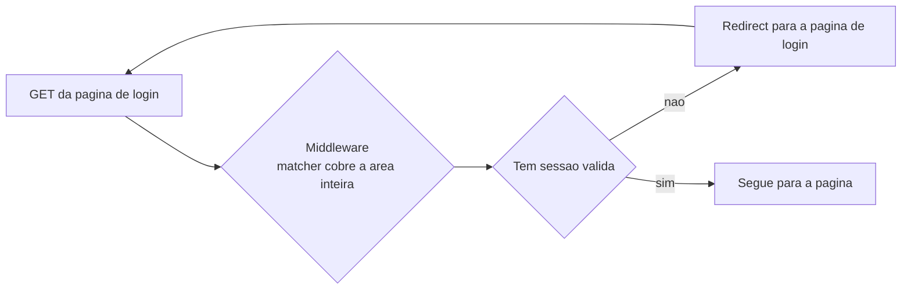
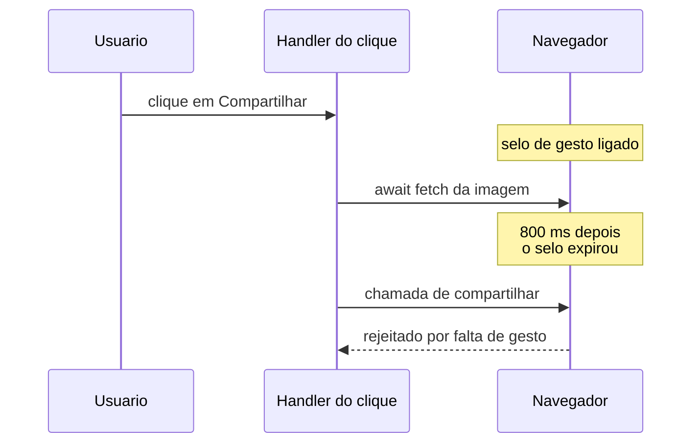
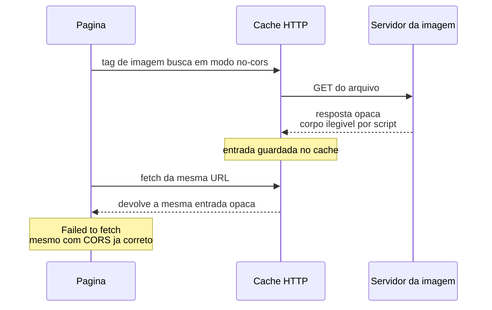

# Frontend, React e Next.js

## `params`, `searchParams`, `cookies()` e `headers()` são assíncronos no Next 15

**Sintoma:** após atualizar de 14 para 15, rotas quebram com erros de tipo ou valores
`undefined` ao ler parâmetros em Server Components e route handlers.

**Causa:** breaking change — essas APIs passaram a devolver `Promise`. Em Client
Components, `useParams()` continua síncrono, o que faz o erro parecer aleatório.

**Server Component, Client Component e hidratação:** um Server Component roda só no
servidor e nunca vai para o navegador — ele pode ler cookie, cabeçalho e banco direto. Um
Client Component é renderizado como HTML no servidor e depois **hidratado**: o navegador
baixa o JavaScript e "religa" os handlers e o estado naquele HTML já pintado. Como são dois
mundos com APIs diferentes, o mesmo dado (`params`) chega assíncrono de um lado e síncrono
do outro — e o erro parece aleatório porque depende de qual arquivo tem `"use client"`.

**Exemplo concreto:** um blog com a rota `/post/[slug]`. A página é Server Component e
passou a precisar de `await`; o botão de curtir, que é Client Component, lê o mesmo slug com
`useParams()` sem `await`. Depois do upgrade, a página quebra e o botão não — e você perde
uma hora achando que é cache.

```tsx
// Server Component
export default async function Page({ params }: { params: Promise<{ slug: string }> }) {
  const { slug } = await params;
}
```

**Regra:** declare `params: Promise<{...}>` e use `await params`. Para escrever cookie em
route handler, use `res.cookies.set/delete` no objeto de resposta.

**Como verificar:** `npx tsc --noEmit` acusa a maioria.

---

## Exceção lançada em Server Action é sanitizada em produção

**Sintoma:** em desenvolvimento a mensagem de erro aparece corretamente; em produção o
usuário vê "ocorreu um erro inesperado" e você fica sem diagnóstico.

**Causa:** o framework remove a mensagem original em produção para não vazar detalhes de
servidor. O bug só se manifesta no ar.

**Exemplo concreto:** o formulário de cadastro lança `throw new Error("E-mail já
cadastrado")`. Local, o usuário lê exatamente isso. Em produção ele lê "ocorreu um erro
inesperado", tenta de novo cinco vezes e abre um chamado — enquanto o motivo real era
trivial de resolver.

```ts
// em vez de throw
export async function cadastrar(dados: FormData) {
  if (await emailExiste(dados)) {
    return { ok: false, error: "E-mail já cadastrado" };
  }
  return { ok: true };
}
```

**Regra:** não use `throw` para comunicar erro de negócio a partir de Server Action.
**Retorne** um objeto (`{ ok: false, error: "motivo legível" }`) e trate na UI. Reserve
`throw` para falhas realmente inesperadas.

**Como verificar:** rode o build de produção localmente e provoque o erro — o
comportamento de dev mente aqui.

---

## Aviso de "Dynamic server usage" no build não é erro

**Sintoma:** o log exibe `Route /api/... couldn't be rendered statically because it used
headers()`.

**Causa:** o framework tenta pré-renderizar estaticamente; ao encontrar acesso a dados por
requisição, desiste e trata a rota como dinâmica — comportamento esperado.

**Exemplo concreto:** a rota `/api/eu` lê o cookie de sessão para devolver o usuário logado.
Ela **não pode** ser estática — o resultado muda por pessoa. O aviso está apenas narrando
essa conclusão óbvia, em vermelho, no meio de um build verde.

**Regra:** ignore. Só declare `dynamic = 'force-dynamic'` para silenciar ruído ou tornar
a intenção explícita.

---

## Comentário `//` dentro de uma tag JSX quebra o build

**Causa:** entre `<Componente` e `>` o parser está em contexto de atributos, onde `//`
não é comentário.

```tsx
// quebra: o parser lê // como parte dos atributos
<Botao
  // desativado por enquanto
  onClick={salvar}
/>

// funciona
<Botao
  {/* desativado por enquanto */}
  onClick={salvar}
/>
```

**Regra:** use `{/* ... */}` fora dos atributos, ou comente acima do elemento.

---

## `middleware` com matcher amplo cria loop de redirect na própria página de login

**Sintoma:** `ERR_TOO_MANY_REDIRECTS` ao acessar a área administrativa.

**Causa:** o matcher `/area/:path*` inclui `/area/login`, então o middleware redireciona a
página de login para ela mesma.



**Exemplo concreto:** uma loja online protege tudo sob `/admin`. O usuário desloga, tenta
entrar em `/admin/login`, o middleware vê "sem sessão" e manda para `/admin/login` — que
cai no mesmo middleware. O navegador desiste depois de 20 saltos.

**Regra:** primeira linha do middleware: liberar explicitamente as rotas públicas do
prefixo protegido. Se o código é gerado por IA, coloque isso como requisito explícito no
prompt — é um erro que ela repete.

---

## `navigator.share` precisa ser chamado no mesmo tick do clique

**Sintoma:** no Android o botão "Compartilhar" nunca abre a bandeja e cai no fallback;
no desktop funciona.

**Causa:** havia um `await fetch(imagem)` **entre** o clique e a chamada. O navegador
perde a ativação transitória durante o await e rejeita a API.

**O que é ativação transitória:** quando o usuário clica, o navegador liga um "selo" de
poucos segundos dizendo que aquele código está agindo em nome de um gesto humano. Só com o
selo ligado é permitido abrir a bandeja de compartilhamento, entrar em tela cheia, escrever
na área de transferência ou abrir uma janela. O selo é consumido pela primeira chamada e
expira sozinho — e qualquer `await` que devolva o controle ao navegador pode acontecer
depois da expiração.



```ts
// prepare antes, no efeito ou no mount
const arquivoRef = useRef<File | null>(null);

// no handler, nada de await antes
function onClick() {
  navigator.share({ files: [arquivoRef.current!] });
}
```

**Regra:** prepare tudo o que a API precisa **antes** — no mount ou num efeito — e no
handler chame de forma síncrona. Vale para qualquer API que exija gesto: abrir janela,
fullscreen, clipboard, áudio.

---

## `AbortError` em `navigator.share` é o usuário cancelando

```ts
try {
  await navigator.share(dados);
} catch (err) {
  if ((err as Error).name === 'AbortError') return; // fechou a bandeja, é isso
  abrirFallback();
}
```

**Regra:** no `catch`, cheque `err.name === 'AbortError'` e saia silenciosamente. Só o
erro real dispara o fallback.

---

## `` exibe imagem cross-origin que `fetch` não consegue baixar

**Sintoma:** a imagem aparece na tela normalmente, mas `fetch(url).then(r => r.blob())`
falha com "Failed to fetch" — e o CORS do servidor está correto.

**Causa:** duas coisas distintas, ambas custosas de diagnosticar. Primeira: exibir imagem
não exige CORS, ler os bytes exige. Segunda, mais traiçoeira: a tag `` busca em modo
`no-cors` e guarda no cache HTTP uma resposta **opaca**; o `fetch` seguinte casa com essa
entrada e não consegue ler o corpo — mesmo depois de o bucket ser configurado
corretamente.

**O que é uma resposta opaca:** quando o navegador busca um recurso de outro domínio sem
permissão de CORS, ele até baixa os bytes — o suficiente para pintar a imagem na tela — mas
entrega ao JavaScript um envelope lacrado: status 0, cabeçalhos vazios, corpo ilegível. Essa
resposta lacrada vai para o **mesmo** cache HTTP que o `fetch` consulta depois. Ou seja: a
tag de imagem envenena o cache para o `fetch` que vier em seguida, e limpar o CORS no
servidor não desfaz o que já está guardado.



**Exemplo concreto:** uma galeria de viagens mostra a foto num `` e, ao clicar em
"Baixar", faz `fetch` da mesma URL para gerar o arquivo. Na primeira visita o download
falha; numa aba anônima funciona. A diferença é só o cache.

**Regra:** use `fetch(url, { cache: 'no-store' })`, ou `crossOrigin="anonymous"` na ``
desde o início. Quando precisar dos bytes de forma confiável, sirva por uma rota de mesma
origem que busca no servidor — com guarda anti-SSRF validando que a URL é do seu bucket.

---

## `fetch` não reporta progresso de **envio**

**Exemplo concreto:** o usuário sobe um vídeo de 200 MB numa conexão lenta. Com `fetch`, a
única coisa que dá para mostrar é um spinner por três minutos — e metade das pessoas recarrega
a página achando que travou.

```ts
const xhr = new XMLHttpRequest();
xhr.upload.onprogress = (e) => {
  if (e.lengthComputable) setPercent(Math.round((e.loaded / e.total) * 100));
};
xhr.open('POST', '/api/upload');
xhr.send(arquivo);
```

**Regra:** para barra de progresso de upload, use `XMLHttpRequest` e
`upload.onprogress`. Não é legado — é a única API que entrega esse dado hoje.

---

## Imagem vinda do cache não dispara `onLoad` no React

**Sintoma:** fotos somem (ficam em `opacity-0`) quando o usuário volta para uma página já
visitada.

**Causa:** se a imagem já está completa quando o React monta o elemento, o evento `load`
já passou.

**Por que "já passou":** `onLoad` é um evento, não um estado — ele acontece uma vez e não
fica guardado. Numa imagem em cache o navegador resolve o arquivo instantaneamente, antes de
o React terminar de montar o componente e registrar o listener. O `` carrega a flag
`complete`, que é o **estado** correspondente, e é ela que você deve consultar.

**Exemplo concreto:** um app de tarefas mostra o avatar de cada pessoa com fade-in
(`opacity-0` até o `onLoad`). Na primeira visita funciona. Ao voltar da tela de detalhe, as
imagens vêm do cache, o `onLoad` nunca dispara e todos os avatares ficam invisíveis — com o
elemento presente no DOM, ocupando espaço.

```tsx
 { if (el?.complete) marcarCarregada(); }}
  onLoad={marcarCarregada}
  src={url}
/>
```

**Regra:** no `ref`, cheque `img.complete` e dispare o mesmo handler manualmente, além de
manter o `onLoad`.

---

## O descritor `w` do `srcset` é a **largura** do arquivo, não o lado maior

**Sintoma:** em galeria com fotos em retrato, o navegador escolhe consistentemente um
arquivo de resolução menor do que precisaria; imagens saem levemente borradas.

**Causa:** ao gerar derivadas com redimensionamento "caber dentro de N×N", uma imagem em
retrato de lado maior 1600 tem largura real ~900. Declarar `1600w` faz o navegador achar
que o candidato é ~1,8x maior do que é.

**O que é `srcset` e o descritor `w`:** `srcset` é a lista de arquivos alternativos da mesma
imagem, cada um anotado com sua largura em pixels — `foto-800.jpg 800w`. O navegador cruza
essa lista com o espaço que a imagem vai ocupar (o atributo `sizes`) e com a densidade da
tela, e escolhe o menor candidato que ainda seja nítido. Todo o cálculo depende do número
antes do `w` ser verdadeiro: se você mentir para cima, o navegador acha que já tem pixels
sobrando e serve um arquivo pequeno demais.

```html
<!-- errado: 1600 e o lado maior, mas o arquivo tem 900 px de largura -->


<!-- certo -->

```

**Exemplo concreto:** uma galeria de viagens gera três derivadas "cabendo em 400, 800 e
1600". Nas fotos horizontais tudo fica nítido; nas verticais, borrado — porque a de 1600
tem, de fato, 900 px de largura, e o navegador achou que 800 já bastava.

**Regra:** guarde largura e altura do original e calcule
`round(largura × min(1, ladoMáx / max(largura, altura)))`. Sem as dimensões originais o
cálculo é impossível — grave-as no momento em que as derivadas são geradas.

**Como verificar:** compare `img.currentSrc` com a largura real do arquivo servido em cada
breakpoint. Cuidado: com `srcset`, `img.naturalWidth` vem dividido pela densidade
atribuída ao candidato e **não** devolve os pixels reais do arquivo.

---

## `loading="lazy"` não adia slides de carrossel

**Causa:** os slides estão **dentro** da viewport, apenas deslocados por transform. O
navegador considera todos visíveis.

**Exemplo concreto:** a home de uma loja online tem um carrossel de 20 banners com
`loading="lazy"`. Você espera baixar 1 imagem no primeiro acesso; o navegador baixa as 20,
porque todas estão na área visível — só que empurradas para os lados por `translateX`.

**Regra:** carregue explicitamente só o slide atual e o próximo; controle por estado.

---

## Processamento de imagem em canvas congela a interface

**Sintoma:** ao selecionar algumas centenas de fotos para upload, a página fica minutos sem
responder.

**Causa:** o canvas roda na mesma thread que pinta a tela.

**Exemplo concreto:** o usuário escolhe 300 fotos de uma viagem para comprimir antes do
upload. Cada uma leva 200 ms no canvas — um minuto inteiro de aba branca, sem scroll, sem
botão de cancelar, com o navegador oferecendo "encerrar página que não responde".

**Regra:** mova a compressão para `Worker` + `OffscreenCanvas`, com um pool pequeno
(ordem de 4). O código do worker pode ser embutido como Blob para evitar arquivo extra no
build.

---

## Variável CSS de fonte precisa estar no `<html>`, não no `<body>`

**Sintoma:** o site inteiro cai para uma fonte serifada padrão. Tipagem, lint e build
passam limpos.

**Causa:** o preflight de frameworks utilitários aplica `font-family` no `<html>`. Se a
regra referencia um `var()` **indefinido** naquele escopo, o CSS invalida a **declaração
inteira** e o navegador usa o default.

**Por que uma variável indefinida derruba a declaração toda:** variáveis CSS são resolvidas
por herança, de cima para baixo. Se `--fonte` só é declarada no `<body>`, a regra que roda no
`<html>` não a enxerga — e o CSS não ignora só o pedaço quebrado: ele descarta a declaração
`font-family` inteira e cai no valor padrão do navegador, que é uma serifada. Nada disso
aparece em build ou lint, porque sintaticamente o CSS está perfeito.

```tsx
// errado
<html><body className={fonte.variable}>{children}</body></html>

// certo
<html className={fonte.variable}><body>{children}</body></html>
```

**Regra:** aplique a classe da fonte no `<html>`. E valide sempre a `font-family`
**computada**, nunca o CSS gerado.

**Como verificar:** `getComputedStyle(document.body).fontFamily` no navegador real.

---

## Variantes `dark:` empatam com `hover:` e vencem pela ordem

**Sintoma:** no modo escuro o hover para de funcionar em quase todos os botões — exceto
num que usa gradiente.

**Causa:** `dark:bg-*` e `hover:bg-*` têm a mesma especificidade; decide a ordem no CSS
gerado. O gradiente "funciona" porque pinta `background-image`, que fica por cima de
`background-color`.

**O que é especificidade, e o desempate por ordem:** quando duas regras CSS pintam a mesma
propriedade no mesmo elemento, o navegador dá um "peso" a cada seletor — mais classes e
pseudo-classes, mais peso. `.dark .btn` e `.btn:hover` têm exatamente o mesmo peso: uma
classe mais um qualificador. Empate não é resolvido por intenção, e sim por **quem aparece
por último no arquivo CSS**. Como a ordem é decidida pelo gerador do framework, o resultado
não é óbvio olhando o JSX.

**Exemplo concreto:** o botão "Comprar" de uma loja tem `bg-azul-600 hover:bg-azul-700
dark:bg-azul-500`. No claro o hover escurece; no escuro nada acontece, porque a regra `dark`
foi emitida depois e ganha o empate — inclusive no estado de hover.

**Regra:** use o modificador de importância ou reorganize as camadas. Ao conferir CSS
compilado, **grepe o seletor, não a cor** — a declaração vira `rgb(...)` e o hex some.

---

## Use `dvh` em vez de `vh` para altura útil no celular

**Causa:** `vh` congela a viewport maior; não acompanha a retração da barra do navegador.

**`vh` versus `dvh` em uma frase cada:** `1vh` é 1% da altura da viewport **com a barra de
endereço recolhida** — o maior tamanho possível, um valor fixo que nunca muda enquanto a
página vive. `1dvh` é 1% da altura **atual**, recalculada conforme a barra do navegador
aparece e some durante o scroll. Por isso um layout em `100vh` no celular sempre nasce um
pedaço mais alto que a tela: o rodapé fica escondido atrás da barra até o usuário rolar.

**Exemplo concreto:** a tela de login ocupa `100vh` e o botão "Entrar" fica no fim. No
iPhone, ao abrir a página, o botão está exatamente sob a barra inferior do navegador — o
usuário jura que não existe botão.

**Regra:** `calc(100dvh - <alturas fixas>)`. Em iOS, `safe-area-inset-*` só funciona com
`viewport-fit=cover` — sem isso o inset é 0.

---

## Alvo de toque é área, não desenho

**Sintoma:** bolinhas de carrossel de 6 px, links de topo de 18 px, botão de fechar
minúsculo — tudo bonito e impossível de acertar.

```tsx
// o desenho continua com 6 px; o alvo tem 44
<button aria-label="Ir para o slide 3" className="w-11 h-11 grid place-items-center">
  <span className="w-1.5 h-1.5 rounded-full bg-current" />
</button>
```

**Regra:** envolva o desenho num botão de ~44 px (mínimo 40 no celular) mantendo o visual
idêntico, com `aria-label`. Em telas sem hover, ações que no desktop aparecem no hover
precisam ficar **sempre visíveis** — e por isso maiores.

**Como verificar:** percorra `document.querySelectorAll('button,a,input')` medindo
`getBoundingClientRect()` e liste tudo abaixo de 40 px.

---

## Cores com alpha da mesma matiz convergem para contraste 1.0 no modo escuro

**Sintoma:** uma etiqueta de destaque fica **invisível** no tema escuro.

**Causa:** fundo `cor-da-marca/10` sobre superfície escura e texto `cor-da-marca` acabam
com quase a mesma luminância.

**Por que a mesma matiz colapsa:** um fundo com 10% de opacidade é uma mistura entre a cor e
a superfície de trás. No tema claro a superfície é branca, então a mistura clareia muito e o
texto colorido continua escuro em cima — contraste alto. No tema escuro a superfície é quase
preta: a mistura mal se afasta do fundo, e o texto, que é a **mesma** cor, chega perto da
mesma luminância. Contraste 1.0 significa literalmente "nenhuma diferença de claro/escuro".

**Exemplo concreto:** a etiqueta "Promoção" de uma loja usa fundo laranja a 10% e texto
laranja. No tema claro lê-se perfeitamente. No escuro, sobra uma mancha laranja levemente
mais clara que o card, e ninguém consegue ler a palavra.

**Regra:** em tema escuro use fundo sólido para badges e recalcule contraste real (alvo
4.5:1). Cinza "secundário" costuma ser o segundo pior ofensor.

---

## Menu absoluto dentro de card com `overflow-hidden` é cortado

**Exemplo concreto:** cada produto de uma listagem é um card com cantos arredondados e
`overflow-hidden` (para a imagem não vazar). O menu "⋯" do card abre para baixo e some na
borda: os três itens existem no DOM, mas o card recorta tudo que passa dele.

**Regra:** renderize o menu num portal para o `<body>` e posicione por coordenadas.
Cheque também z-index de widgets flutuantes: um balão de ajuda fixo pode cobrir o botão
principal de checkout.

---

## O botão de sair some justamente para quem está logado

**Sintoma:** em tela estreita a barra de topo quebra e o penúltimo item é o primeiro a
ser empurrado para fora.

**Regra:** não deixe ação crítica de sessão depender do espaço remanescente do header.
Coloque identidade e sair dentro da própria área autenticada.

---

## Emoji é fonte: dimensione com `font-size`

**Causa:** emoji é glifo tipográfico, não SVG. Classes utilitárias de `width/height` não
controlam o desenho.

```tsx
// não faz nada com o desenho
<span className="w-8 h-8">🎯</span>

// controla de verdade
<span style={{ fontSize: 32, lineHeight: 1 }}>🎯</span>
```

**Regra:** renderize num `<span>` com `font-size` em px. Vantagem colateral: cada aparelho
mostra o emoji do próprio sistema.

---

## Cota "mensal" calculada em UTC reseta cedo para o usuário

**Causa:** o início do período foi calculado com o relógio UTC do servidor, enquanto o
usuário vive em outro fuso.

**Exemplo concreto:** o plano gratuito dá 50 gerações por mês. Para quem está três horas
atrás de UTC, o "mês novo" do servidor começa às 21h do dia 30 — o usuário ganha três horas
de cota extra e, no último dia, vê o contador zerar antes da meia-noite dele. O gráfico do
painel, gerado com o fuso local do navegador, mostra números que não batem com a consulta.

**Regra:** limites, cotas e agrupamentos por dia/mês são calculados no fuso do **negócio**.
Defina numa constante única e use em toda parte — inclusive nos rótulos gerados no front,
senão o gráfico desloca em relação à consulta.

---

## Tracking de visita curta registra 0s se o primeiro ping demora

**Causa:** o heartbeat só disparava a cada 15s; quem saía antes nunca gerava um segundo
evento, e a duração (`último - primeiro`) dava zero.

**Por que `fetch` não serve na saída, e `sendBeacon` sim:** quando a página é descarregada, o
navegador cancela requisições pendentes — o `fetch` do "último evento" morre no meio.
`navigator.sendBeacon` entrega o corpo ao sistema operacional e devolve o controle
imediatamente; o envio acontece mesmo depois de a aba fechar. Em compensação não há resposta
para ler, então toda a lógica precisa ficar no servidor.

**Exemplo concreto:** um blog recebe 1.000 visitas de rede social. A maioria olha o título e
sai em 5 segundos. Com heartbeat de 15s, essas 1.000 visitas entram no relatório como "0
segundo de permanência" — e o painel conclui que o conteúdo é péssimo, quando na verdade a
medição é que não existe.

```ts
addEventListener('pagehide', () => {
  navigator.sendBeacon('/api/visita', JSON.stringify({ id: visitaId }));
});
```

**Regra:** mande um primeiro ping cedo (~4s) e um evento final no
`pagehide`/`visibilitychange`, usando `navigator.sendBeacon` — o `fetch` normal é cancelado
quando a página é descarregada. Calcule a duração no **servidor**.

---

## O caminho do cron precisa repetir as validações do caminho interativo

**Sintoma:** um usuário que perdeu o plano pago continua recebendo o benefício, só pelo
agendamento.

**Causa:** a checagem de permissão foi implementada no endpoint da interface, e o job
agendado chama a função de negócio direto.


**Exemplo concreto:** um app de tarefas envia relatório semanal por e-mail só para o plano
pago. O botão "Enviar agora" checa o plano; o cron de domingo chama `enviarRelatorio()`
direto. Quem cancelou a assinatura em janeiro segue recebendo relatório em julho.

**Regra:** coloque a validação **dentro** da função de domínio, não no controller.

---

## Push web no iOS só funciona com o app instalado

**Sintoma:** notificações funcionam no Android e desktop e nunca chegam no iPhone.

**Causa:** no iOS a permissão de push só existe para PWA adicionado à tela de início. Se
só a área pública tem manifesto, a área administrativa não é instalável — e é justamente
ela que precisa do aviso.

**Exemplo concreto:** a loja avisa o dono quando entra um pedido. No Android chega em
segundos; no iPhone, nunca. O manifesto está no site público (a vitrine), e o dono usa o
`/admin`, que não é instalável — logo, não pode nem pedir permissão de push.

**Regra:** manifesto e metadados por área instalável. Na UI, seja honesto sobre os canais:
e-mail (sempre ativo), push (com o motivo quando indisponível) e a instrução específica do
iOS.

---

## `iframe srcDoc` com documento completo não pode ser embrulhado

**Causa:** envolver um documento que já tem `<!doctype>`/`<html>` em outro HTML produz
DOCTYPE duplicado.

```ts
// errado: gera <!doctype> dentro de <!doctype>
const html = `<!doctype html><html><body>${documentoRecebido}</body></html>`;

// certo: use como veio, depois de validar
const html = /<!doctype|<html/i.test(documentoRecebido)
  ? documentoRecebido
  : `<!doctype html><html><body>${documentoRecebido}</body></html>`;
```

**Regra:** use o documento como veio; valide a presença de `<!doctype`/`<html>` e recuse
ou limpe a saída em vez de embrulhar.

---

## Buffer apoiado em `SharedArrayBuffer` é recusado pelo SDK de storage

**Sintoma:** erro "The input argument must be ArrayBuffer. Received SharedArrayBuffer" ao
enviar uma imagem processada; funciona local e só quebra ao subir.

**Causa:** bibliotecas nativas de processamento de imagem podem devolver um `Buffer` sobre
memória compartilhada; o SDK precisa hashear o corpo para assinar a requisição e recusa
esse tipo.

**O que é um `SharedArrayBuffer`:** é um bloco de bytes que pode ser lido e escrito por mais
de uma thread ao mesmo tempo, ao contrário do `ArrayBuffer` comum, que pertence a uma só. A
consequência prática é que o conteúdo pode mudar no meio de uma leitura — por isso APIs que
precisam de um valor estável, como assinar o corpo de uma requisição, se recusam a trabalhar
com ele. Copiar os bytes para um buffer normal resolve porque a cópia é sua e ninguém mais
mexe nela.

**Exemplo concreto:** a rota que gera a miniatura do produto funciona na sua máquina e
quebra no deploy — porque a build local caiu numa versão da biblioteca que não usa threads,
e a de produção caiu numa que usa.

**Regra:** copie antes de enviar —
`const out = new Uint8Array(buf.length); out.set(buf);`. Dica: a presença de metadados do
SDK no objeto de erro denuncia quem lançou.

---

## Binário nativo em função serverless precisa ser declarado externo ao bundle

**Sintoma:** erro de módulo não encontrado apenas no ambiente de deploy, com
processamento de imagem, PDF ou planilha.

**Causa:** o bundler tenta empacotar pacotes com dependências nativas (`.node`), que não
sobrevivem à transformação.

**Exemplo concreto:** a rota que gera o PDF do pedido roda perfeitamente em `dev` — onde
nada é empacotado — e responde 500 com "Cannot find module" em produção, na primeira compra.

**Regra:** liste-os em `serverExternalPackages` no config do framework.

---

## Cliente de banco em singleton global sobrevive ao hot reload

**Sintoma:** em desenvolvimento, esgotamento de conexões após alguns salvamentos.

**Causa:** o hot reload reavalia o módulo e cria um pool novo a cada recarga, sem fechar o
anterior.

**Exemplo concreto:** você salva o arquivo 25 vezes numa tarde. Cada salvamento abre um pool
novo de 10 conexões e abandona o anterior. Na vigésima quinta vez o banco recusa tudo com
"too many connections", e parece bug de produção — mas só acontece na sua máquina.

```ts
const g = globalThis as unknown as { db?: Cliente };
export const db = g.db ?? criarCliente();
if (process.env.NODE_ENV !== 'production') g.db = db;
```

**Regra:** guarde a instância em `globalThis` e reutilize — só fora de produção, onde cada
instância serverless deve ter seu próprio cliente.

---

## Renomear entidade que gera slug quebra todo link já compartilhado

**Causa:** o slug é derivado do nome e regenerado na atualização, sem histórico.

**Exemplo concreto:** um post chamado "Dicas de viagem" vive em `/dicas-de-viagem` e foi
compartilhado 500 vezes. O autor corrige o título para "10 dicas de viagem"; o slug vira
`/10-dicas-de-viagem` e os 500 links passam a dar 404 — inclusive o que estava no topo da
busca.

**Regra:** guarde histórico de slugs e responda com redirect permanente do antigo para o
atual. Custa uma tabela e evita perda de tráfego e de autoridade de busca.

---

## O alfabeto padrão de geradores de ID tem caracteres inválidos em hostname

**Causa:** geradores populares de ID curto incluem `_` e maiúsculas; hostname aceita
apenas `[a-z0-9-]`.

**Exemplo concreto:** cada loja ganha um subdomínio próprio. O gerador devolve `aB_9xK2q`,
o código monta `aB_9xK2q.exemplo.com` e o certificado nem chega a ser emitido — a loja fica
inacessível desde o cadastro, e o erro só aparece no provedor de DNS.

**Regra:** use alfabeto customizado minúsculo e sem sublinhado para slugs que virarão
hostname, e faça as buscas por slug case-insensitive em todos os pontos.

---

## Rota de `sitemap` dinâmica congela no build sem revalidação

**Exemplo concreto:** o blog tinha 12 posts no dia do deploy. Três meses e 80 posts depois,
o sitemap continua listando os mesmos 12 — congelado no build — e os posts novos demoram
semanas para serem indexados.

```ts
export const revalidate = 3600;
```

**Regra:** declare `export const revalidate = <segundos>`. Exclua conteúdo de demonstração
por um critério robusto (dono ou flag), não por slug — slug muda.

---

## `title.template` faz sua marca "vampirizar" o nome do cliente

**Sintoma:** toda página de inquilino aparece no buscador como "Nome do Cliente — Sua
Marca".

**Exemplo concreto:** sua plataforma hospeda lojas de terceiros. O template global é
`%s — Plataforma X`, então a loja "Padaria do Bairro" aparece na busca como "Padaria do
Bairro — Plataforma X". O dono da padaria reclama que está fazendo propaganda de graça — e
tem razão.

```ts
// no layout da plataforma
export const metadata = { title: { template: '%s — Plataforma X', default: 'Plataforma X' } };

// no layout do inquilino: título absoluto, sem template
export const metadata = { title: { absolute: 'Padaria do Bairro' } };
```

**Regra:** use template no seu próprio conteúdo e título **absoluto** nas páginas de
inquilino. Adicione dados estruturados — é o que habilita resultado enriquecido.
