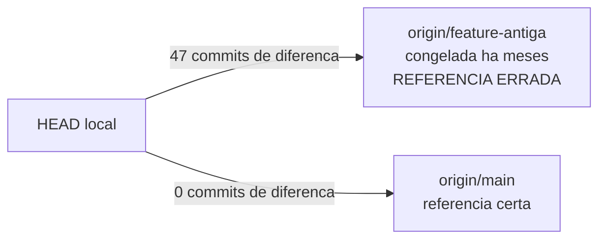
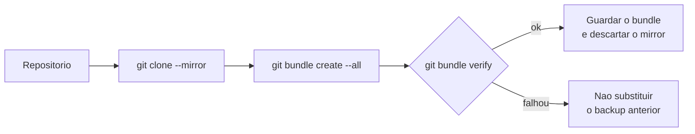
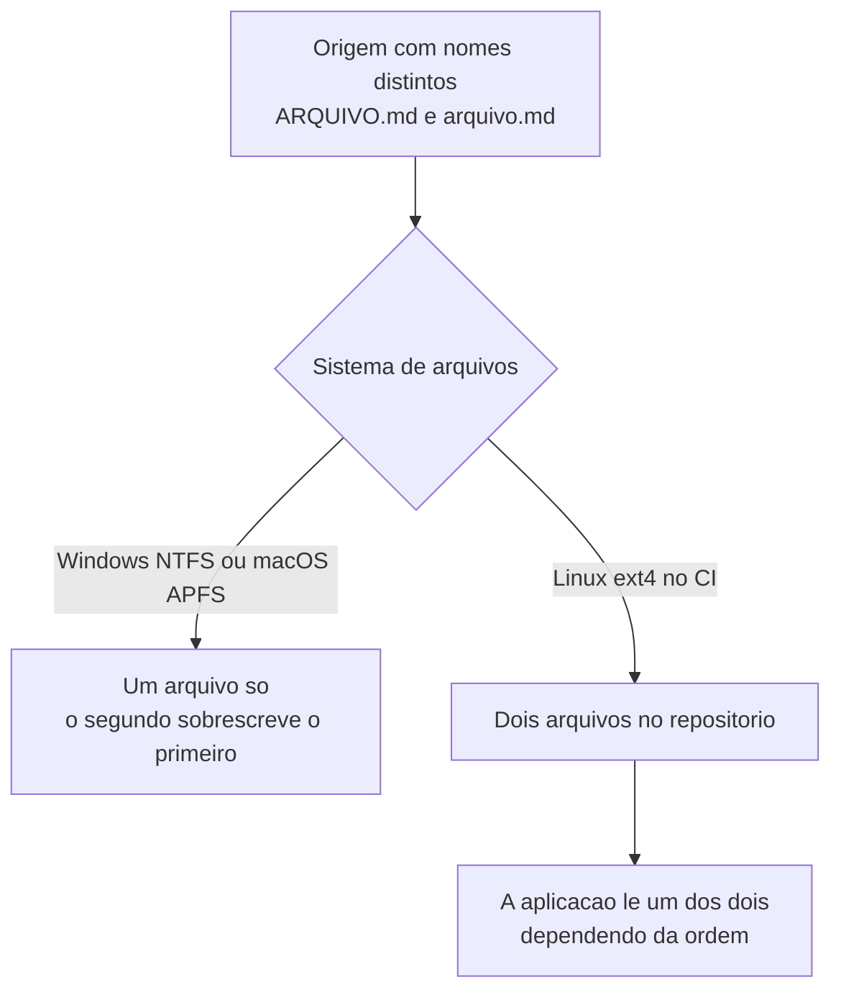

# Git

## `*.env` no `.gitignore` não pega `.env.bak`

**Sintoma:** um arquivo de backup cheio de credenciais fica versionável — ou versionado —
apesar do `.gitignore` "cobrir env".

**Causa:** o padrão casa arquivos **terminados** em `.env`. `.env.bak`, `.env.local.old` e
`.env.producao` não terminam assim.

**Como o Git lê um padrão de `.gitignore`:** o padrão precisa casar o nome **inteiro** do
arquivo, não um pedaço. `*` substitui qualquer sequência de caracteres, menos a barra. Por
isso `*.env` significa literalmente "qualquer nome que termine em `.env`" — e `.env.bak`
termina em `.bak`. Não existe casamento parcial: se sobrou um caractere no fim, não casa.

**Exemplo concreto:** antes de mexer na configuração de produção você faz
`cp .env .env.bak`, por segurança. Terminou o trabalho, `git add .`, commit, push. O
arquivo com todas as senhas do banco foi para o repositório, e o `git status` nunca deu
sinal de alerta porque você "sabia" que env estava ignorado.

**Regra:** use padrões que cubram sufixos: `.env*`, `*.env*`, e explicitamente `*.bak`.
Nunca confie na leitura visual do `.gitignore`.

**Como verificar:**
```bash
git check-ignore -v .env.bak      # se não imprimir regra, NÃO está ignorado
git status --ignored
```

---

## Regra genérica no `.gitignore` pode engolir uma pasta de código

**Sintoma:** a rota funciona local e responde 404 em produção; o arquivo "existe" na sua
máquina.

**Causa:** uma linha como `storage/` casa **qualquer** diretório com esse nome em qualquer
profundidade — inclusive uma pasta de rota de API.

**Por que a barra no começo muda tudo:** um padrão sem barra no meio é comparado contra
todos os níveis da árvore. `storage/` casa `./storage/`, `app/storage/` e
`src/api/storage/`. Com a âncora, `/storage/` casa **só** a pasta na raiz do repositório —
que era a intenção original de quem escreveu a regra.

**Exemplo concreto:** alguém ignorou `storage/` porque a aplicação salvava uploads de
teste numa pasta com esse nome. Meses depois você cria a rota `app/api/storage/route.ts`.
Ela nunca entra em nenhum commit. Local funciona, o deploy sobe verde, e a rota devolve
404 em produção — porque o arquivo simplesmente não existe lá.

**Regra:** ancore as regras (`/storage/`) em vez de deixá-las soltas. Depois de criar
arquivo em pasta de nome genérico, confirme que ele foi versionado.

---

## `.gitignore` com `*.json` global é armadilha silenciosa

**Sintoma:** um arquivo de configuração novo simplesmente "não aparece" no `git status`, e
ninguém percebe até o deploy quebrar.

**Causa:** padrão nascido de um susto legítimo (credenciais em JSON) resolvido com força
bruta: ignorar tudo e adicionar exceções `!package.json`, `!tsconfig.json`… A lista de
exceções nunca acompanha o projeto.

**Exemplo concreto:** o repositório tem `*.json` ignorado e seis linhas de exceção escritas
há dois anos. Você adiciona um arquivo de configuração de deploy na raiz. Ele não aparece
no `git status`, você assume que já estava commitado, e o deploy roda com a configuração
padrão da plataforma. O sintoma vai aparecer como comportamento estranho em produção, não
como erro de git.

**Regra:** ignore por **nome específico** dos arquivos sensíveis (`client_secret_*.json`,
`*-service-account.json`) e mantenha um comentário dizendo por quê. Se precisar de rede de
segurança, use um hook de pré-commit com varredura de segredos — não uma regra que também
esconde arquivos legítimos.

---

## Branch local rastreando upstream antigo inventa commits "não enviados"

**Sintoma:** `git status` acusa dezenas de "commits ahead" num repositório que você sabe
estar sincronizado — e você quase reescreve o remoto por causa disso.

**Causa:** o branch local ainda rastreava um branch remoto congelado meses atrás. A
contagem é real, só que contra a referência errada.

**O que é o upstream de um branch:** é o branch remoto contra o qual o Git conta "ahead" e
"behind". Ele fica gravado no `.git/config`, definido no momento em que o branch foi
criado ou pelo primeiro `push -u` — **não** é deduzido pelo nome. Um branch chamado `main`
pode perfeitamente estar apontado para `origin/qualquer-outra-coisa`, e o Git nunca vai
achar isso estranho.



**Exemplo concreto:** `git status` diz "ahead of 'origin/feature-antiga' by 47 commits".
Você acabou de dar pull, o repositório está limpo, e mesmo assim o Git insiste que há 47
commits pendentes. A tentação imediata é forçar o push para "acertar o remoto" — e é isso
que costuma destruir o trabalho de alguém.

**Como verificar:**
```bash
git rev-parse --abbrev-ref --symbolic-full-name @{u}
git log --oneline origin/main..HEAD
git branch -u origin/main          # corrige
```

---

## Antes de limpar uma máquina, varra todos os repositórios

**Sintoma:** trabalho de meses desaparece junto com o disco.

**Causa:** o que nunca virou commit não existe em lugar nenhum, e "eu acho que estava tudo
enviado" nunca é verdade em todos os repositórios.

**Exemplo concreto:** você vai formatar a máquina de trabalho e tem 12 repositórios
clonados. A varredura encontra: dois com commits locais nunca enviados, um `stash` de três
semanas atrás com a correção que você ficou devendo, e um `.env` com credenciais que só
existiam naquele disco. Nenhum dos três apareceria numa conferência "de olho".

```bash
for d in */.git; do r="${d%/.git}"; echo "== $r"
  git -C "$r" status --porcelain
  git -C "$r" log --oneline @{u}..HEAD
  git -C "$r" stash list
done
```

**Regra:** script de varredura que, para cada repositório, imprime `git status --porcelain`,
`git log @{u}..HEAD`, `git stash list` e os arquivos ignorados relevantes. Resolva item a
item antes de apagar qualquer coisa. Atenção a segredos em arquivos locais não versionados
— esses vão para o gerenciador de segredos, não para o git.

---

## Repositório vazio não se detecta pelo branch padrão

**Sintoma:** rotina de clone ou backup falha em alguns repositórios, ou gera artefato
inválido.

**Causa:** APIs de hospedagem git reportam um `default_branch` (`main`) mesmo em
repositórios que nunca receberam commit.

**Exemplo concreto:** a rotina noturna faz backup de 30 repositórios. Três foram criados na
véspera e ainda não receberam nenhum commit. A API informa `default_branch: main` para os
três, o script assume que há histórico, e o backup termina "com sucesso" gerando três
arquivos inúteis. O problema só aparece no dia em que alguém tenta restaurar.

**Regra:** use a flag explícita de repositório vazio que a API oferece; nunca infira do
branch padrão.

---

## Backup de repositório: `git bundle`, não zip da pasta

**Causa:** um bundle é um arquivo único com o histórico completo — commits, branches e
tags — restaurável com `git clone arquivo.bundle`. Zipar a pasta de trabalho guarda o
`.git` inteiro **mais** os arquivos já materializados: o mesmo conteúdo duas vezes.

**Exemplo concreto:** a pasta do projeto tem 400 MB no disco. Zipada, dá uns 300 MB — e
metade disso é a cópia de trabalho, que o `.git` já sabe reconstruir sozinho. O bundle do
mesmo repositório sai com 120 MB e, na hora de restaurar, vira um `git clone` normal em
vez de uma pasta que você espera que esteja consistente.



**Regra:** `git clone --mirror` → `git bundle create --all` → validar → descartar o mirror.
Bundle já sai comprimido (o packfile é zlib): embrulhar em zip rende quase nada. O ganho
real de espaço vem de **escolher o que não guardar** — artefato de CI, cache e binário
grande —, não de comprimir mais forte.

**Como verificar:** `git bundle verify arquivo.bundle` antes de substituir o backup
anterior.

---

## Chave SSH por repositório vai em `core.sshCommand`

**Sintoma:** você precisa de uma deploy key específica sem afetar os demais acessos SSH da
máquina.

**Causa:** editar `~/.ssh/config` é global e, em ambientes com controle de mudanças, costuma
ser bloqueado.

**Exemplo concreto:** a máquina já usa uma chave pessoal para todos os repositórios do
time. Chega um projeto que exige uma deploy key própria, só de leitura. Mexer no
`~/.ssh/config` para atender esse projeto muda o comportamento de todos os outros clones
da máquina — e, num servidor compartilhado, de todo mundo que usa aquele host.

**Regra:**
```bash
git config core.sshCommand "ssh -i ~/.ssh/<chave> -o IdentitiesOnly=yes"
```
Escopo local, reversível, não interfere em nada fora dali.

---

## Deploy por cópia de arquivo para diretório que não é repositório é dívida

**Sintoma:** o servidor tem uma versão que não corresponde a nenhum commit e ninguém sabe
qual.

**Exemplo concreto:** o ajuste era urgente, então alguém copiou dois arquivos direto da
máquina local para o servidor e reiniciou o serviço. Funcionou. Três meses depois, o
serviço apresenta um comportamento que não existe em nenhuma versão do código — e não há
como saber o que está rodando ali além de abrir arquivo por arquivo e comparar à mão.

**Regra:** se precisa ser assim, copie **apenas** de código já commitado, guarde backup
datado do estado anterior no próprio servidor, e valide o health check depois do restart.
Melhor ainda: transforme o diretório em checkout, mesmo que o deploy continue manual.

---

## Dois arquivos que só diferem em maiúsculas colidem em Windows e macOS

**Sintoma:** criar `ARQUIVO.md` falha ou sobrescreve silenciosamente porque já existe
`arquivo.md`; no CI Linux o repositório passa a ter os dois e a aplicação lê o errado.

**Causa:** NTFS e APFS são case-insensitive por padrão; ext4 não é. O Git registra a
diferença de caixa que o sistema local não enxerga.



**Exemplo concreto:** você exporta 500 registros de um banco case-sensitive, um arquivo por
chave. Duas chaves são `Produto` e `produto`. Na sua máquina Windows saem 499 arquivos e
ninguém repara — o segundo apagou o primeiro. Se o mesmo script rodar no CI Linux, saem os
500, e aí a aplicação passa a ler ora um, ora outro.

**Regra:** padronize a caixa dos nomes de arquivo de convenção e nunca dependa de distinção
por maiúsculas. Ao exportar em lote de uma origem case-sensitive para arquivos, verifique
colisão **antes** de escrever.

**Como verificar:**
```bash
git ls-files | tr 'A-Z' 'a-z' | sort | uniq -d
```
