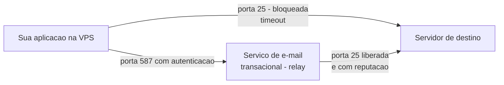
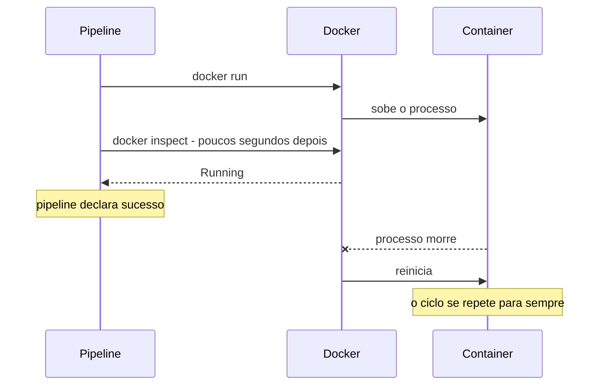
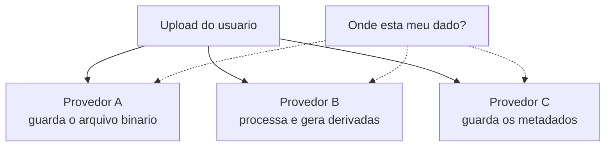

# Infraestrutura, containers e rede

## Porta 25 de saída é bloqueada pelo provedor de nuvem

**Sintoma:** a fila do servidor de e-mail cresce com `connect to ...:25: Connection timed
out`. Enviar de dentro do servidor não funciona, mas o serviço de e-mail parece saudável.

**Causa:** a maioria dos provedores de VPS bloqueia a porta 25 de saída por padrão
(antispam). O gargalo é a entrega final, não a autenticação — por isso "logar com uma conta
válida" não resolve.

**Por que existem duas portas:** a 25 é a porta em que servidores de e-mail conversam
**entre si** para a entrega final. A 587 é a porta em que um cliente autenticado **submete**
uma mensagem para um servidor que vai entregá-la por ele — isso é um relay. Como a 587 exige
autenticação, ela não serve para spam em massa e por isso quase nunca é bloqueada. Bloquear
a 25 de saída não impede você de mandar e-mail; impede você de entregar diretamente.



**Exemplo concreto:** o formulário de contato do site nunca entrega. Nos logs, a fila tem
80 mensagens presas, todas com timeout. Você troca a senha, cria uma conta nova, revisa o
código de envio — nada muda, porque nenhuma das tentativas chegou a sair da máquina.

**Regra:** configure relay para um serviço de e-mail transacional na porta 587 com SASL, ou
use a API HTTPS do provedor. Pedir desbloqueio da 25 ainda deixa a entregabilidade ruim por
reputação de IP. Verifique também se a conta está fora do modo sandbox antes de projetar o
fluxo.

**Como verificar:** compare `nc -vz -w 5 <mx-externo> 25` com `nc -vz -w 5 <relay> 587`.

---

## Entregabilidade exige DKIM + **um único** SPF + DMARC

**Sintoma:** e-mails caem em spam, ou a verificação de domínio não conclui.

**Causa:** configuração parcial, ou dois registros SPF separados no apex — o que invalida os
dois.

**Os três registros, em uma frase cada:** SPF é a lista de quem tem permissão de enviar em
nome do seu domínio; DKIM é a assinatura criptográfica que prova que a mensagem não foi
alterada e saiu de quem diz ter saído; DMARC é a instrução do que fazer quando SPF ou DKIM
falham. A regra de "um único SPF" existe porque a especificação manda o receptor tratar
domínio com dois registros `v=spf1` como erro permanente — e aí nenhum dos dois vale.

**Exemplo concreto:** o domínio já tinha um SPF do serviço de e-mail corporativo. Você
adiciona um segundo para o serviço transacional do site. A partir desse momento os e-mails
de **ambos** passam a cair em spam. O certo é um registro só, com os dois `include:`:

```
v=spf1 include:servico-a.exemplo include:servico-b.exemplo ~all
```

**Regra:** publique os CNAMEs de DKIM do provedor, **mescle** todos os `include:` num só
registro SPF, e publique DMARC. Leia a zona antes de escrever para não derrubar registros
existentes.

**Como verificar:** `dig TXT dominio` deve mostrar exatamente um `v=spf1`.

---

## Domínio sem registro MX não recebe e-mail

**Regra:** ao prometer um endereço em domínio próprio, valide o MX antes de divulgar o
endereço em cadastros e materiais. `dig +short MX exemplo.tld`.

---

## SSL curinga em subdomínio geralmente exige delegar a subzona por NS

**Sintoma:** subdomínios dinâmicos sobem sem certificado.

**Causa:** a plataforma só emite certificado curinga se ela controlar o DNS daquele nível.

**Exemplo concreto:** cada loja do seu produto ganha um endereço próprio do tipo
`nome-da-loja.lojas.exemplo.com`. Como as lojas nascem a cada minuto, não dá para pedir um
certificado por nome — é preciso um curinga para `*.lojas.exemplo.com`. E a plataforma só
consegue emiti-lo se você delegar a subzona `lojas` inteira para os servidores dela.

**Regra:** crie um registro NS para a subzona apontando para os servidores da plataforma.
**Apague antes o registro A ou curinga anterior daquele nome** — ele conflita e a API recusa
com erro do tipo "abaixo de delegação".

---

## Update de conjunto de registros DNS pode não ser `PUT`

**Sintoma:** `PUT` no recurso do registro devolve 422 sem explicação útil.

**Causa:** algumas APIs de DNS expõem a substituição como endpoint de **ação**, não como
update REST.

**Regra:** leia a referência do provedor antes de assumir semântica REST. E sempre leia a
zona antes de escrever, para não apagar registros de outros serviços.

---

## `docker inspect` dizendo "Running" não é health check

**Sintoma:** o pipeline declara sucesso e o site está fora do ar.

**Causa:** um container em restart loop aparece como "Running" durante cada tentativa.
Checar poucos segundos depois do start pega exatamente essa janela.

**O que é um restart loop:** com política de reinício automática, um container que morre é
recriado imediatamente. Se ele morre sempre — variável faltando, porta ocupada, migração que
falha —, o ciclo se repete indefinidamente. Durante os segundos em que o processo está
subindo antes de morrer, o estado reportado é legitimamente "Running". Ou seja: você não
está lendo um estado errado, está lendo um estado verdadeiro no instante errado.



**Exemplo concreto:** o deploy verifica o estado 3 segundos depois de subir. O container
leva 5 segundos para morrer por causa de uma variável de banco faltando. O pipeline fica
verde em todos os 40 deploys do dia, e ninguém descobre até um usuário reclamar.

**Regra:** valide com requisição HTTP real esperando 200, contra endereço IPv4 literal, com
algumas tentativas espaçadas.

```bash
for i in 1 2 3 4 5; do
  code=$(curl -s -o /dev/null -w '%{http_code}' http://127.0.0.1:3000/health)
  [ "$code" = "200" ] && exit 0
  sleep 5
done
exit 1
```

---

## Nunca chame o CLI do ORM via `npx` no entrypoint de um container

**Sintoma:** o container entra em restart loop em produção; local funciona. Ou: roda por
meses e um dia quebra com "flag desconhecida".

**Causa:** o CLI não está no runtime, então `npx` baixa a **última major** publicada — que
pode ter removido a flag que seu comando usa.

**O que o `npx` faz de verdade:** se o pacote existe localmente, ele o executa; se não
existe, ele **baixa da internet** a versão mais recente e executa. É esse segundo caminho
que morde. Dentro de um container de produção enxuto, o pacote quase nunca está lá — então
todo start vira um download, e todo download traz a versão publicada naquele dia.

**Exemplo concreto:** o entrypoint chama `npx <cli-do-orm> migrate deploy`. Funcionou por oito
meses. Numa terça, o mantenedor publica uma major nova, o container reinicia por qualquer
motivo banal, baixa a versão nova e morre com "flag desconhecida". Você não mudou uma linha
de código, e o site está fora.

**Regra:** copie o CLI para a imagem e invoque o binário local por caminho explícito. Fixe
versões no manifesto. Regra geral: `npx` em entrypoint é dependência de rede mais versão
flutuante.

```dockerfile
COPY --from=build /app/node_modules/.bin/ferramenta /app/node_modules/.bin/ferramenta
CMD ["/app/node_modules/.bin/ferramenta", "migrate", "deploy"]
```

**Como verificar:** `docker logs --tail 50 <container>` mostra o mesmo erro em ciclo.

---

## Módulo nativo precisa de toolchain de compilação na imagem

**Sintoma:** a instalação de dependências falha em ambiente limpo com erro de compilação,
mesmo funcionando na máquina do desenvolvedor.

**Causa:** pacotes que falam com o SO em baixo nível não têm binário pré-compilado para
toda combinação de plataforma e versão, e caem para compilar do fonte.

**O que é um módulo nativo:** a maior parte dos pacotes é só código interpretado, que roda
igual em qualquer lugar. Um módulo nativo contém código C/C++ que precisa virar binário para
aquele sistema operacional, arquitetura e versão de runtime específicos. Os autores publicam
binários prontos para as combinações mais comuns; quando a sua não está na lista, o
instalador tenta compilar — e aí precisa de compilador, `make` e Python presentes na imagem.
Na sua máquina isso já existe há anos; numa imagem base enxuta, não existe nada.

**Exemplo concreto:** o pacote de processamento de imagem instala em 5 segundos no seu
notebook e falha na imagem `slim` com um erro de mil linhas terminando em `gyp ERR!`. Não é
o pacote que quebrou: é a sua máquina que tinha o compilador instalado e a imagem não tem.

**Regra:** instale compilador, `make` e Python na imagem **antes** do install. Melhor
ainda: pré-construa uma imagem base com as dependências pesadas já instaladas e rebaseie a
aplicação nela — corta ordens de magnitude do tempo de build.

---

## Swap resolve o congelamento de build, mas é mitigação

**Sintoma:** build na VPS trava a máquina, derruba o SSH e mata a aplicação.

**Causa:** build de aplicação moderna é o pico de RAM do ciclo de vida do projeto, e VPS
baratas dimensionam RAM para o regime permanente.

**O que é swap:** é um pedaço de disco que o sistema usa como se fosse memória quando a RAM
acaba. Ele impede o desfecho brutal — o kernel matando processos por falta de memória —, mas
disco é ordens de magnitude mais lento que RAM. Com swap, o build que morreria em 2 minutos
passa a terminar em 30, e durante esses 30 minutos a máquina inteira fica arrastada, porque
está movendo páginas entre RAM e disco o tempo todo.

**Exemplo concreto:** a VPS de 2 GB atende a loja com folga o ano inteiro, usando 600 MB. O
build consome 3 GB por 90 segundos, uma vez por deploy. Você dimensionou a máquina para o
regime permanente e ela morre no pico — que é raro, previsível e nem precisava acontecer ali.

```bash
fallocate -l 2G /swapfile && chmod 600 /swapfile
mkswap /swapfile && swapon /swapfile
```

**Regra:** crie swap como rede de segurança — mas entenda que ele troca "morrer" por "ficar
muito lento", ainda estressando a CPU que deveria atender clientes. A solução real é não
compilar na máquina de produção.

---

## Estado de job só em memória significa que restart destrói trabalho

**Sintoma:** um deploy ou restart apaga jobs em andamento sem rastro; o usuário fica
esperando para sempre.

**Exemplo concreto:** a exportação do relatório leva 4 minutos e guarda o progresso numa
variável do processo. Você faz um deploy de correção de typo no meio dela. O processo novo
sobe sem saber que existia um job, e a tela do usuário continua girando até ele desistir —
não há erro, não há log, não há nada.

**Regra:** persista estado de job (fila, progresso, resultado) fora do processo. Enquanto
isso não existir, documente em local visível "não reiniciar com job ativo" e verifique antes
de reiniciar.

---

## Métrica que a ferramenta não expõe exige um segundo comando

**Sintoma:** um campo aparece sempre zerado no painel de monitoramento de containers.

**Causa:** o comando de estatísticas em tempo real não inclui uso de disco; é uma métrica
cara, coletada por outro caminho.

**Regra:** verifique qual comando expõe a métrica e mescle os dois resultados por
identificador, em vez de estimar.

---

## Saída de CLI vem com unidade grudada e zera gráfico

**Sintoma:** barras do gráfico não renderizam altura nenhuma; os valores aparecem certos
nas tabelas.

**Causa:** ferramentas de linha de comando devolvem strings formatadas (`12.5%`, `1.2GiB`).
Bibliotecas de gráfico precisam de número; string vira `NaN` ou zero.

**Exemplo concreto:** a tabela mostra "1.2GiB" e "512MiB" corretamente, porque texto é texto.
O gráfico ao lado fica com todas as barras rentes ao chão. O bug parece ser do componente de
gráfico, mas o dado nunca foi numérico — e, de quebra, ordenar por essa coluna colocaria
"512MiB" acima de "1.2GiB", porque a comparação é alfabética.

**Regra:** normalize na camada de API — remova símbolo, converta para uma base única e
devolva número puro. A unidade volta só no rótulo da interface.

---

## Antes de debugar, confirme qual serviço realmente guarda o dado

**Sintoma:** horas perdidas olhando um painel vazio, concluindo que "nada foi salvo".

**Causa:** arquiteturas multi-provedor separam armazenamento de arquivos, processamento e
metadados em serviços diferentes.



**Regra:** mantenha um diagrama de uma tela por sistema dizendo qual provedor guarda o quê.
Ao investigar, primeiro identifique o dono do dado.

---

## Quando "tudo ficou estranho de uma vez", vá aos logs antes de caçar bug

**Sintoma:** vários registros mudam ao mesmo tempo e a hipótese natural é escrita em massa
defeituosa.

**Causa:** foi clique humano. Em aplicações com ações de servidor, cada clique aparece como
uma requisição na rota da própria página, com timestamp.

**Exemplo concreto:** trinta produtos aparecem como "inativos" numa manhã. A suspeita
imediata é um job de sincronização com bug. Os logs mostram trinta requisições na rota do
painel entre 9h12 e 9h14, todas da mesma sessão: alguém selecionou tudo e clicou em
desativar. Um minuto de log economizou meio dia de leitura de código correto.

**Regra:** consulte os logs de runtime primeiro. Três requisições no mesmo minuto provam a
origem em um minuto e evitam horas depurando código correto. Retenção curta de log é motivo
real para manter observabilidade paga.

---

## Meça antes de escolher em qual servidor rodar

**Sintoma:** você monta um ambiente novo no servidor que já está sufocado de memória,
arriscando derrubar produção.

**Causa:** o inventário citava só um host; havia outro, com folga, que não estava
documentado.

**Exemplo concreto:** o documento de infraestrutura lista um servidor. Você começa a subir
o ambiente novo nele e vê 90% de memória em uso. Só ao rodar `free -m` em tudo que responde
é que aparece um segundo host, com 80% de RAM livre, pago há meses e usado por um único
serviço esquecido.

**Regra:** antes de recomendar onde rodar qualquer coisa nova, liste os hosts existentes e
meça memória e disco em **todos** os candidatos. Depois, atualize o documento: a lacuna que
enganou você vai enganar o próximo.

```bash
free -m | awk 'NR==2 {print "RAM livre:", $7, "MB"}'
df -h --output=target,pcent,avail / /var
```

---

## Franquia gratuita pode valer só nos 12 primeiros meses da conta

**Sintoma:** a conta do fornecedor vem maior do que a calculadora interna previa.

**Causa:** muitos "X mil requisições grátis por mês" são benefício de conta nova, não
permanente — e frequentemente não cobrem o armazenamento associado.

**Exemplo concreto:** você calcula o preço do seu produto assumindo 20 mil chamadas grátis
por mês. No décimo terceiro mês da conta a franquia some, as 20 mil chamadas passam a ser
cobradas integralmente, e a margem que você prometeu ao cliente vira prejuízo — com o preço
já publicado.

**Regra:** ao repassar custo, use **zero** de franquia por padrão e deixe configurável.
Errar cobrando a menos é pior que cobrar a mais. E meça o custo em vez de estimar: registre
cada chamada paga como evento de uso.

---

## Redundância de dado de fonte viva se faz espelhando o destino, não re-executando

**Sintoma:** você quer uma cópia local de segurança do que um pipeline grava num
armazenamento remoto e pensa em rodar o mesmo pipeline localmente — mas as duas cópias do
"mesmo dia" nunca batem, e você começa a desconfiar de corrupção.

**Causa:** o pipeline extrai de uma **fonte viva**, que muda ao longo do dia. Duas execuções
em horários diferentes fotografam estados diferentes da fonte; a cópia "redundante" diverge
da original **por origem, não por defeito**.

**Exemplo concreto:** um relatório "do dia 8" no sistema de origem continua ganhando e
alterando registros depois da meia-noite. O pipeline oficial extraiu às 7h; você re-extrai
às 15h para "ter uma cópia" e ela vem com mais linhas. Comparando arquivo a arquivo, os dois
"dia 8" divergem — e você perde horas achando que é bug de pipeline.

**Regra:** redundância de **dado** se faz copiando o artefato final (espelhar o destino:
baixar o que já foi gravado), não reproduzindo o processo. Reserve a re-execução para
redundância de **capacidade** (poder rodar se o executor cair), ciente de que ela gera dado
novo, não idêntico. Para provar que a cópia é fiel, compare tamanho e hash **contra o
destino** — nunca contra uma nova extração.

```bash
# fiel = comparar contra o destino (tamanho/hash), nao contra uma re-extracao
aws s3api head-object --bucket destino --key caminho/arquivo   # tamanho + ETag
md5sum copia_local/caminho/arquivo                             # bate com o ETag (parte unica)
```

---

## Imagem nginx oficial com `USER` não-root entra em crash loop

**Sintoma:** você sobe um site estático atrás de um reverse proxy e o container "sobe",
mas o domínio devolve `404 page not found` do proxy — não a sua página. Um 404, não um 502:
parece que a rota nem existe.

**Causa:** o Dockerfile terminava com `USER 1000` (ou qualquer UID não-root) "por segurança".
A imagem oficial do nginx precisa de root no processo master para criar `/var/cache/nginx/*`
e bindar a porta 80 (portas abaixo de 1024 exigem privilégio). Sem isso:
`[emerg] mkdir() "/var/cache/nginx/client_temp" failed (13: Permission denied)` → o processo
morre → `restart: always` recria → **crash loop**. Container em loop não fica conectado à rede
do proxy; o proxy não vê backend e, como não há rota registrada para aquele host, responde 404.

**Por que 404 e não 502:** um 502/503 seria "tenho rota, mas o backend não responde". Um 404
do proxy é "não tenho rota para esse host". O reverse proxy que descobre backends por container
só registra a rota quando o container está **rodando e conectado à rede**. Um container em
`Restarting` some da rede — então a rota nunca nasce.

**Exemplo concreto:** você compara o container problemático com um que funciona:
`docker network inspect proxynet` lista o do vizinho, mas **não** o seu — apesar de
`docker inspect` mostrar o mesmo NetworkID nos dois. Essa é a pista: NetworkID igual, porém
ausente da lista de conectados = o container não está *up* naquele instante.

```dockerfile
USER 1000:1000   # NÃO: nginx como UID arbitrário quebra o cache e o bind da porta 80
# A imagem oficial já roda o master como root e os workers como 'nginx'. Remova a linha USER.
```

**Regra:** não coloque `USER <uid>` no Dockerfile de uma imagem nginx oficial servindo na
porta 80 — ela foi feita para rodar o master como root e derrubar privilégio nos workers. Se
precisa mesmo de não-root, use a variante `nginx-unprivileged` (escuta em 8080) e ajuste a
porta no proxy.

**Como verificar:** `docker ps -a` mostra `Restarting (1)`; `docker logs <container>` mostra o
`[emerg] ... Permission denied`; `docker network inspect <rede>` **não** lista o container
mesmo o NetworkID batendo em `docker inspect`.

---

## Middleware de proteção no reverse proxy é por-rota, não global

**Sintoma:** você publica um serviço novo atrás do mesmo reverse proxy que já protege os
outros, assumindo que a proteção de acesso "vale para todos". Testa de fora da rede e o serviço
novo responde **200** — aberto — enquanto os antigos respondem **403**.

**Causa:** o middleware que bloqueia acesso externo (allowlist de IP, autenticação) é aplicado
**por roteador**, via label/config em cada serviço — não é um filtro global do entrypoint. Cada
serviço novo nasce **sem** o middleware e, portanto, público. "Os outros estarem protegidos"
não propaga nada para o novo.

**Por que é fácil errar:** a proteção parece uma propriedade do proxy ("o proxy protege o
domínio"), mas na verdade é uma propriedade de cada **rota** que o proxy conhece. Adicionar uma
rota nova é adicionar uma rota **sem** as defesas, a menos que você repita o label do middleware.

**Exemplo concreto:** dois serviços atrás do mesmo reverse proxy. De fora da rede,
`curl https://antigo.exemplo.com` → 403 (middleware barra); `curl https://novo.exemplo.com`
→ 200 (sem middleware). A diferença não está no proxy — está no label de middleware que só o
antigo carrega.

**Regra:** trate a proteção de acesso como parte do **contrato de cada rota**, não do proxy. Ao
publicar um serviço, replique explicitamente o middleware; e valide de fora.

**Como verificar:** `curl` do lado de fora da rede contra o serviço novo. **403 = protegido;
200 = público.** Não confie em "está atrás do proxy protegido".

---

## `proxy_pass https://` no nginx: o header Host não é o SNI do TLS

**Sintoma:** Reverse proxy do nginx para uma API externa por HTTPS retorna 502, "certificate mismatch" ou serve o certificado errado — mesmo com o header `Host` apontando para o domínio certo.

**Causa:** `proxy_set_header Host dominio` só ajusta o header HTTP (camada 7). O nome enviado no handshake TLS (SNI) é controlado separadamente e, por padrão, o nginx **não** envia SNI para o upstream. Upstreams atrás de proxy compartilhado/CDN (que selecionam o certificado por SNI) devolvem o certificado padrão e o handshake quebra.

**Exemplo concreto:** Bloco `location /api/ { proxy_pass https://api.terceiro.example/; proxy_set_header Host api.terceiro.example; }`. Funciona contra um IP dedicado, mas contra um upstream por SNI dá erro de TLS. Falta `proxy_ssl_server_name on;`.

**Regra:** Ao fazer `proxy_pass` para um upstream HTTPS, ligue `proxy_ssl_server_name on;`. Trate SNI (TLS) e `Host` (HTTP) como dois ajustes independentes. Bônus: passar a API de terceiro pelo seu próprio `/api/` é justamente o que elimina o CORS no navegador — mas só se o TLS ao upstream fechar.

```nginx
location /api/ {
  proxy_pass https://api.terceiro.example/;
  proxy_ssl_server_name on;              # envia SNI
  proxy_set_header Host api.terceiro.example;  # header HTTP, coisa diferente
}
```

---

## Caminho absoluto de disco do Windows em código que roda em container Linux vira pasta-fantasma

**Sintoma:** No servidor, a memória de curto prazo nunca persiste entre execuções, ou aparece um diretório com nome estranho tipo `D:` dentro do container. Nenhum erro é lançado.

**Causa:** Uma classe de contexto guarda o arquivo de estado num caminho absoluto de Windows fixado no código (`D:/projeto/utils/memory.json`). Em Linux, `os.makedirs(os.path.dirname(...))` cria alegremente uma pasta literal chamada `D:` na raiz do processo e grava lá — o path é "válido" no POSIX, só que sem sentido.

**Exemplo concreto:** `ContextManager(memory_file="D:/projeto/utils/memory.json")`. Roda no notebook do dev; no container Docker de produção grava em `/app/D:/projeto/...`, some no próximo deploy e a memória volátil fica morta enquanto ninguém percebe.

**Regra:** Nunca fixe caminho absoluto de uma plataforma em código que também roda noutra. Derive o path de `__file__`, de uma env var, ou de um volume declarado. Se o mesmo código roda no seu Windows e num container Linux, um caminho com letra de drive é bug garantido.

## Olhe a carga antes de paralelizar — o gargalo pode não ser CPU

**Sintoma:** você paraleliza um processamento (mais workers, mais threads) e o tempo
quase não muda; ou aluga uma máquina maior e ela fica ociosa.

**Causa:** paralelismo de CPU só acelera trabalho limitado por CPU. Se o gargalo é rede
ou disco, mais núcleos disputam a mesma banda — e a carga do sistema, que denunciaria
isso de graça, não foi olhada antes da decisão.

**Exemplo concreto:** deduplicação de corpus numa máquina de 16 núcleos: carga 0,27 —
94% ociosa, gargalo era o download sequencial de um objeto por vez do bucket. Prefetch
de 10 downloads em paralelo (threads de I/O, não de CPU): 7× mais rápido. No mesmo dia,
o caso oposto: tokenização com carga 1,0 em 16 núcleos era gargalo de CPU serial
(`encode` monothread) — a correção foi outra (`encode_batch`). A mesma leitura de carga
diagnosticou os dois em segundos.

**Regra:** antes de paralelizar, `uptime` + `top` por 30 segundos. Carga ≪ núcleos =
gargalo de I/O (paralelize downloads/leituras); carga ≈ 1 com um processo = serialização
de CPU (paralelize o cálculo); carga ≈ núcleos = já saturado (paralelizar piora).

**Como verificar:** a razão carga/núcleos durante o processamento. Se você nunca a
mediu, a sua intuição sobre o gargalo está desinformada — nos dois casos acima ela
estava errada.

## APIs em transição de versão: cada operação pode morar numa versão diferente

**Sintoma:** o DELETE de um recurso devolve 404 numa versão da API e funciona na outra —
enquanto a LISTAGEM faz o oposto. O código "corrigido para a versão nova" deixa de
conseguir destruir recursos que continuam cobrando.

**Causa:** provedores migram endpoints um a um. Durante a transição, a versão antiga
responde erro explícito para uns caminhos e a nova ainda não implementa outros. Corrigir
o cliente inteiro para uma única versão troca um conjunto de falhas por outro.

**Exemplo concreto:** na API do Vast.ai, `/api/v0/instances/` (listagem) foi aposentado
com erro 410 e lista vazia — fazendo a checagem "sobrou instância?" dar falso negativo —
enquanto o DELETE só funciona na v0 e devolve 404 na v1. Um desligamento automático que
confiou na v1 deixou uma instância de GPU cobrando por 2 horas com "sucesso" no log.

**Regra:** trate a versão POR OPERAÇÃO, não por cliente; após qualquer DELETE, confirme
pela LISTAGEM que o recurso sumiu — nunca pelo código de retorno; e teste o caminho de
destruição com a mesma seriedade do de criação, porque é ele que para a cobrança.

**Como verificar:** para cada operação do seu cliente, chame as duas versões e anote a
matriz do que funciona onde — ela raramente é uniforme.
