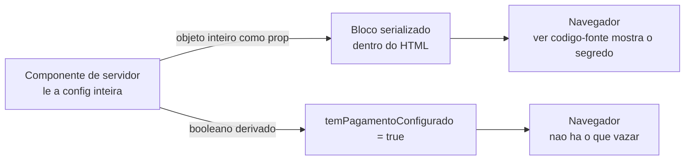
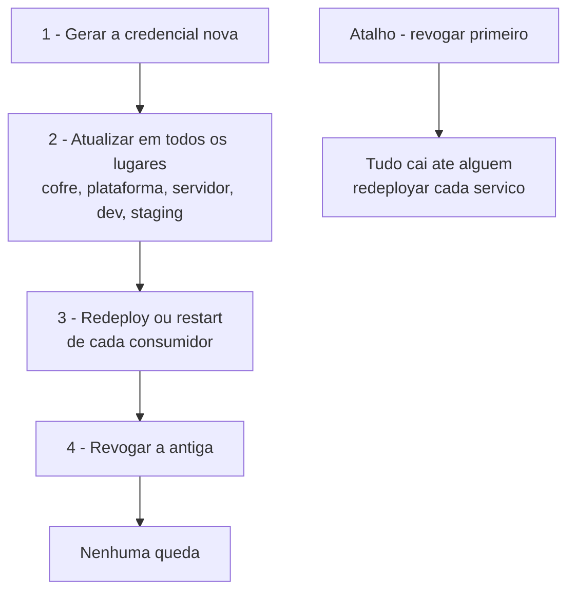
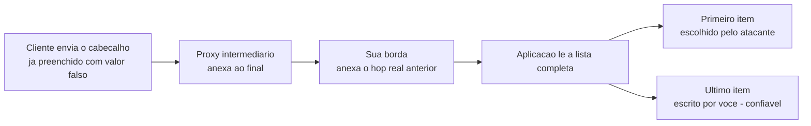
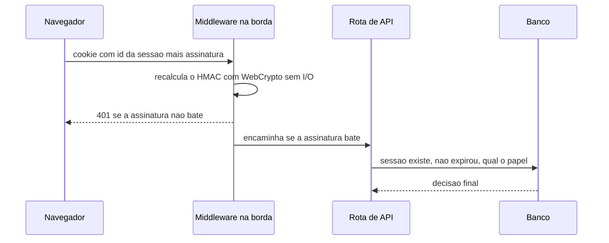

# Segurança e segredos

## `process.env.X || "<valor real>"` é vazamento disfarçado de robustez

**Sintoma:** o código "nunca quebra por falta de variável" — e a chave real está no
repositório, no bundle do cliente e no histórico do Git para sempre.

**Causa:** esse padrão nasce de um incidente legítimo (a variável não carregou em
produção e derrubou o login) e vira hábito. Aparece em segredo de sessão, chave de API
de mapa, string de conexão em arquivo de configuração.

**Exemplo concreto:** o login do seu blog caiu numa sexta porque o segredo de sessão não
foi injetado. Você escreve `process.env.SESSION_SECRET || "s3nh4-do-blog-2024"` para não
acontecer de novo. Um ano depois esse literal está em 400 commits, e qualquer pessoa que
clonar o repositório consegue forjar o cookie de qualquer usuário.

**Regra:** falte a variável, **falhe alto** — `throw new Error("X não definida")` na
inicialização. Um erro de boot claro custa minutos; uma chave versionada custa rotação
de credencial e reescrita de histórico. Para o caso "a plataforma às vezes não injeta",
a correção é conferir o escopo/ambiente da variável, não embutir o valor.

**Como verificar:**
```bash
git grep -nE "process\.env\.[A-Z_]+ *\|\| *[\"'][^\"']{8,}"
```
Só placeholders óbvios devem aparecer.

---

## Prefixo `NEXT_PUBLIC_` / `VITE_` é contrato, não convenção

**Sintoma:** uma chave secreta aparece no bundle JavaScript servido ao usuário. Nenhum
erro, nenhum aviso.

**Causa:** esses prefixos instruem o bundler a **inlinear** o valor no código que vai
para o navegador. É o comportamento documentado — o erro é humano, ao nomear.

**O que significa "inlinear":** o bundler não lê a variável em tempo de execução; ele
faz uma substituição de texto durante o build. Onde estava `process.env.NEXT_PUBLIC_X`,
o arquivo JavaScript final passa a conter o valor literal, escrito por extenso. Não há
nada em runtime que possa esconder isso depois.

**Exemplo concreto:** numa loja online, a chave pública do provedor de pagamento precisa
mesmo ir para o navegador, então alguém a nomeia com prefixo público — correto. Meses
depois, outra pessoa precisa da chave **secreta** do mesmo provedor num componente e,
como "o outro nome funcionava", duplica com o mesmo prefixo. A chave que autoriza estorno
passa a ser servida junto com a página de checkout.

**Regra:** só use esses prefixos em valor que você publicaria num outdoor. Ao criar uma
variável, decida primeiro o lado (servidor ou cliente) e só então o nome. Nunca
"duplique com prefixo público para facilitar".

**Como verificar:** busque o valor no bundle de produção. Se estiver lá, é público.

---

## Prop de componente de servidor para componente de cliente vaza para o HTML

**Sintoma:** a chave secreta de um serviço externo aparece no payload de hidratação da
página, visível em "ver código-fonte" — mesmo o código nunca tendo usado um prefixo público.

**Causa:** props passadas de um componente de servidor para um de cliente são
serializadas e enviadas ao browser. Passar o objeto de configuração inteiro leva junto
o segredo.

**O que é hidratação, e por que ela carrega dados:** o servidor manda HTML pronto para o
usuário ver rápido, mas o JavaScript no navegador precisa reassumir aquela tela e torná-la
interativa. Para isso ele precisa dos **mesmos dados** que o servidor usou — e esses dados
viajam embutidos no HTML, num bloco serializado. Tudo que virou prop de um componente de
cliente está nesse bloco, legível por qualquer pessoa.



**Exemplo concreto:** a página de configurações lê o registro da loja no banco e passa
`<PainelPagamento loja={loja} />`. O objeto `loja` tem 12 campos, e um deles é a chave
secreta do provedor de pagamento. A tela nunca mostra esse campo — mas ele está no HTML.

**Regra:** nunca passe o segredo como prop. Derive no servidor apenas o que a UI precisa
saber — normalmente um booleano (`temPagamentoConfigurado`) ou um dado já mascarado.

**Como verificar:**
```bash
curl -s https://SEU_HOST/pagina | grep -c -iE "api[_-]?key|secret"
```
Qualquer resultado maior que zero merece inspeção.

---

## Chave de API de terceiro pertencente ao seu cliente exige cifra em repouso

**Sintoma:** nenhum visual — a credencial do inquilino está no payload serializado do
componente cliente.

**Causa:** passar o objeto inteiro do registro (que inclui a credencial daquele cliente)
como props.

**O que é "cifrar em repouso", e por que o ponto único importa:** cifrar em repouso é
guardar o valor embaralhado no banco, de modo que um dump do banco — vazado, copiado para
staging, aberto num cliente de SQL — não entregue a credencial. A cifra só é desfeita no
instante do uso. Se a decifragem estiver espalhada por dez lugares, você tem dez lugares
onde o valor claro pode acabar num log ou numa prop; concentrando num único módulo, há um
lugar só para auditar.

**Exemplo concreto:** sua plataforma hospeda 300 lojas, e cada lojista cola a própria
chave do provedor de pagamento no painel. Essas 300 chaves não são suas: um vazamento
significa cobranças indevidas na conta de terceiros, e você é quem responde.

**Regra:** derive booleanos no servidor e passe só isso. Cifre a credencial em repouso
(AES-256-GCM) e decifre num **único ponto** — o cliente HTTP que fala com o provedor —
mantendo compatibilidade com registros legados em texto até a próxima gravação.

**Como verificar:** busque o prefixo conhecido da chave no HTML servido; deve dar zero.

---

## Nunca guarde token de plataforma dentro do painel entregue ao cliente

**Sintoma:** requisito de produto ("o cliente configura o domínio dele sozinho") que
exigiria armazenar um token com escopo de conta.

**Causa:** tokens de plataforma de deploy normalmente valem para **todos** os projetos
da conta — o raio de explosão é a sua operação inteira.

**Regra:** prefira deixar o último passo manual e documentado a materializar um token de
alto privilégio num sistema multi-inquilino. Automatize apenas se houver token com
escopo por projeto.

---

## O artefato do CI é um pacote acessível: não coloque `.env` dentro dele

**Sintoma:** nenhum — funciona perfeitamente, e é por isso que passa despercebido.

**Causa:** para o build precisar de variáveis, é tentador gerar um `.env.production` no
CI e incluí-lo no `tar.gz` do artefato. Artefatos são baixáveis por qualquer pessoa com
acesso de leitura ao repositório e ficam retidos por dias.

**Exemplo concreto:** o pipeline monta o build e empacota a pasta inteira, `.env.production`
junto. O arquivo fica disponível para download por 30 dias, para qualquer colaborador com
leitura no repositório — inclusive o estagiário que entrou ontem e o contratado que saiu
mês passado mas ainda tem acesso.

**Regra:** injete segredos como variáveis de ambiente do passo de build, nunca como
arquivo dentro do artefato. Se o runtime precisar deles, entregue no servidor de destino
no momento da execução.

**Como verificar:**
```bash
tar -tzf artefato.tar.gz | grep -iE '\.env|secret|key'   # saída tem que ser vazia
```

---

## Não empacote arquivo de ambiente dentro de instalador desktop

**Sintoma:** nenhum — o app funciona. E cada usuário que instalou tem sua chave de API
paga em disco.

**Causa:** empacotadores de app desktop aceitam listar `.env` em recursos extras, e é a
forma mais rápida de fazer o app funcionar sem backend.

**Exemplo concreto:** um app de tarefas com um recurso de resumo automático. Para evitar
subir um backend, a chave paga vai dentro do instalador. Foram 500 downloads: agora
existem 500 cópias da sua chave em máquinas alheias, e basta uma pessoa curiosa abrir a
pasta de instalação para começar a gastar seu crédito.

**Regra:** chave paga fica no seu servidor; o app desktop fala com um endpoint seu,
autenticado por credencial do usuário. Se o app precisa mesmo de chave, ela é **do
usuário**, digitada por ele e guardada no cofre do sistema operacional.

**Como verificar:** descompacte o instalador gerado e procure por `.env` e por prefixos
de chave conhecidos.

---

## Segredo impresso em comando de shell fica gravado em log para sempre

**Sintoma:** uma chave aparece em texto claro no histórico do terminal ou num arquivo de
transcrição exportado — muito depois de ter sido "usada só uma vez".

**Causa:** comandos como `echo`, `export` inline e testes rápidos de credencial são
capturados pelo histórico do shell e por qualquer ferramenta que registre a sessão.
Truncar na tela não trunca no arquivo.

**Exemplo concreto:** para conferir se a variável carregou, você roda `echo $API_KEY`.
O valor aparece na tela por um segundo e some. Mas ficou no arquivo de histórico do shell,
na gravação da sessão e no log da ferramenta que você usa para trabalhar — três cópias
que ninguém vai lembrar de limpar.

**Regra:** nunca ecoe uma credencial. Para testar, verifique só o efeito
(`comando && echo OK`) ou o hash do valor. Trate qualquer chave que tenha passado por um
comando como comprometida.

**Como verificar:**
```bash
grep -rIn -E "(sk-|AKIA|ghp_|xox[baprs]-)" . --exclude-dir=.git
```

---

## Compare segredos por hash, nunca expondo o valor

**Sintoma:** você precisa saber se o token que achou num arquivo é o mesmo do
gerenciador de segredos, sem imprimir credencial em lugar nenhum.

**Causa:** muitos gerenciadores são write-only e a comparação exigiria olhar o valor.

**Regra:** compare o `sha256` dos dois valores — prova igualdade sem revelar nada.
Registre apenas essa evidência; nunca cole o valor completo em anotação ou ticket.

```bash
printf '%s' "$DO_ARQUIVO" | sha256sum
printf '%s' "$DO_COFRE"   | sha256sum
# hashes iguais = mesmo segredo, e nada sensível foi impresso
```

---

## Audite documentação cruzando contra os valores reais do cofre

**Sintoma:** uma chave de API achatada no meio de um documento de arquitetura, um `.md`
de anotações ou um log de sessão, escrita meses atrás e esquecida.

**Causa:** documento de contexto é escrito no fluxo do trabalho, quando o valor está à
mão. Diferente de código, não passa por review nem por scanner de segredo.

**Exemplo concreto:** no `README` do projeto alguém escreveu "para testar local, use a
chave `xxxxx` do ambiente de sandbox". Na época era sandbox mesmo. Depois o valor foi
promovido a produção e ninguém voltou no `README` — que está num repositório público.

**Regra:** varra a documentação como você varreria o código. Regex de formato (`sk-`,
`AKIA`, `ghp_`) pega uma parte, mas o método mais forte é comparar contra os valores
reais do cofre: qualquer trecho que bata exatamente com um segredo real é exposição
confirmada, sem falso positivo.

**Ponto cego importante:** essa técnica **não** encontra o token que dá acesso *ao*
próprio cofre, porque ele não está guardado *dentro* dele. Combine os dois métodos.

**Como verificar:** carregue os valores do cofre em memória e procure cada um nos
documentos. Reporte só nome e localização — nunca imprima o valor.

---

## Rotação: crie o novo e propague antes de revogar o antigo

**Sintoma:** token vazado é revogado imediatamente "por segurança" e três aplicações
caem em produção.

**Causa:** o mesmo valor costuma estar replicado em vários lugares (gerenciador de
segredos, envs de plataforma, configs de servidor), e o runtime só recarrega em novo
deploy ou restart.



**Regra:** sequência obrigatória — (1) gerar a credencial nova; (2) atualizar em
**todos** os lugares onde o valor aparece, incluindo dev e staging; (3) redeploy ou
restart de cada consumidor; (4) só então revogar a antiga. Antes de tudo, mapeie os
consumidores: nomes iguais em projetos diferentes muitas vezes são valores diferentes e
não devem ser tocados.

---

## Duas fontes de verdade para o mesmo segredo divergem em silêncio

**Sintoma:** a aplicação conecta com uma credencial antiga depois de uma rotação
"concluída".

**Causa:** a mesma variável existe no gerenciador de segredos **e** nas variáveis de
ambiente da plataforma de deploy, e só uma foi atualizada. Editar direto no painel do
host cria uma segunda fonte que o gerenciador não sobrescreve nem audita.

**Exemplo concreto:** numa madrugada de incidente, alguém colou a senha nova direto no
painel da plataforma de deploy para resolver rápido. Funcionou. Três meses depois, a
rotação oficial atualiza o gerenciador de segredos, todo mundo dá deploy — e a aplicação
continua usando a senha antiga, porque o valor do painel vence.

**Regra:** escolha uma fonte canônica. Se a duplicação for inevitável, documente e
rotacione nos dois lugares no mesmo procedimento. Saiba, por projeto, qual é a fonte
**efetiva** do runtime — ter o valor "guardado em algum lugar" não é o mesmo que ele
estar disponível no processo.

---

## Mantenha um índice de nomes de variáveis — nunca de valores

**Sintoma:** você copia o valor de uma variável de um projeto para outro porque "tem o
mesmo nome", e a aplicação sobe apontando para o banco de outro sistema — e escreve nele.

**Causa:** nomes genéricos (`DATABASE_URL`, `ENCRYPTION_KEY`, `API_KEY_*`) se repetem
entre projetos com valores completamente diferentes. Convenções divergem entre projetos
criados em épocas diferentes: dá para ter `SERVICE_API_KEY` num e `API_KEY_SERVICE`
noutro, com valores de contas distintas.

**Exemplo concreto:** você está subindo o app de reservas e falta `DATABASE_URL`. O
projeto do blog tem uma variável com esse nome exato, então você copia. O app de reservas
sobe lindamente — rodando migrations no banco do blog.

**Por que o índice guarda só nomes:** a maioria dos gerenciadores de segredos é
*write-only* — depois de gravado, o valor não é mais legível nem por você. Isso é
proposital e bom. A consequência prática é que, sem um mapa externo dizendo **onde cada
nome mora e para que serve**, a única forma de descobrir é adivinhar por tentativa.

**Regra:** mantenha um mapa versionado **só com nomes e propósito** — em qual projeto
cada variável mora e para que serve. Isso é essencial porque muitos gerenciadores são
write-only: depois de criado, o valor não é mais legível, e sem o mapa você adivinha.
Documente explicitamente os pares de nomes trocados que já causaram confusão.

**Como verificar:** audite o índice **nos dois sentidos** — todo segredo do cofre está
documentado? todo nome documentado ainda existe? Cuidado com notação compacta
(`PREFIX_ID{,_DAY,_WEEK}`): economiza espaço mas some do grep. Escreva por extenso.

---

## Duas credenciais do mesmo fornecedor com finalidades opostas trocam de lugar

**Sintoma:** a cobrança funciona mas o webhook dá 401 (ou o inverso) depois que alguém
"organizou" os segredos.

**Causa:** provedores de pagamento costumam ter **chave de API** (seu app chama o
provedor) e **token de assinatura de webhook** (o provedor chama seu app). São coisas
diferentes, geradas em telas diferentes, e ambas parecem "o token do fornecedor".

**Exemplo concreto:** a loja continua cobrando normalmente, então ninguém percebe nada.
Mas o pedido nunca sai do status "aguardando pagamento", porque a confirmação que o
provedor envia de volta está sendo rejeitada com 401. Você descobre pelo cliente
reclamando, não pelo monitoramento.

**Regra:** nomeie pelo **sentido do tráfego** (`X_API_KEY` vs `X_WEBHOOK_TOKEN`),
documente em que painel cada uma é gerada, e teste os dois caminhos após qualquer rotação.

---

## Credencial SMTP não é a chave de API do mesmo provedor

**Sintoma:** autenticação SMTP falha repetidamente com uma chave que funciona nas
chamadas de API.

**Causa:** provedores de e-mail transacional emitem credenciais SMTP separadas.

**Regra:** gere explicitamente as credenciais SMTP no console do provedor. Em alguns casos a
senha SMTP é derivada deterministicamente da chave da conta — se for, ela é re-derivável a
qualquer momento e não precisa ser guardada como segredo separado. Confira a documentação
antes de tratá-la como valor independente.

---

## Tarefa agendada nunca usa credencial pessoal

**Sintoma:** vários jobs quebram simultaneamente com erro de login.

**Causa:** a credencial pessoal do desenvolvedor costuma ter validade limitada por política;
a conta de serviço normalmente não.

**Exemplo concreto:** numa segunda-feira, seis rotinas agendadas falham ao mesmo tempo com
erro de autenticação. Não houve deploy, não houve mudança de rede. O que houve foi a troca
obrigatória de senha do desenvolvedor que criou os jobs há dois anos — e que talvez nem
trabalhe mais ali.

**Regra:** automação sempre com conta de serviço dedicada. Se herdar um job com
credencial pessoal, migre antes que expire. Cuidado ao copiar valores entre arquivos:
**comentário inline colado no valor** (`SENHA=xxx   # conta de serviço`) vira parte da senha
em vários parsers de `.env`.

---

## Autenticação por rota, não por página

**Sintoma:** nenhum — é justamente isso. Tudo parece protegido porque a tela pede login.

**Causa:** o middleware casa a rota da página, não as rotas de API que aquela página
chama. Sem sessão dá para apagar registros, disparar rotinas que consomem crédito pago e
ler estatísticas.

**Exemplo concreto:** o middleware protege tudo que começa com `/admin`. A tela de produtos
mora em `/admin/produtos` — protegida. Mas o botão "excluir" chama `DELETE /api/produtos/42`,
que não começa com `/admin` e nunca foi coberto. Um `curl` sem cookie apaga o catálogo
inteiro.

**Regra:** um helper único de autenticação usado por **todas** as rotas de mutação.
Liste explicitamente as poucas rotas públicas e teste-as. Esconder aba ou botão nunca é
controle de acesso.

**Como verificar:** sem cookie, `curl` em cada método de mutação exigindo 401; e em cada
rota pública exigindo 200.

---

## "Estar logado" não é autorização — separe por capacidade

**Sintoma:** um usuário criado para uma função restrita (consultar faturamento) consegue
apagar conteúdo de outra área, porque as rotas usavam apenas `isAuthenticated()`.

**Causa:** um único gate booleano genérico replicado em todas as rotas cresce junto com
o número de perfis e vira falso positivo.

**Exemplo concreto:** você cria uma conta para a contadora, que só precisa ver o relatório
de faturamento. Ela está logada — e `isAuthenticated()` devolve `true` também na rota que
apaga posts do blog. Ninguém quis dar essa permissão; ela simplesmente veio junto.

**Regra:** exporte **um gate por capacidade** (`somenteDono`, `gerenciaConteúdo`,
`verFinanceiro`), não um gate por autenticação. Cada rota importa o gate da sua
capacidade. Bootstrap do primeiro superusuário por variável de ambiente ou promoção do
registro mais antigo — nunca um e-mail literal no código-fonte.

**Como verificar:** `git grep -n "isAuthenticated\|requireAuth"` — cada ocorrência deve
ser justificada.

---

## Quem só pode ver o preço final não pode receber o custo bruto

**Sintoma:** nenhum. O painel "esconde" a margem, mas a resposta da API traz custo bruto
e preço unitário.

**Causa:** filtrar no cliente. Com custo e preço na mão, uma divisão revela a margem.

**Exemplo concreto:** o revendedor abre o catálogo e vê "R$ 100". A resposta JSON daquela
mesma tela traz `custo: 60` num campo que a interface simplesmente não renderiza. Abrir a
aba de rede do navegador — dois cliques — entrega sua margem de 40%.

**Regra:** o servidor monta **payloads diferentes por papel**. Se um dado é derivável
dos campos enviados, ele não está protegido.

---

## Endpoint de seed ou bootstrap esquecido é backdoor ativa

**Sintoma:** nenhum sintoma. Uma rota `GET` sem autenticação que cria um administrador
com senha trivial continua respondendo em produção meses depois.

**Causa:** código de inicialização que "só rodaria uma vez" nunca foi removido, e o
login aceitava comparação em texto plano como fallback.

**Exemplo concreto:** para não configurar o primeiro acesso na mão, você criou
`GET /api/setup-admin`, que cria o usuário `admin` com senha `admin`. Rodou uma vez no dia
do lançamento e você esqueceu. A rota continua no ar: qualquer pessoa que abra essa URL
recria a conta e entra como administrador.

**Regra:** remova rotas de setup assim que o ambiente sobe. Login só aceita hash com
algoritmo moderno. Apague contas fracas do banco. Deletar código morto em produção é
seguro — e um diagnóstico somente-leitura no banco desarma o medo de mexer.

**Como verificar:** liste as rotas que respondem sem cookie; audite a tabela de contas
procurando senhas que não começam com o prefixo do seu algoritmo de hash.

---

## Nunca confie no primeiro item de `X-Forwarded-For`

**Sintoma:** bloqueio por tentativas de login e rate limit são zerados trivialmente —
basta o atacante mandar o cabeçalho com um IP diferente a cada requisição.

**Causa:** `X-Forwarded-For` é uma lista acumulada da esquerda para a direita e **o
primeiro elemento é fornecido pelo cliente**. Só os hops finais, anexados pela sua
própria borda, são confiáveis.

**Como a lista se forma:** cada proxy pelo qual a requisição passa **acrescenta ao final**
o endereço de quem falou com ele. Se o cliente já mandar o cabeçalho preenchido, esse
conteúdo inventado fica na frente de tudo — e continua lá quando a requisição chega em
você. Ninguém no caminho apaga o que veio antes.



**Regra:** prefira o cabeçalho de IP real que sua plataforma injeta; como fallback, use
o **último** hop. Centralize numa única função usada em todo lugar que envolva identidade
de origem — lockout, rate limit, auditoria.

**Como verificar:** `curl -H "X-Forwarded-For: 1.2.3.4"` repetidas vezes não pode
contornar o bloqueio.

---

## Sessão assinada por HMAC permite autorizar na borda sem tocar no banco

**Sintoma:** middleware de rota em runtime de borda não consegue usar o driver do banco
para validar sessão.

**Causa:** o runtime de borda só oferece WebCrypto e `fetch`.

**O que é HMAC, em uma frase:** é um selo criptográfico calculado sobre um valor usando
uma chave secreta que só o servidor conhece. Quem não tem a chave não consegue produzir um
selo válido para um valor inventado, e qualquer alteração no valor invalida o selo. Ele
prova **integridade e origem** — não esconde nada e não diz se a sessão ainda está viva.



**Regra:** emita o cookie como `<idSessão>:<HMAC-SHA256(idSessão)>`. O middleware
verifica só a assinatura — barato, sem I/O — e barra todo o tráfego não autenticado. A
verificação **completa** (sessão existe, não expirou, papel do usuário) acontece nas
rotas de API, contra o banco. Duas camadas: uma barata e ampla, outra cara e precisa.

---

## Busca de URL feita pelo servidor precisa de allowlist (anti-SSRF)

**Sintoma:** nenhum — até alguém usar sua rota como proxy para a rede interna.

**Causa:** rota que aceita uma URL do cliente e busca o conteúdo do lado do servidor.

**O que é SSRF:** é quando o atacante escolhe **para onde o seu servidor vai fazer uma
requisição**. O pedido sai da sua infraestrutura, de dentro do perímetro — alcançando
serviços internos, painéis administrativos sem exposição pública e endpoints de metadados
da nuvem que nenhum navegador de fora conseguiria acessar. A resposta volta pela sua
própria rota, como se fosse conteúdo legítimo.

**Exemplo concreto:** você cria `GET /api/preview?url=...` para gerar a miniatura de um
link colado pelo usuário. Alguém passa o endereço interno do painel de administração da
sua rede — e sua rota, que tem acesso a ele, devolve o HTML da página inteira.

**Regra:** valide que o host pertence ao seu próprio storage ou domínios conhecidos
antes de buscar. Prefira receber a **chave** do objeto e montar a URL no servidor.

---

## Valide identificadores com allowlist antes que virem nome de container, caminho ou subdomínio

**Sintoma:** um identificador vindo da requisição acaba concatenado em `docker rm`, num
caminho de arquivo ou numa configuração de proxy.

**Causa:** esses identificadores atravessam três domínios de interpretação (shell,
filesystem, DNS), cada um com seus metacaracteres.

**Exemplo concreto:** o usuário escolhe o identificador da loja dele, e esse texto vira
ao mesmo tempo o subdomínio, a pasta onde ficam os uploads e o nome do container. Um
identificador com `../` sobe de diretório; um com `;` ou espaço vira argumento extra no
comando; um com maiúscula simplesmente não é aceito como nome DNS. Três bugs diferentes,
mesma origem.

**O que é um rótulo DNS:** é cada pedaço entre pontos de um domínio. O formato é estreito
de propósito — só letras minúsculas, dígitos e hífen, sem começar nem terminar com hífen,
no máximo 63 caracteres. Por ser o mais restritivo dos três domínios de interpretação, ele
serve como denominador comum seguro para os outros dois.

**Regra:** uma regex allowlist única — `^[a-z0-9][a-z0-9-]{0,61}[a-z0-9]$`, o formato de
rótulo DNS — aplicada na validação do payload **e** de novo em cada rota que consome.
Nunca sanitize por remoção sem revalidar o resultado.

---

## URL assinada de vida curta é pedida na hora do envio, nunca antecipada

**Sintoma:** num lote longo, as últimas URLs assinadas expiram e os uploads falham no fim.

**Causa:** assinar todas de uma vez é conveniente — e cada URL é uma autorização de
escrita transferível enquanto vale.

**O que é uma URL pré-assinada:** é um endereço que já carrega, embutida, a autorização
para uma operação específica no storage. Quem tiver a URL pode executar aquela operação —
não há login, não há cookie, não há como saber se quem usou é quem pediu. Ela é a
credencial. Por isso o prazo curto não é detalhe: é o único limite real.

**Exemplo concreto:** um usuário sobe 200 fotos de uma vez. O front pede as 200
assinaturas no começo, com validade de 5 minutos. As 40 primeiras sobem rápido; a conexão
oscila; quando chega na foto 150, aquelas assinaturas já expiraram e o lote falha no fim —
depois de o usuário ter esperado o tempo todo.

**Regra:** expiração curta (~60s) e uma assinatura por arquivo, solicitada imediatamente
antes daquele envio. Valide o nome do arquivo no servidor (`..`, `/` inicial) antes de
assinar: quem assina define a chave, não o cliente.

---

## Upload assinado não limita bytes — só o storage sabe o tamanho real

**Sintoma:** um cliente estoura a cota apesar de a rota que assina a URL "checar" o
tamanho informado.

**Causa:** a URL pré-assinada amarra método, chave e content-type, mas não o tamanho do
corpo. O tamanho informado pelo cliente é declaração, não fato.

**Exemplo concreto:** o front diz "vou enviar 1 MB", sua rota confere contra o limite de
10 MB e assina. O upload vai direto do navegador para o storage, sem passar por você — e
carrega 2 GB. Sua contabilidade de cota registrou 1 MB.

**Regra:** depois do envio, confirme com uma chamada HEAD no objeto e grave o tamanho
que o **storage** reporta; só então contabilize a cota.

---

## Montar o socket do Docker e a raiz do host num container é dar root no host

**Sintoma:** um painel de administração com acesso ao daemon de containers funciona
lindamente — e qualquer falha de autenticação nele vira comprometimento total da máquina.

**Causa:** montar o socket do Docker permite criar containers privilegiados; montar o
sistema de arquivos do host com escrita permite alterar chaves de SSH, agendamentos e regras
de elevação. Rede em modo host remove o isolamento restante.

**Por que o socket equivale a root:** quem fala com o socket do Docker pode pedir ao daemon
— que roda como root — a criação de um novo container privilegiado montando qualquer
diretório do host. Não existe "acesso parcial" ao socket: conseguir escrever nele já é
conseguir executar qualquer coisa como root na máquina inteira.

**Exemplo concreto:** você sobe um painel próprio para reiniciar seus containers pelo
navegador. É um projeto interno, então a autorização é uma comparação simples com o seu
e-mail. Se esse painel tiver uma única falha de autenticação, o atacante não ganha "acesso
ao painel" — ganha o servidor.

**Regra:** qualquer container com essas permissões deve ser tratado como o próprio host —
autenticação forte e auditada, nunca exposto sem proxy autenticado, e a checagem de
autorização não pode ser uma comparação literal de e-mail no código. Prefira montar só o que
é lido, em modo somente-leitura, e um agente separado de superfície mínima para ações
privilegiadas.

**Como verificar:**
```bash
docker inspect <container> --format '{{.HostConfig.Binds}} {{.HostConfig.NetworkMode}} {{.HostConfig.Privileged}}'
```

---

## Antes de cifrar um backup, decida contra o que você está se protegendo

**Sintoma:** investe-se em criptografia enquanto o backup segue com cópia única,
desatualizado e sem teste de restauração.

**Causa:** confunde-se confidencialidade com disponibilidade. Backup existe para você
**recuperar** algo; criptografia protege contra alguém **ler** algo.

**Exemplo concreto:** o backup do banco da loja está num contêiner cifrado, no mesmo disco
do servidor, atualizado pela última vez há 4 meses, e ninguém nunca tentou restaurar. O
disco morre. A criptografia funcionou perfeitamente: ninguém leu os dados — nem você.

**Regra:** se o disco já tem cifragem de volume, um contêiner adicional acrescenta pouco
contra roubo — e acrescenta um jeito novo de perder tudo (senha esquecida, cabeçalho
corrompido) e um atrito que atrapalha a atualização automática. Cifre quando o dado
**sair** do perímetro: mídia removível, nuvem de terceiros, transporte.

**Como verificar:** pergunte nesta ordem — existe segunda cópia? está atualizada? já
testei restaurar? Só depois disso a criptografia entra na fila.

---

## Token de acesso granular pode ter permissão de ler arquivo mas não de listar

**Sintoma:** você cria um token "só leitura" para uma automação, testa lendo um arquivo
específico de um repositório e funciona (200). Em produção, a automação falha logo no começo:
**403** ao tentar **listar** os repositórios do grupo.

**Causa:** tokens de acesso granulares (fine-grained) não têm um único escopo "leitura" — têm
permissões por recurso. O seu tinha permissão de **ler conteúdo de repositório** (por isso o
arquivo veio), mas **não** a de **listar projetos** do grupo. São capacidades distintas; ter uma
não implica a outra. A mensagem denuncia: `insufficient_granular_scope: requires ... [Project: Read]`.

**Por que o teste passou e a produção falhou:** você validou o token na operação mais óbvia
(ler um arquivo) e generalizou "o token lê, então lê tudo". Mas *descobrir o que existe*
(listar) e *ler um item conhecido* são endpoints com permissões separadas no modelo granular.

**Exemplo concreto:** um sync que primeiro lista `grupo/*` para achar os repositórios e depois
baixa o `README` de cada um. O passo de listar toma 403; o de baixar tomaria 200. Solução sem
ampliar o token: **eliminar a listagem** — trabalhar sobre uma lista fixa de nomes conhecidos e
ler cada arquivo direto (a permissão que o token de fato tem).

**Regra:** ao usar token granular, teste **cada tipo de operação** que a automação faz
(listar ≠ ler ≠ escrever), não só uma. Se listar não é permitido, contorne com uma lista
explícita em vez de ampliar o escopo do token.

**Como verificar:** exercite separadamente o endpoint de **listagem** e o de **leitura de item**
com o token, antes de depender dele. Um passa e o outro falha? É escopo granular, não credencial
inválida.

---

## `if not authorization` só checa se o header existe — não valida o token

**Sintoma:** Endpoints "protegidos" devolvem dados para qualquer requisição que mande um header `Authorization` com qualquer string, inclusive lixo, sem sessão válida.

**Causa:** A rota confunde "presença do header" com "autenticação". O guard é `if not authorization: raise 401`, mas o código nunca chama a verificação real do token antes de consultar e retornar. A validação de verdade só acontece nas rotas que por acaso derivam o contexto do usuário; as que não derivam ficam abertas.

**Exemplo concreto:** Rotas como listar cargos, buscar conteúdo de aula e obter aula por ID fazem só `if not authorization: raise HTTPException(401)` e em seguida `return db.table(...).select("*").execute().data`. Um `curl -H "Authorization: x"` passa e recebe os dados; o token nunca é decodificado.

**Regra:** Presença de header não é autenticação. Toda rota protegida tem que validar o token (resolver o usuário) antes de tocar em dados — de preferência num único ponto (dependency/middleware) para não existir rota que "esqueceu" de validar.

```python
# ERRADO: só checa presença
if not authorization: raise HTTPException(401)
return db.table("aulas").select("*").execute().data
# CERTO: valida o token e falha se inválido
user = get_current_user(authorization)  # decodifica/verifica; 401 se inválido
```

---

## Salt de hash gerado uma vez no módulo e reusado anula o propósito do salt

**Sintoma:** Dois usuários com a mesma senha acabam com o hash idêntico no banco.

**Causa:** O salt foi gerado **uma vez**, no carregamento do módulo (`const salt = bcrypt.genSaltSync(10)`), e reaproveitado em todo hash. O salt existe justamente para ser único por senha; fixá-lo faz senhas iguais gerarem hashes iguais e permite pré-computação contra toda a base de uma vez.

**Exemplo concreto:** `const salt = genSaltSync(10)` no topo do arquivo e depois `bcrypt.hashSync(password, salt)` em `create` e `update`. Todos os cadastros de um mesmo processo compartilham o mesmo salt.

**Regra:** Deixe o bcrypt gerar um salt novo a cada senha — passe o custo, não um salt fixo: `bcrypt.hash(password, 10)`. Nunca hoiste a geração de salt para fora da chamada por-senha.

```js
// ERRADO
const salt = bcrypt.genSaltSync(10);        // uma vez, global
bcrypt.hashSync(password, salt);
// CERTO
bcrypt.hashSync(password, 10);               // salt novo por senha
```

---

## Segredo no arquivo de config padrão do framework vaza também dentro do build

**Sintoma:** Credencial de banco commitada no repositório público — e, mesmo depois de "limpar" o arquivo de config, ela continua no repo.

**Causa:** Dois enganos que se somam: (1) a config padrão gerada pelo framework (`application.yml`/`.properties`, `appsettings.json`, etc.) é versionada por padrão, então quem escreve `username`/`password` ali commita o segredo; (2) sem `.gitignore`, o diretório de build entra no repo carregando uma **segunda cópia** compilada dessa mesma config. Apagar do fonte não basta: a cópia no build ainda vaza.

**Exemplo concreto:** `src/main/resources/application.yml` com `password:` de um Postgres real, e uma cópia idêntica em `target/classes/application.yml` — ambos rastreados porque o projeto Maven não tinha `.gitignore`.

**Regra:** Nunca ponha segredo na config versionada — leia de variável de ambiente/cofre e commite só um `application.example.yml`. Ignore o diretório de build (`target/`, `bin/`, `dist/`) desde o primeiro commit. Se vazou, rotacione e procure a credencial em todas as cópias, inclusive nos artefatos de build.
