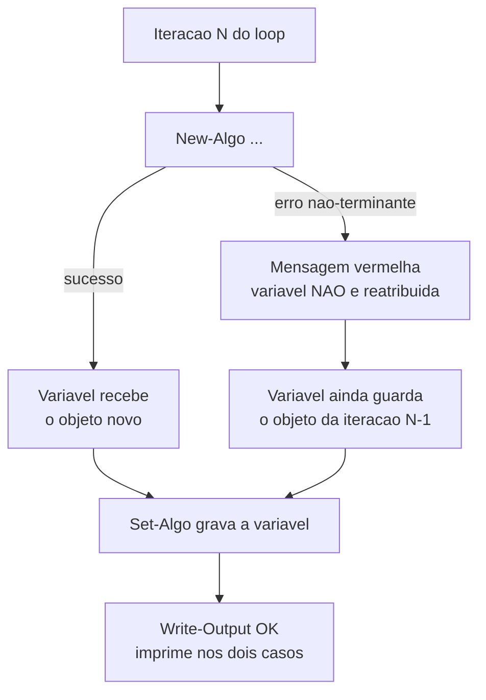
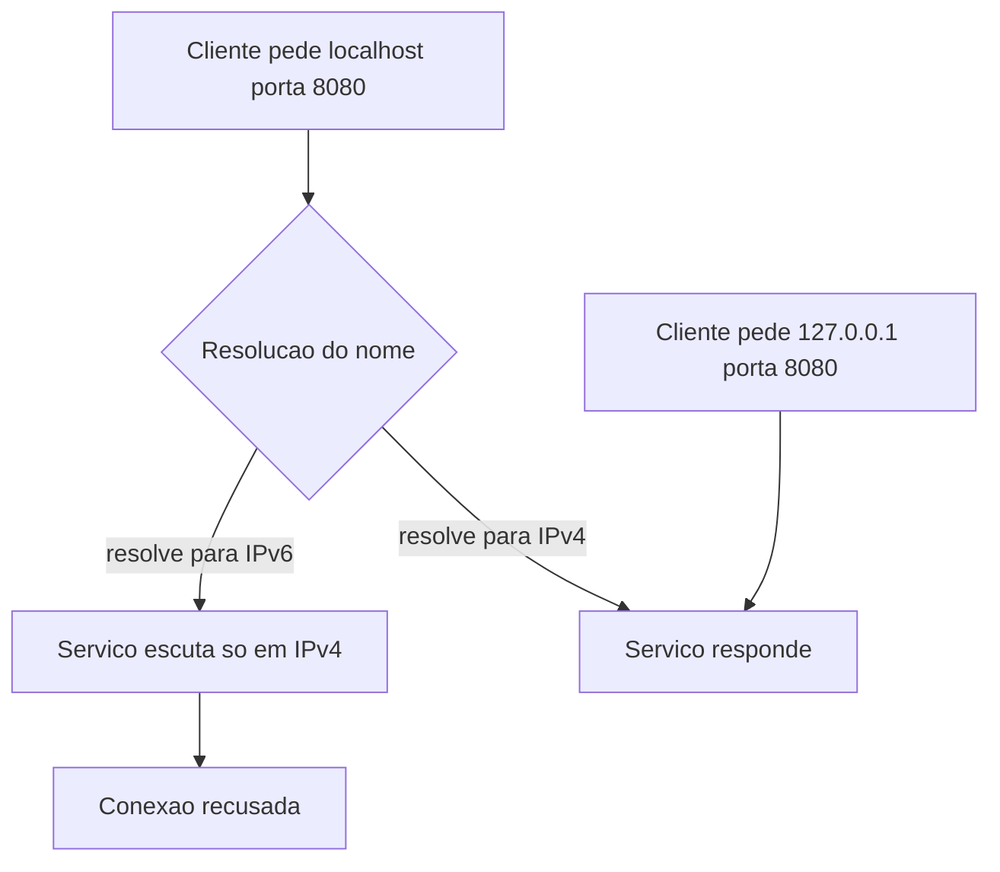

# Windows e PowerShell

Quase tudo aqui é a mesma classe de problema: um comando que existe no mundo Unix existe
no PowerShell com **outro significado**, ou um padrão de código que funciona em Linux
falha no Windows por causa de permissão, codificação ou case-insensitivity.

---

## `shutil.rmtree` falha em diretório `.git` — e com `ignore_errors=True` falha em silêncio

**Sintoma:** a limpeza "roda sem erro" e mesmo assim sobram gigabytes de diretórios
temporários no disco.

**Causa:** o git grava os objetos como somente-leitura. No Windows, arquivo somente-leitura
não pode ser apagado direto — a exclusão levanta `PermissionError`. Com
`ignore_errors=True`, a exceção é engolida e o diretório fica pela metade.

**Exemplo concreto:** um script clona 50 repositórios por dia numa pasta temporária e limpa
tudo ao final. A limpeza nunca reclama. Em duas semanas o disco enche, e a pasta temporária
tem 700 diretórios `.git` pela metade — todos "apagados com sucesso".

**Regra:** passe um handler que ajuste a permissão e tente de novo. Nunca use
`ignore_errors=True` em limpeza que você precisa que realmente aconteça — ele transforma
falha em mentira.

```python
shutil.rmtree(p, onerror=lambda f, path, e: (os.chmod(path, stat.S_IWRITE), f(path)))
```

**Como verificar:** confirme com medição de tamanho da pasta, não com ausência de exceção.

---

## Erro não-terminante deixa a variável do loop com o valor da iteração anterior

**Sintoma:** uma edição em lote "reporta OK" para todos os itens, mas metade das tarefas
passa a apontar para o alvo errado — o alvo da última iteração que deu certo.

**Causa:** um cmdlet `New-*` que falha com erro **não-terminante** não interrompe o loop e
**não reatribui** a variável; a linha seguinte usa o valor velho como se fosse novo. No
caso real, um parâmetro vazio fez o cmdlet recusar a criação e o `Set-` seguinte gravou o
objeto da iteração anterior.

**Erro terminante versus não-terminante, no PowerShell:** um erro **terminante** aborta a
execução ali mesmo e pode ser capturado por `try/catch`. Um erro **não-terminante** apenas
imprime uma mensagem vermelha no console e o script **segue para a próxima linha** — não
levanta exceção, não entra no `catch`, não muda o fluxo. A maior parte dos cmdlets falha desse
segundo jeito por padrão, e é exatamente por isso que um loop consegue "dar certo" 20 vezes
gravando o mesmo objeto errado.

**Exemplo concreto:** um script percorre 20 tarefas agendadas e, para cada uma, monta o objeto
de ação e grava. Na iteração 3 o caminho do executável vem vazio, o `New-` recusa em vermelho,
o `$acao` continua sendo o da tarefa 2 — e o `Set-` grava a tarefa 3 apontando para o programa
da tarefa 2. Da 3 em diante, todas herdam o mesmo alvo errado. O log imprime "OK" vinte vezes.



**Regra:**
1. `$var = $null` no topo de cada iteração, ou cheque sucesso antes de usar;
2. construa cada item a partir de dados **explícitos** (hashtable nome→valor), nunca a
   partir do estado do objeto que está sendo mutado;
3. não passe parâmetros com valor vazio;
4. considere `-ErrorAction Stop` dentro de `try/catch`.

```powershell
foreach ($item in $itens) {
    $acao = $null
    try   { $acao = New-Algo -Caminho $item.Caminho -ErrorAction Stop }
    catch { Write-Warning "falhou: $($item.Nome) - $_"; continue }
    Set-Algo -Nome $item.Nome -Acao $acao
}
```

**Como verificar:** depois de qualquer mutação em lote, liste as propriedades-chave de
**todos** os itens e confira uma a uma. `Write-Output "OK"` dentro do loop imprime mesmo
quando o comando anterior falhou.

---

## `curl` e `dir /s /b` não são o que você pensa

**Sintoma:** `curl -s URL` retorna um objeto de resposta em vez do corpo, ou erra em flags
válidas; `dir /s /b` devolve erro de parâmetro.

**Causa:** no PowerShell, `curl` é alias de `Invoke-WebRequest` (flags POSIX não existem) e
`dir` é alias de `Get-ChildItem` (as flags são do `cmd.exe`).

**Regra:** chame `curl.exe` explicitamente para o cURL real, e use
`Get-ChildItem -Recurse -Filter` para busca de arquivos. Em scripts multiplataforma,
prefira o executável com extensão.

**Como verificar:** `Get-Command curl | Select-Object CommandType, Source`

---

## Redirecionamento de saída gera UTF-16 ou ANSI e quebra parsers

**Sintoma:** um JSON gerado por script aparece com um byte nulo entre cada caractere e
falha em `JSON.parse` ou `jq`; ou vem com BOM inesperado.

**Causa:** `>` e `Out-File` no PowerShell padrão usam UTF-16LE; `Set-Content` e
`Add-Content` usam a codepage ANSI do sistema. Ferramentas Unix esperam UTF-8 sem BOM.

**O que é UTF-16LE, e por que aparece o byte nulo:** em UTF-8, a letra `A` ocupa um byte
(`41`). Em UTF-16 ela ocupa dois (`41 00`), porque a codificação usa duas unidades de byte por
caractere. Para texto que é quase todo ASCII, metade dos bytes é zero — e é exatamente esse
`00` intercalado que um parser que espera UTF-8 lê como fim de string ou lixo binário.

**Exemplo concreto:** um passo de CI gera `config.json` com `Out-File`. O arquivo abre
perfeitamente no editor do Windows. O passo seguinte, que roda `jq`, falha com um erro de
sintaxe apontando para a coluna 2 — e ninguém entende, porque "o JSON está claramente certo".

**Regra:** sempre passe `-Encoding utf8` explicitamente ao escrever arquivo que outra
ferramenta vai ler. Em CI rodando em runner Windows, declare `shell: bash` nos passos que
geram arquivos de configuração — resolve a classe inteira.

**Como verificar:** `file arquivo.json` deve dizer "UTF-8", não "UTF-16".

---

## Alimentar CLI via PowerShell insere BOM e corrompe o valor

**Sintoma:** o segredo "está configurado" mas a autenticação falha com credencial
inválida; comparar visualmente não mostra diferença.

**Causa:** redirecionamentos e cmdlets escrevem UTF-8 **com BOM** por padrão; a CLI grava o
byte extra dentro do valor.

**O que é BOM:** *Byte Order Mark* — três bytes invisíveis (`EF BB BF`) colocados no início do
arquivo para anunciar "isto é UTF-8". Nenhum editor os mostra, nenhuma comparação visual os
revela. Para quem lê o arquivo como texto puro, eles são simplesmente os três primeiros
caracteres do conteúdo — e num campo de senha isso significa uma senha diferente da que você
digitou.

**Exemplo concreto:** você grava a chave de API num arquivo e alimenta a CLI com ele. O painel
mostra a chave configurada, com os mesmos 40 caracteres visíveis. Toda chamada volta 401. O
valor armazenado tem 43 bytes.

**Regra:** use um shell POSIX para alimentar valores em CLIs, ou passe
`-Encoding utf8NoBOM`/`-NoNewline` explicitamente.

**Como verificar:** `head -c3 arquivo | xxd` — `efbbbf` é BOM.

---

## Para enviar arquivo via API, leia bytes crus

**Sintoma:** acentos e emojis chegam corrompidos no destino depois de um upload em base64.

**Causa:** `Get-Content -Raw` decodifica o arquivo usando a codificação **presumida** do
shell e devolve string; re-codificar essa string só acerta se o palpite estiver certo.

**Regra:** use `[System.IO.File]::ReadAllBytes($caminho)` e converta direto para base64. O
byte que saiu é o byte que entrou, independentemente de codificação, BOM ou locale.

```powershell
$bytes = [System.IO.File]::ReadAllBytes($caminho)
$b64   = [Convert]::ToBase64String($bytes)
```

---

## Ao achatar um namespace em nomes de arquivo, verifique colisão por maiúscula

**Sintoma:** você exporta N itens e recebe menos que N arquivos, sem erro. Um sobrescreveu
o outro.

**Causa:** o sistema de arquivos é case-insensitive por padrão. Origens que diferenciam
maiúsculas (URLs, APIs, Linux) podem ter dois itens que só diferem no caso.

**Exemplo concreto:** você exporta 500 registros para arquivos nomeados pela chave da origem.
Dois deles se chamam `RelatorioMensal` e `relatoriomensal` — chaves distintas e legítimas na
API. No disco viram o mesmo arquivo: o segundo apaga o primeiro, silenciosamente, e você
termina com 499.

**Regra:** antes de gravar em lote, agrupe os nomes por versão em minúsculas e verifique se
algum grupo tem mais de um. Cheque também caracteres inválidos e o comprimento total do
caminho.

```powershell
$nomes | Group-Object { $_.ToLower() } | Where-Object Count -gt 1
```

**Como verificar:** conte os arquivos gerados e compare com o número de itens da origem.

---

## Disco cheio quebra a ferramenta e o erro não diz "disco cheio"

**Sintoma:** automação de navegador headless passa a falhar com `ENOSPC` e mensagens
inconsistentes.

**Causa:** perfis temporários de navegador acumulam gigabytes por execução, num disco
compartilhado com outros perfis de usuário.

**Exemplo concreto:** uma captura de páginas roda 200 vezes por dia e deixa 50 MB de perfil
temporário a cada execução. Em um mês são 300 GB. Os erros que aparecem primeiro falam de
timeout, de aba que não abriu, de sessão inválida — nunca de espaço.

**Regra:** aponte diretórios temporários para um volume com folga e limpe ao fim de cada
execução. Antes de investigar um erro estranho de I/O, cheque espaço livre.

**Como verificar:** `Get-PSDrive C | Select-Object Used,Free` como primeiro passo do
diagnóstico.

---

## Use `127.0.0.1`, não `localhost`, ao falar com serviços locais

**Sintoma:** `ECONNREFUSED` ou `curl` devolvendo código 000 contra um serviço
comprovadamente no ar.

**Causa:** `localhost` pode resolver para IPv6 (`::1`) enquanto o serviço escuta apenas em
IPv4.

**Exemplo concreto:** o serviço sobe escutando em `0.0.0.0:8080` e responde normalmente pelo
navegador. O health check do script, apontando para `localhost:8080`, falha sempre. Trocar uma
palavra por `127.0.0.1:8080` resolve — o serviço nunca esteve fora do ar.



**Regra:** em health check e automação, use o endereço literal IPv4. Vale também dentro de
container.

---

## `.bat` que aponta pro `streamlit.exe` do Python da Microsoft Store não roda em outra máquina

**Sintoma:** O launcher funciona só no PC de quem criou; em outro usuário dá "o sistema não pode encontrar o caminho especificado".

**Causa:** Python instalado pela Microsoft Store coloca os console scripts em `%LOCALAPPDATA%\Packages\PythonSoftwareFoundation.Python.3.x_<hash>\LocalCache\local-packages\Python3xx\Scripts` — caminho **por usuário**, com sufixo pseudo-aleatório no nome do pacote, fora do PATH. Fixar esse caminho absoluto embute também o nome de usuário e quebra em qualquer outra conta.

**Exemplo concreto:** `start "" "C:\Users\<user>\AppData\Local\Packages\PythonSoftwareFoundation.Python.3.11_<hash>\LocalCache\local-packages\Python311\Scripts\streamlit.exe" run app.py`.

**Regra:** Chame a ferramenta pelo módulo, não pelo `.exe`: `python -m streamlit run app.py` (ou `py -m ...`), que resolve pelo interpretador no PATH. Nunca hardcode o caminho de Scripts do Python da Store.
